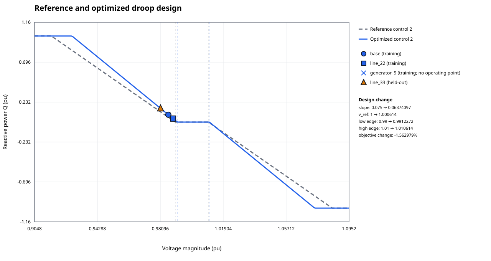
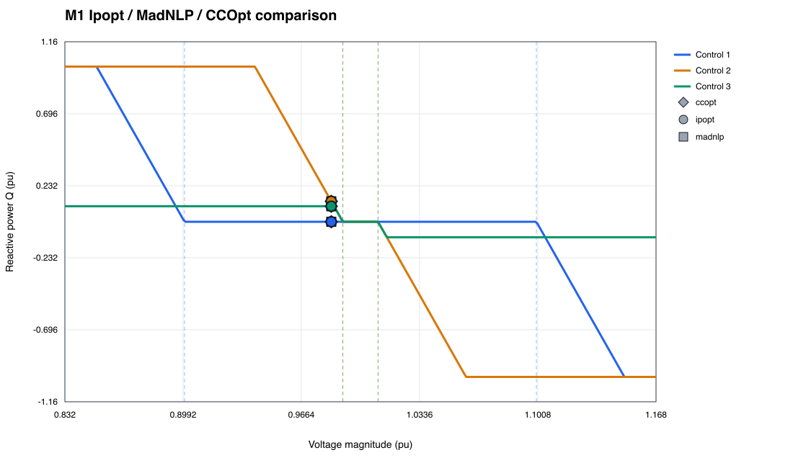

# DroopOPF.jl

[](https://github.com/frederikgeth/DroopOPF.jl/actions/workflows/CI.yml)
[](https://github.com/frederikgeth/DroopOPF.jl/actions/workflows/Documentation.yml)
[](https://frederikgeth.github.io/DroopOPF.jl/dev/)
[](LICENSE)

DroopOPF.jl is a Julia library for AC optimal power flow with generator
volt-var droop controls. It is being developed as the foundation for a
security-constrained AC OPF library with equilibrium-aware generator controls.

Version `0.1.0` delivered M1:

- AC network power-flow physics and OPF constraints;
- static piecewise-linear volt-var curves with deadband and reactive limits;
- independent equilibrium and droop-curve validation;
- numerically stable smooth encoding for standard nonlinear programming;
- Ipopt and MadNLP access through the same smoothed model;
- an exact complementarity encoding for CCOpt;
- operating-point extraction, SVG plots, and solver comparison examples.

Version `0.3.0` delivered M3: reference-anchored slope sweeps and
bounded optimization of droop slope, voltage reference, and asymmetric deadband
widths. Optimized designs are reconstructed as exact PWL curves, independently
validated across the M2 security-constrained model, and checked on held-out
contingencies. M2 line/generator outages, response policies, continuation, JSON
serialization, and visual validation remain available unchanged.

| Release | Milestone | Scope and evidence |
|---|---|---|
| `v0.4.0` | M4 | Robustness, public-case regressions, and scale-up evidence |
| `v0.5.0` | M5 | Transformer data, fixed transformer physics, and validation |
| `v0.6.0` | M6 | Fixed shunts and simple-bank physics, accounting, and validation |
| `v0.7.0` | M7 | Continuous tap, simple-bank, and joint droop design in the declared base-case scope |

S1 is the active reliability investigation for the M7 joint model on IEEE
118/300. It is deliberately not labelled a completed reliability release.

Run the M2 workflow with `julia --project=. examples/m2_workflow.jl`.
Run the first M3 validation slice with
`julia --project=. examples/m3_slope_sweep.jl /tmp/droopopf-m3`.
Run the complete bounded-design workflow with
`julia --project=. examples/m3_workflow.jl /tmp/droopopf-m3-design`.
Run the first M4 robustness slice with
`julia --project=. examples/m4_robustness_workflow.jl /tmp/droopopf-m4`.
Run M3 parameter multi-start validation with
`julia --project=. examples/m4_design_multistart.jl /tmp/droopopf-m4-design`.
Run the pinned public-case and M2 measurements with
`julia --project=. examples/m4_benchmark_workflow.jl /tmp/droopopf-m4-benchmark`.



## Documentation and milestone reports

Start with [Milestones and S1 status](docs/src/milestones.md): it is the
repository map for implemented scope, release status, reliability gates, and
retained solver evidence.

| Topic | Documentation | Retained report |
|---|---|---|
| M1–M4 | [Getting started](docs/src/getting_started.md), [SCOPF](docs/src/scopf.md), [M3](docs/src/droop_optimization.md), [M4](docs/src/robustness.md) | [M4 scale-up decision](docs/src/scale_up_decision.md) |
| M5 transformers | [Data model](docs/src/data_model.md#fixed-transformer-electrical-model-m52m54) | [M5 report](artifacts/m5/report.md) and [M5.1 report](artifacts/m5_1/report.md) |
| M6 shunts and banks | [Data model](docs/src/data_model.md#fixed-bus-shunts-m61) | [M6 report](artifacts/m6/report.md) and [M6.1 report](artifacts/m6_1/report.md) |
| M7 continuous equipment | [Equipment optimization](docs/src/equipment_optimization.md) | [M7.1](artifacts/m7_1/report.md), [M7.2](artifacts/m7_2/report.md), [M7.3](artifacts/m7_3/report.md), and [CCOpt comparison](artifacts/m7_ccopt_comparison/report.md) |
| S1 reliability | [S1 joint formulation](docs/src/joint_formulation.md), [S1 evidence](docs/src/s1_evidence.md), [CCOpt frozen lane](docs/src/s1_ccopt.md) | [Frozen CCOpt](artifacts/s1_ccopt_frozen/report.md), [feasibility status](artifacts/s1_ccopt_frozen/FEASIBILITY_STATUS.md), and [developer reproduction report](artifacts/s1_ccopt_frozen/DEVELOPER_REPORT.md) |

The documentation navigation contains the detailed S1 studies: restart policy,
normalization, staged initialization, KKT diagnostics, and alternate droop-Q
formulations. The [architecture](ARCHITECTURE.md), [roadmap](ROADMAP.md), and
[changelog](CHANGELOG.md) provide project-wide context and decision history.

## Installation

From a checkout:

```julia
import Pkg
Pkg.activate(".")
Pkg.instantiate()
```

Or install the public repository directly:

```julia
import Pkg
Pkg.add(url = "https://github.com/frederikgeth/DroopOPF.jl.git")
```

The project currently includes the solver integrations used by the test suite:
Ipopt, MadNLP, CCOpt, MathOptComplements, and NLPModelsJuMP.

## Quick start

Cases are assembled from typed network, generator, load, and droop-control
objects. The complete small case is in
[`examples/m1_regime_case_study.jl`](examples/m1_regime_case_study.jl).

```julia
using DroopOPF

# `case` is a Case containing an ACNetwork and generator-control attachments.
result = solve_opf(case; smooth_epsilon = 1.0e-3)
report = equilibrium_report(case, result)
println(markdown_report(report))
```

The default smooth solver is Ipopt. MadNLP uses the same smooth model:

```julia
using MadNLP

madnlp_result = solve_opf(
    case;
    optimizer_factory = MadNLP.Optimizer,
    smooth_epsilon = 1.0e-3,
)
```

For the exact piecewise-linear droop graph, use CCOpt:

```julia
ccopt_result = solve_opf_complementarity(case)
```

Always inspect the independent equilibrium report, especially when a solver
returns an acceptable-but-not-fully-converged status:

```julia
equilibrium_report(case, ccopt_result).valid
```

## Droop curves and plots

Operating points can be extracted and plotted directly:

```julia
points = droop_operating_points(case, result.state)
write_droop_plot("droop_operating_points.svg", case, result.state)
```

The reproducible three-solver comparison prints numerical residuals and writes
a figure:

```sh
julia --project=. examples/m1_solver_comparison.jl
```



The plot uses curve colours for controls and marker shapes for solvers. The
comparison example exercises deadband, proportional, and reactive saturation
operation in the same case.

## Numerical formulation

The smooth model replaces positive-part terms with the stable
`LogExpFunctions.log1pexp` implementation. Voltage smoothing is specified in
per-unit voltage. Reactive smoothing is scaled per control as a fraction of the
smaller distance from the deadband reactive reference to either reactive limit;
an absolute reactive smoothing width can be supplied when needed.

The complementarity model represents voltage hinges with nonnegative
complementarity pairs and reactive clipping with the KKT conditions for
projection onto the reactive capability interval. It is exposed through
`solve_opf_complementarity` and uses the CCOpt JuMP integration via
MathOptComplements.

Solver comparison guidance and starting tolerances are documented in
[`SOLVER_COMPATIBILITY.md`](SOLVER_COMPATIBILITY.md). Architecture and the
development plan are in [`ARCHITECTURE.md`](ARCHITECTURE.md) and
[`ROADMAP.md`](ROADMAP.md).

## Testing

```sh
julia --project=. -e 'using Pkg; Pkg.test()'
```

The test suite includes small AC network tests, equilibrium validation,
plotting checks, and compatibility smoke tests for Ipopt, MadNLP, and CCOpt.

## License

DroopOPF.jl is released under the BSD 3-Clause license. See
[`LICENSE`](LICENSE).
