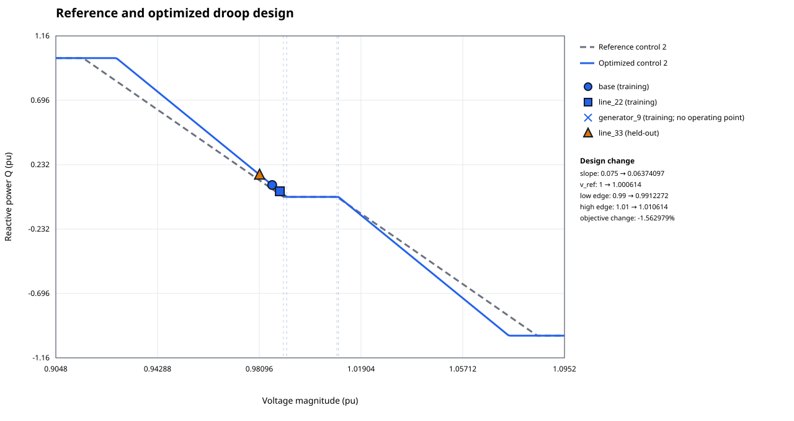
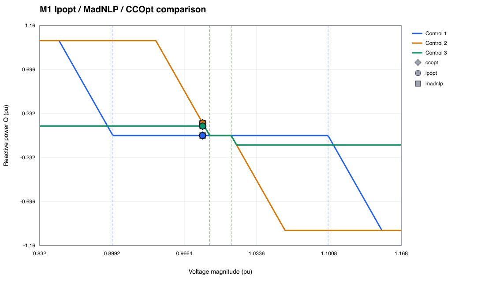

# DroopOPF.jl

[](https://github.com/frederikgeth/DroopOPF.jl/actions/workflows/CI.yml)
[](https://github.com/frederikgeth/DroopOPF.jl/actions/workflows/Documentation.yml)
[](https://frederikgeth.github.io/DroopOPF.jl/dev/)
[](LICENSE)

DroopOPF.jl is a Julia library for equilibrium-aware AC optimal power flow.
It supports smooth nonlinear and exact-complementarity representations of
generator reactive controls, independently validates returned operating points,
and retains failed numerical attempts as evidence rather than treating solver
status as physical feasibility.

## Current release: v0.8.0

M8 adds explicit `FreeQ`, `FixedQ`, AVR, and Volt–VAr assignments; local,
remote-bus, and identified branch-terminal regulation; common-location AVR
sharing; legacy-compatible persistence; and AVR-aware continuous equipment
design. Ipopt and MadNLP provide smooth formulations, while CCOpt provides the
separately reported exact-complementarity lane.

| Release gate | Result |
|---|---:|
| Package tests | 2267/2267 pass |
| Documentation build | Pass |
| Qualified AVR joint stages, Ipopt + MadNLP | 24/24 physically valid and `LOCALLY_SOLVED` |
| Qualified AVR joint stages, direct CCOpt | 11/12 physically valid; 7/12 strictly `LOCALLY_SOLVED` |
| CCOpt cross-seed diagnostic | Recovers the remaining physical point; not a direct-start pass |

Read the [v0.8.0 release notes](RELEASE_NOTES_v0.8.0.md) and the
[current S1 decision report](docs/src/s1_summary.md). S1 remains open for the
frozen synthetic-droop reliability contract; the qualified AVR lane does not
rescore it. Coordinated preventive/corrective equipment policy is deferred to
M9.

| Release | Milestone | Scope and evidence |
|---|---|---|
| `v0.4.0` | M4 | Robustness, public-case regressions, and scale-up evidence |
| `v0.5.0` | M5 | Transformer data, fixed transformer physics, and validation |
| `v0.6.0` | M6 | Fixed shunts and simple-bank physics, accounting, and validation |
| `v0.7.0` | M7 | Continuous tap, simple-bank, and joint droop design in the declared base-case scope |
| `v0.8.0` | M8 | Explicit reactive-control modes, AVR, and qualified AVR-aware base-case joint design |

S1 is the active reliability investigation for the M7/M8 numerical models on
IEEE 118/300. It is deliberately not labelled a completed reliability release.

Run the M2 workflow with `julia --project=. examples/m2_workflow.jl`.
Run the first M3 validation slice with
`julia --project=. examples/m3_slope_sweep.jl /tmp/droopopf-m3`.
Run the complete bounded-design workflow with
`julia --project=. examples/m3_workflow.jl /tmp/droopopf-m3-design`.
Run the first M4 robustness slice with
`julia --project=. examples/m4_robustness_workflow.jl /tmp/droopopf-m4`.
Run M3 parameter multi-start validation with
`julia --project=. examples/m4_design_multistart.jl /tmp/droopopf-m4-design`.
Run the pinned public-case and M2 measurements with
`julia --project=. examples/m4_benchmark_workflow.jl /tmp/droopopf-m4-benchmark`.



## Documentation and milestone reports

Start with [Milestones and S1 status](docs/src/milestones.md), then use the
[current S1 decision report](docs/src/s1_summary.md) for the authoritative
scorecards, failure classification, evidence provenance, and M9 entry gate.

| Topic | Documentation | Retained report |
|---|---|---|
| M1–M4 | [Getting started](docs/src/getting_started.md), [SCOPF](docs/src/scopf.md), [M3](docs/src/droop_optimization.md), [M4](docs/src/robustness.md) | [M4 scale-up decision](docs/src/scale_up_decision.md) |
| M5 transformers | [Data model](docs/src/data_model.md#fixed-transformer-electrical-model-m52m54) | [M5 report](artifacts/m5/report.md) and [M5.1 report](artifacts/m5_1/report.md) |
| M6 shunts and banks | [Data model](docs/src/data_model.md#fixed-bus-shunts-m61) | [M6 report](artifacts/m6/report.md) and [M6.1 report](artifacts/m6_1/report.md) |
| M7 continuous equipment | [Equipment optimization](docs/src/equipment_optimization.md) | [M7.1](artifacts/m7_1/report.md), [M7.2](artifacts/m7_2/report.md), [M7.3](artifacts/m7_3/report.md), and [CCOpt comparison](artifacts/m7_ccopt_comparison/report.md) |
| M8 reactive controls and AVR | [Data model](docs/src/data_model.md#explicit-reactive-control-modes) | [IEEE AVR qualification](artifacts/avr_ieee_qualification/README.md) and [reactive-control roadmap](REACTIVE_CONTROL_ROADMAP.md) |
| S1 reliability | [Current decision report](docs/src/s1_summary.md), [joint formulation](docs/src/joint_formulation.md), and [CCOpt frozen lane](docs/src/s1_ccopt.md) | [Three-solver scorecard](artifacts/s1_three_solver_scorecard/report.md), [witness-seed matrix](artifacts/s1_frozen_witness_seed_matrix/report.md), and [frozen CCOpt](artifacts/s1_ccopt_frozen/report.md) |

The detailed S1 pages are an audit trail: restart policy, normalization, staged
initialization, KKT diagnostics, and alternate droop-Q formulations. Their
individual counts reflect the checkpoint at which each experiment ran; the
current decision report is the synthesis. The [architecture](ARCHITECTURE.md),
[roadmap](ROADMAP.md), and [changelog](CHANGELOG.md) provide project-wide
context and decision history.

## M8 quick start

Reactive behavior is explicit and opt-in. An AVR assignment names both the
generator and the voltage location it regulates:

```julia
using DroopOPF

assignments = [
    ReactiveControlAssignment(
        7,
        AVR(1.02),
        RegulatedLocation(:generator_terminal, 10),
    ),
]

result = solve_opf(case; reactive_assignments=assignments)
report = validate_equilibrium(case, result;
    reactive_assignments=assignments,
    power_tolerance=1e-5,
)
@assert report.valid
```

Use `optimize_joint_design` with the same `reactive_assignments` to coordinate
continuous taps or simple-bank settings in the base case. Equipment timing and
scenario coupling are not inferred; those preventive/corrective decisions are
the declared scope of M9.

## Installation

From a checkout:

```julia
import Pkg
Pkg.activate(".")
Pkg.instantiate()
```

Or install the public repository directly:

```julia
import Pkg
Pkg.add(url = "https://github.com/frederikgeth/DroopOPF.jl.git")
```

The project currently includes the solver integrations used by the test suite:
Ipopt, MadNLP, CCOpt, MathOptComplements, and NLPModelsJuMP.

## Quick start

Cases are assembled from typed network, generator, load, and droop-control
objects. The complete small case is in
[`examples/m1_regime_case_study.jl`](examples/m1_regime_case_study.jl).

```julia
using DroopOPF

# `case` is a Case containing an ACNetwork and generator-control attachments.
result = solve_opf(case; smooth_epsilon = 1.0e-3)
report = equilibrium_report(case, result)
println(markdown_report(report))
```

The default smooth solver is Ipopt. MadNLP uses the same smooth model:

```julia
using MadNLP

madnlp_result = solve_opf(
    case;
    optimizer_factory = MadNLP.Optimizer,
    smooth_epsilon = 1.0e-3,
)
```

For the exact piecewise-linear droop graph, use CCOpt:

```julia
ccopt_result = solve_opf_complementarity(case)
```

Always inspect the independent equilibrium report, especially when a solver
returns an acceptable-but-not-fully-converged status:

```julia
equilibrium_report(case, ccopt_result).valid
```

## Droop curves and plots

Operating points can be extracted and plotted directly:

```julia
points = droop_operating_points(case, result.state)
write_droop_plot("droop_operating_points.svg", case, result.state)
```

The reproducible three-solver comparison prints numerical residuals and writes
a figure:

```sh
julia --project=. examples/m1_solver_comparison.jl
```



The plot uses curve colours for controls and marker shapes for solvers. The
comparison example exercises deadband, proportional, and reactive saturation
operation in the same case.

## Numerical formulation

The smooth model replaces positive-part terms with the stable
`LogExpFunctions.log1pexp` implementation. Voltage smoothing is specified in
per-unit voltage. Reactive smoothing is scaled per control as a fraction of the
smaller distance from the deadband reactive reference to either reactive limit;
an absolute reactive smoothing width can be supplied when needed.

The complementarity model represents voltage hinges with nonnegative
complementarity pairs and reactive clipping with the KKT conditions for
projection onto the reactive capability interval. It is exposed through
`solve_opf_complementarity` and uses the CCOpt JuMP integration via
MathOptComplements.

Solver comparison guidance and starting tolerances are documented in
[`SOLVER_COMPATIBILITY.md`](SOLVER_COMPATIBILITY.md). Architecture and the
development plan are in [`ARCHITECTURE.md`](ARCHITECTURE.md) and
[`ROADMAP.md`](ROADMAP.md).

## Testing

```sh
julia --project=. -e 'using Pkg; Pkg.test()'
```

The test suite includes small AC network tests, equilibrium validation,
plotting checks, and compatibility smoke tests for Ipopt, MadNLP, and CCOpt.

## License

DroopOPF.jl is released under the BSD 3-Clause license. See
[`LICENSE`](LICENSE).
