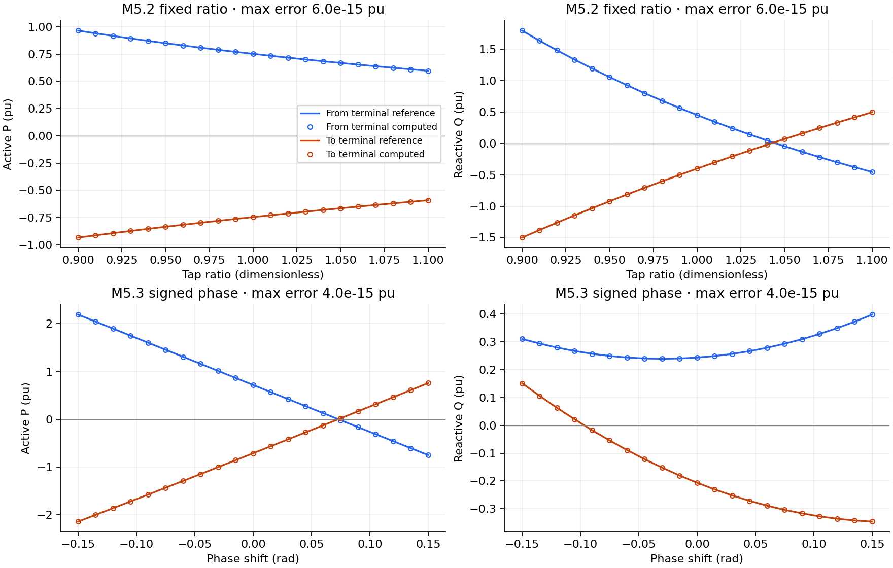
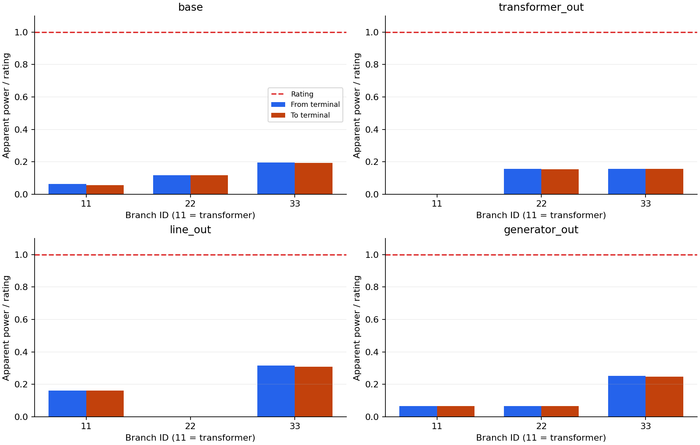
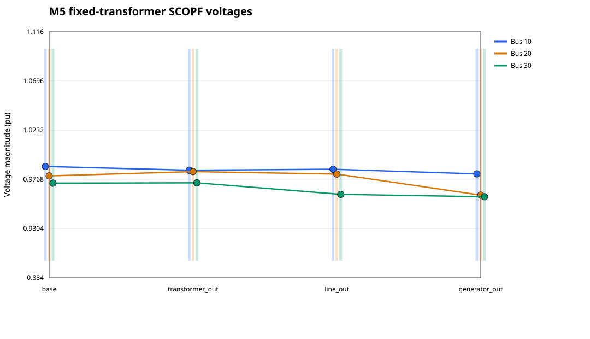
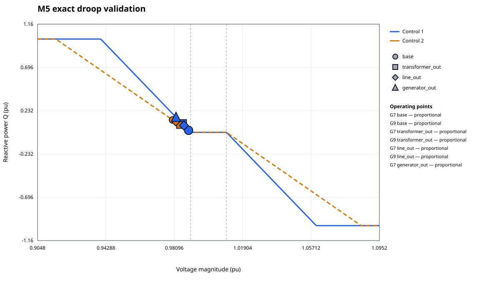
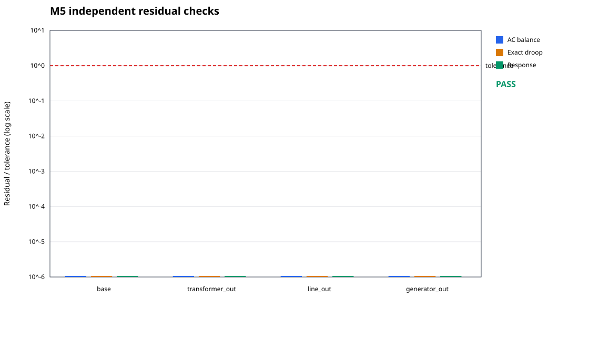

# M5 transformer validation

Synthetic fixtures; fixed ratio and phase. Overall numerical checks: **PASS**.

M5.2 compares both terminal P/Q against a scalar polar reference over 21 ratios; M5.3 repeats over 21 signed phase shifts. Absolute tolerance: 1e-12 pu.

| Run/check | Status | Pass |
|---|---|---|
| preventive_ipopt | LOCALLY_SOLVED | true |
| bounded_slope_design | LOCALLY_SOLVED | true |
| wrong_ratio | deliberate corruption | true |
| wrong_phase_sign | deliberate corruption | true |
| preventive_madnlp | LOCALLY_SOLVED | true |
| preventive_ccopt | LOCALLY_SOLVED | true |
| corrective_ipopt | LOCALLY_SOLVED | true |

M5.4 checks base, transformer-outage, line-outage and generator-outage states; exact droop tolerance 1e-5, AC tolerance 1e-6. Both terminal apparent powers are checked against the same rating. Wrong-ratio and wrong-phase-sign checks pass only when the corrupted model fails validation.

CCOpt uses ProportionalRelaxationUpdate with sigma_min=1e-12, tol=acceptable_tol=1e-9 and bound_relax_factor=0; the default relaxation failed exact-droop validation on this fixture. Validation tolerances are unchanged.

Declared proportional-regime starts are used for all runs. Flat 1 pu starts can stall in the droop deadband; convergence from arbitrary starts is not established.

Fixed settings are supplied data, not optimized schedules. No tap grid, automatic AVR, switching trajectory, global optimality or dynamic security is claimed. JSON records retain numerical results and failed attempts. Analytical fixtures and both-end thermal rejection tests are in test/test_transformer_physics.jl.
