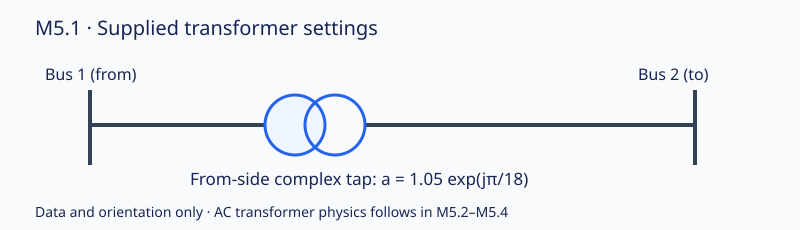

# M5.1 transformer data verification

Synthetic fixture; fixed supplied settings. Overall data checks: **PASS**.

Ratio is dimensionless; phase is in radians. Expected ratio 1.05, phase π/18 (10°). Absolute tolerance: 1e-14.

| Stage | Ratio | Ratio error | Phase (rad) | Phase error | Available | Pass |
|---|---:|---:|---:|---:|---|---|
| import | 1.05 | 0.0 | 0.17453292519943295 | 0.0 | true | true |
| copy | 1.05 | 0.0 | 0.17453292519943295 | 0.0 | true | true |
| JSON round trip | 1.05 | 0.0 | 0.17453292519943295 | 0.0 | true | true |
| outage | 1.05 | 0.0 | 0.17453292519943295 | 0.0 | false | true |

Transformer physics is supported by M5.2-M5.4 and verified in its separate evidence bundle.

Solver: not run. AC feasibility and operating limits: not evaluated. Discrete implementability: unknown; no tap grid supplied. Outage preservation is checked without claiming transformer-flow validation.

The diagram shows branch 1 only; the fixture has a third bus and alternate paths so its outage remains connected.
