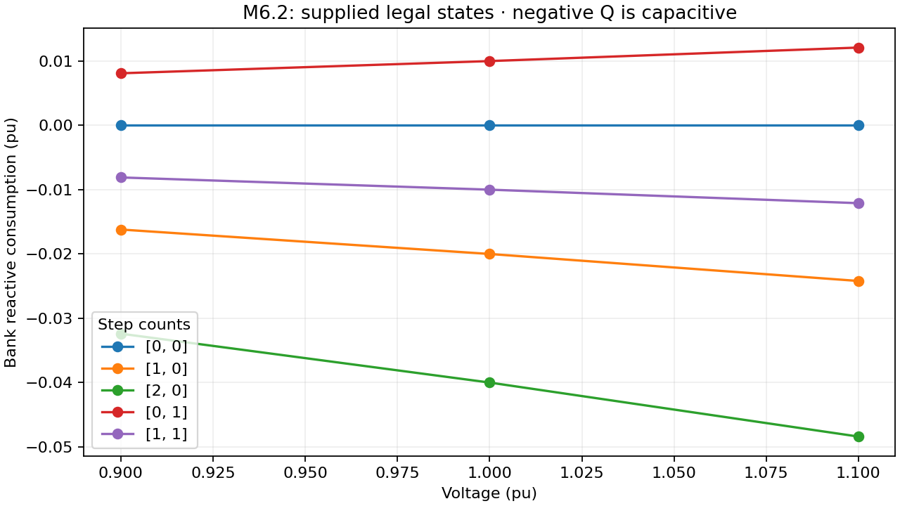
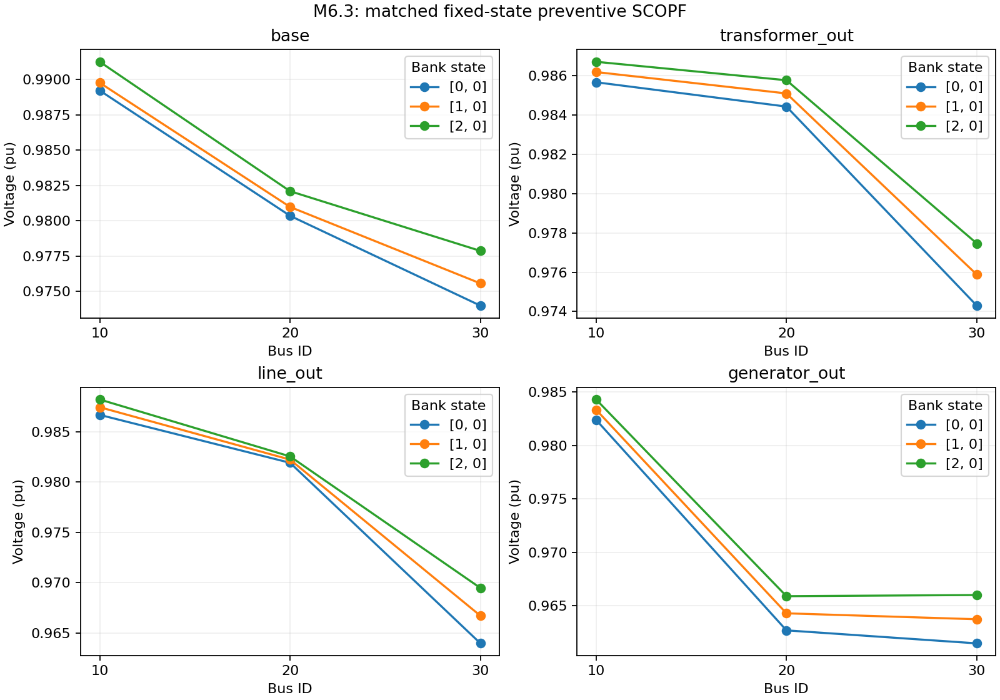
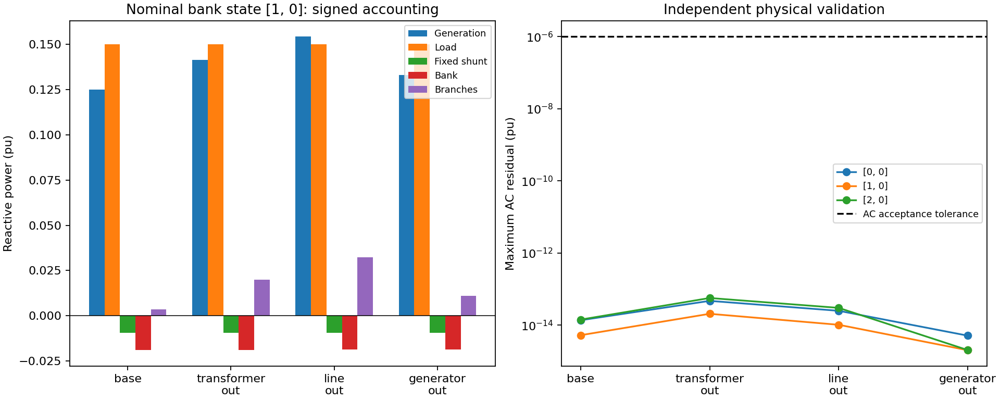

# M6 shunt reference verification

Overall numerical checks: **PASS**. Synthetic three-bus system, 100 MVA base. Fixed transformer ratios and fixed droop settings are identical across compared bank states. Each SCOPF covers base, transformer outage, line outage and generator outage.

Supplied bank states are step-count tuples. Legal states: (0,0), (1,0), (2,0), (0,1), (1,1). Step admittances: 0.001+j0.02 and 0.0005−j0.01 pu. Nominal state: (1,0). Fixed shunt: 0.002+j0.01 pu. Positive Q below denotes consumption. No switching trajectory or optimized bank schedule is claimed.

| Bank state | Solver status | Objective | Independent valid | Maximum AC residual (pu) |
|---|---|---:|---|---:|
| [0, 0] | LOCALLY_SOLVED | 2.5566642869051415e-5 | true | 4.718447854656915e-14 |
| [1, 0] | LOCALLY_SOLVED | 2.7600446695334818e-5 | true | 2.067790383364354e-14 |
| [2, 0] | LOCALLY_SOLVED | 2.9480966161269715e-5 | true | 5.667688540711424e-14 |

Analytical bank sweep tolerance: 1e-14 pu; independent AC tolerance: 1e-6 pu. Ipopt smooth droop epsilon: 1e-5; declared proportional-regime starts from `m5_initial_states`. Study and result JSON files accompany each run.

The regression suite additionally checks invalid/unavailable states, immutable metadata, schema migration, zero-shunt equivalence, omitted bank rejection, MadNLP and CCOpt agreement, corrective SCOPF and bounded droop design. See [regression log](regression-tests.txt) and [fixed-shunt/import evidence](../m6_1/report.md). Equipment optimization remains M7; automatic controls remain later milestones.

## Reproduction

From the repository root, run `julia --project=. examples/m6_shunt_workflow.jl artifacts/m6`, then `python3 examples/plot_m6_shunts.py artifacts/m6` with Matplotlib installed. Run `julia --project=. test/runtests.jl` for the full suite: **691/691 tests passed**. PNG and PDF versions of each plot are retained.
