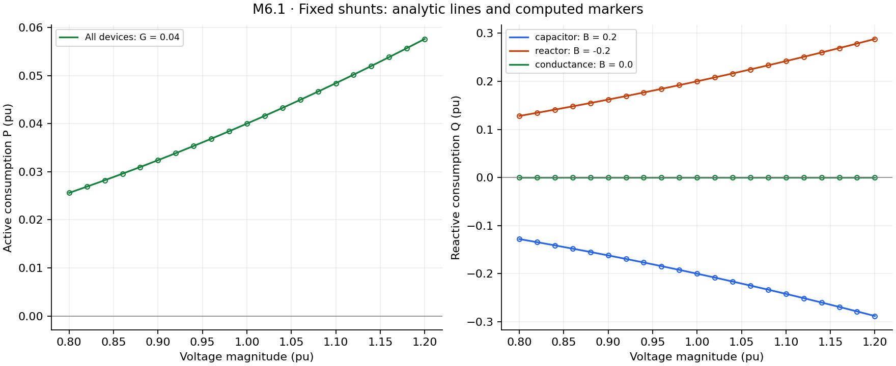
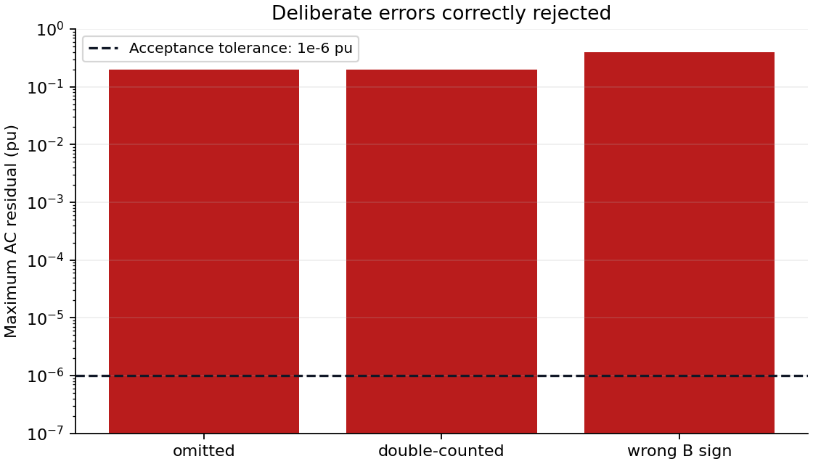

# M6.1 fixed-shunt verification

Overall checks: **PASS**.

Fixed admittance is separate from loads and branch charging. Consumption is P=GV², Q=−BV²; B>0 is capacitive. All powers and admittances below are per unit unless labelled otherwise. No discrete positions are inferred.

## Import conversion

Base power: 100 MVA. GS is MW consumed at 1 pu; BS is MVAr injected at 1 pu.

| Bus / shunt ID | GS | BS | Expected / actual G | Expected / actual B | Pass |
|---|---:|---:|---|---|---|
| 1 | 2.0 | 10.0 | 0.02 / 0.02 | 0.1 / 0.1 | true |
| 3 | 0.0 | -5.0 | 0.0 / 0.0 | -0.05 / -0.05 | true |

63 voltage/equipment checks over 0.8–1.2 pu; maximum analytical error: 5.594315114139762e-17 pu (tolerance 1e-14). Independent AC residual tolerance: 1e-6 pu.

## Adversarial accounting checks

These cases must fail physical validation; a passing test means the error was detected.

| Corruption | AC residual | Detected |
|---|---:|---|
| omitted | 0.19999999999999998 | true |
| double-counted | 0.20000000000000004 | true |
| wrong B sign | 0.4 | true |

Unavailable-device check: true. Study v4 round trip: true. Basic one-bus OPF: LOCALLY_SOLVED, physical validation: true.

The OPF check exercises the shared fixed-admittance Ybus path. It does not complete M6.3 security-constrained/matched-study validation. Switched-bank evidence is in the M6.2/M6.3 workflow; optimization and AVR remain later milestones. Inputs are synthetic, not observations of a real system.
