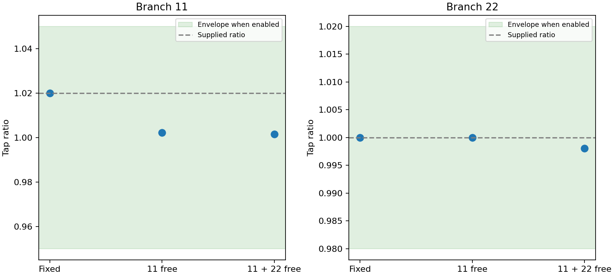

# M7.1 continuous tap optimization

Numerical acceptance: **PASS**. Synthetic three-bus base-case OPF, 100 MVA base. Droop settings, phase shifts and shunts are fixed. Branch 22 is explicitly treated as a second adjustable transformer in the two-device experiment.

The objective is the existing sum of squared active dispatch deviations plus 0.001 times squared reactive deviations from generator initial values. Tap deviation and losses are reported separately and do not enter this objective. Ratios are continuous relaxed settings, not discrete positions or switching counts. Local solutions do not certify global optimality.

| Configuration | Objective | AC residual (pu) | Exact droop residual (pu) | Minimum thermal margin | Valid |
|---|---:|---:|---:|---:|---|
| fixed | 2.760044669534019e-5 | 2.431214951581495e-15 | 1.047512770968595e-14 | 1.611099174931803 | true |
| tap 11 free | 1.99494787449747e-5 | 2.8707591859244985e-13 | 1.061650767297806e-15 | 1.6255058710756778 | true |
| taps 11 and 22 free | 1.993398017888094e-5 | 5.830752547453244e-14 | 7.147060721024445e-16 | 1.6280874512435537 | true |

| Configuration | Branch active losses (pu) | Shunt active consumption (pu) |
|---|---:|---:|
| fixed | 0.002264237783147216 | 0.0028551965804841668 |
| tap 11 free | 0.0021135010105841623 | 0.0028599122470743315 |
| taps 11 and 22 free | 0.002108154972377263 | 0.0028655094661196308 |

| Configuration / branch | Supplied | Nominal | Solved | Deviation from supplied |
|---|---:|---:|---:|---:|
| fixed / 11 | 1.02 | 1.02 | 1.02 | 0.0 |
| fixed / 22 | 1.0 | 1.0 | 1.0 | 0.0 |
| fixed / 33 | 1.0 | 1.0 | 1.0 | 0.0 |
| tap 11 free / 11 | 1.02 | 1.0 | 1.0022996090232554 | -0.017700390976744584 |
| tap 11 free / 22 | 1.0 | 1.0 | 1.0 | 0.0 |
| tap 11 free / 33 | 1.0 | 1.0 | 1.0 | 0.0 |
| taps 11 and 22 free / 11 | 1.02 | 1.0 | 1.00154815704561 | -0.018451842954390063 |
| taps 11 and 22 free / 22 | 1.0 | 1.0 | 0.9980805074464099 | -0.0019194925535901408 |
| taps 11 and 22 free / 33 | 1.0 | 1.0 | 1.0 | 0.0 |

Inputs and versioned design results are included. All 41 sweep attempts retain status and validity in evidence.json. Ipopt uses smooth epsilon 1e-5 and the declared `m5_initial_state`; independent tolerances are 1e-6 pu AC balance and 1e-5 pu exact droop. The optimized objective must be no worse than any valid sweep point within 1e-8.

Regression tests check fixed-bound/empty-policy equivalence, policy corruption, unavailable equipment, multiple devices, both-terminal margins, MadNLP agreement and serialization. See [full test log](regression-tests.txt).

Run `julia --project=. examples/m7_1_taps.jl artifacts/m7_1`, then `python3 examples/plot_m7_1_taps.py artifacts/m7_1` with Matplotlib installed. Security-constrained equipment decisions remain M9.
