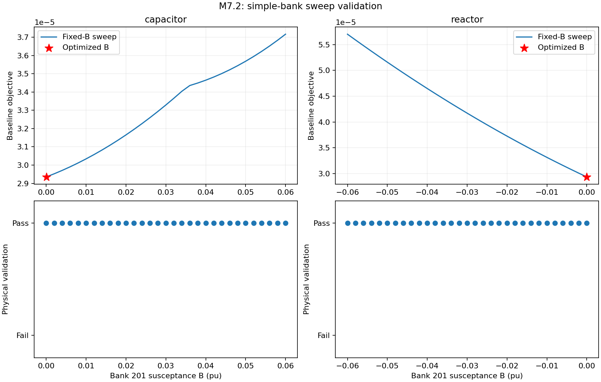
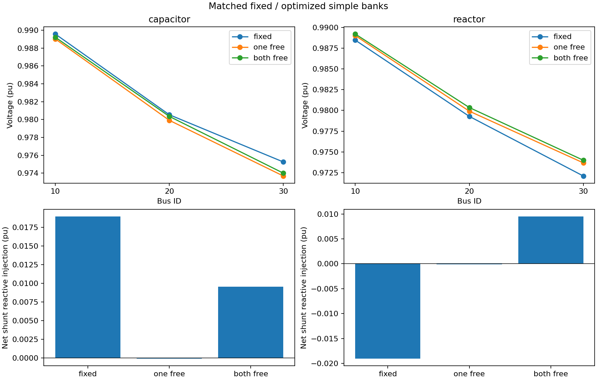
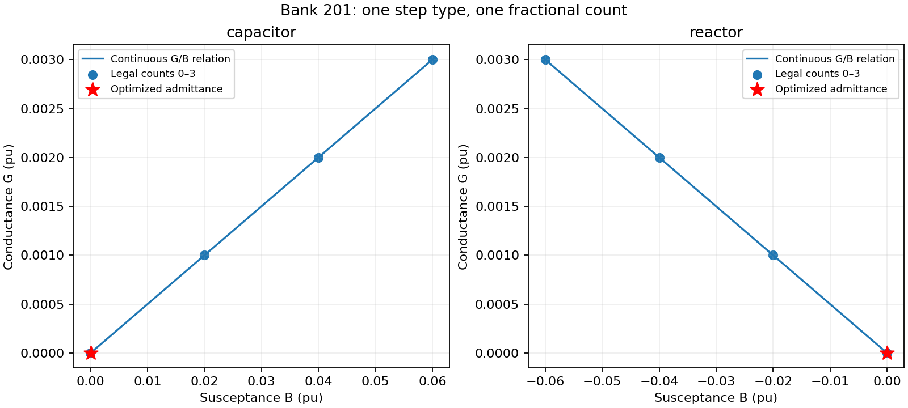
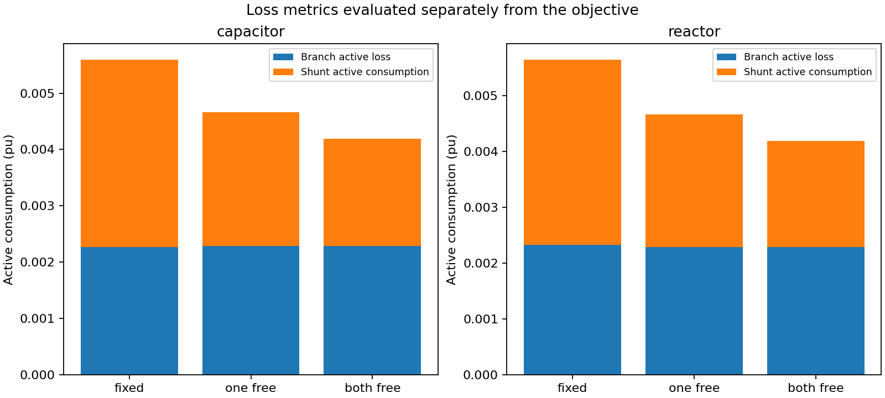

# M7.2 simple capacitor/reactor optimization

Numerical acceptance: **PASS**. Synthetic three-bus base-case OPF, 100 MVA. Transformer ratios, phase shifts and droop settings remain fixed.

Bank 201 at bus 30 has step G=0.001 pu and B=+0.02 (capacitor) or −0.02 (reactor), legal counts 0–3, supplied/nominal count 1. Bank 202 at bus 20 has G=0.0005, B=−0.01, legal counts 0–2 and supplied/nominal count 1. Fixed shunt 101 is retained. The fractional count scales both G and B; no independent conductance freedom is added.

| Equipment / mode | Objective | AC residual | Exact droop residual | Valid |
|---|---:|---:|---:|---|
| capacitor / fixed | 3.1653126276789796e-5 | 3.969047313034935e-15 | 7.216449660063518e-16 | true |
| capacitor / one free | 2.9354426164232915e-5 | 2.1247579529148908e-9 | 1.8388068845354155e-16 | true |
| capacitor / both free | 2.5571646533313767e-5 | 2.245834074265929e-11 | 1.942890293094024e-16 | true |
| reactor / fixed | 3.7267890424042714e-5 | 5.172945405362839e-15 | 1.0998146837692957e-15 | true |
| reactor / one free | 2.9354338353687903e-5 | 1.2361223156176493e-12 | 5.204170427930421e-16 | true |
| reactor / both free | 2.5571651577358897e-5 | 6.664602203443337e-11 | 9.610368056911511e-16 | true |

| Equipment / mode | Branch active losses | Shunt active consumption | Net shunt reactive injection |
|---|---:|---:|---:|
| capacitor / fixed | 0.002262357295382489 | 0.0033340589211172575 | 0.018918807808583786 |
| capacitor / one free | 0.0022877271568645385 | 0.002377693452957576 | -9.21743429936183e-5 |
| capacitor / both free | 0.002289527269377034 | 0.0018993713243721777 | 0.00951411301476719 |
| reactor / fixed | 0.0023291328090067065 | 0.0033143887651474364 | -0.019039604781313516 |
| reactor / one free | 0.0022877834284570353 | 0.002376527651821037 | -0.0001283426672976408 |
| reactor / both free | 0.002289591117211942 | 0.0018980145874268228 | 0.009472799425127737 |

| Equipment / mode / bank | Supplied B | Nominal B | Solved B | Solved G | Fractional count |
|---|---:|---:|---:|---:|---:|
| capacitor / one free / 201 | 0.02 | 0.02 | 3.121800525445091e-5 | 1.5609002627225456e-6 | 0.0015609002627225456 |
| capacitor / both free / 201 | 0.02 | 0.02 | 3.590034934508394e-5 | 1.795017467254197e-6 | 0.001795017467254197 |
| capacitor / both free / 202 | -0.01 | -0.01 | -6.897809287471007e-6 | 3.4489046437355037e-7 | 0.0006897809287471007 |
| reactor / one free / 201 | -0.02 | -0.02 | -6.8953136817810235e-6 | 3.4476568408905116e-7 | 0.00034476568408905116 |
| reactor / both free / 201 | -0.02 | -0.02 | -7.56969858462988e-6 | 3.7848492923149397e-7 | 0.00037848492923149395 |
| reactor / both free / 202 | -0.01 | -0.01 | -6.906487159714652e-6 | 3.4532435798573263e-7 | 0.0006906487159714653 |

All powers and admittances are pu. Positive reactive support means injection. The baseline dispatch-deviation objective is unchanged; loss and setting metrics are not objective terms. These are local continuous relaxed solutions, not legal switching positions or global optimality certificates.

Each 31-point sweep retains solver status and physical validity. Both optimized single-bank objectives match or improve every sweep point within 1e-8. Ipopt uses smoothing 1e-5 and declared `m5_initial_state` starts; independent AC and exact-droop tolerances are 1e-6 and 1e-5 pu. Regression additionally covers fixed-bound equivalence, reactor signs, G/B coupling, voltage-squared scaling, multiple banks, invalid policies, preservation, MadNLP and result round trips. See [regression log](regression-tests.txt).

Run `julia --project=. examples/m7_2_shunts.jl artifacts/m7_2`, followed by `python3 examples/plot_m7_2_shunts.py artifacts/m7_2` with Matplotlib installed. Heterogeneous-bank optimization is deferred until the simple bank/transformer/droop scaling gate passes. Joint equipment/droop optimization remains M7.3 and optimized SCOPF coupling M9.
