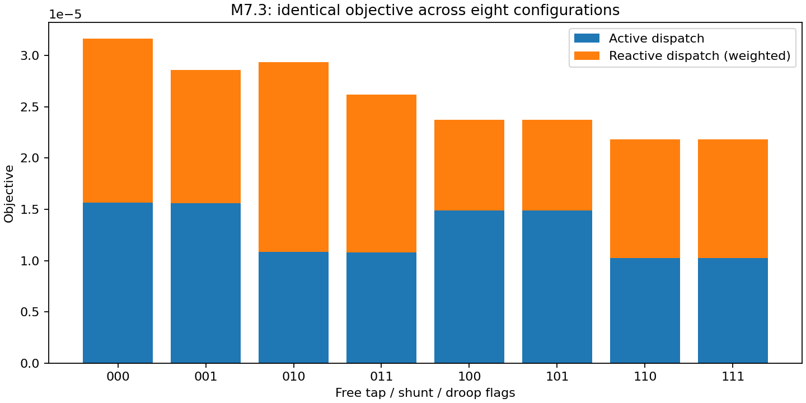
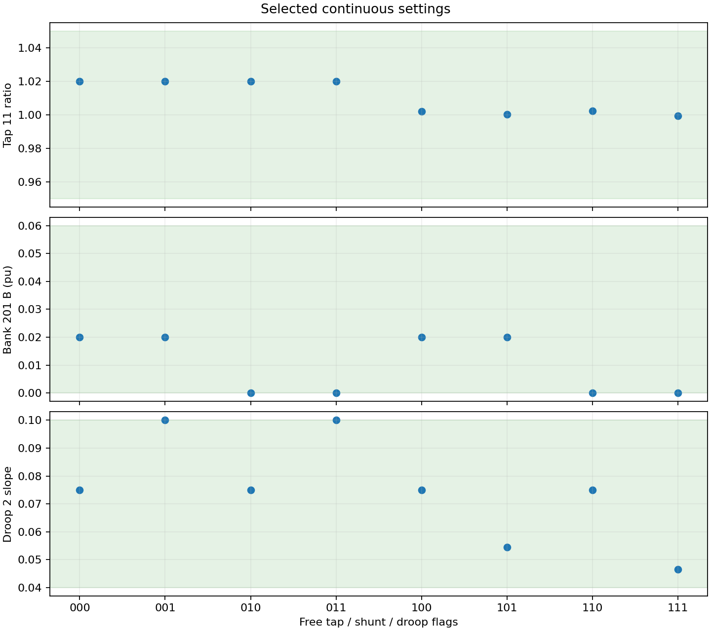
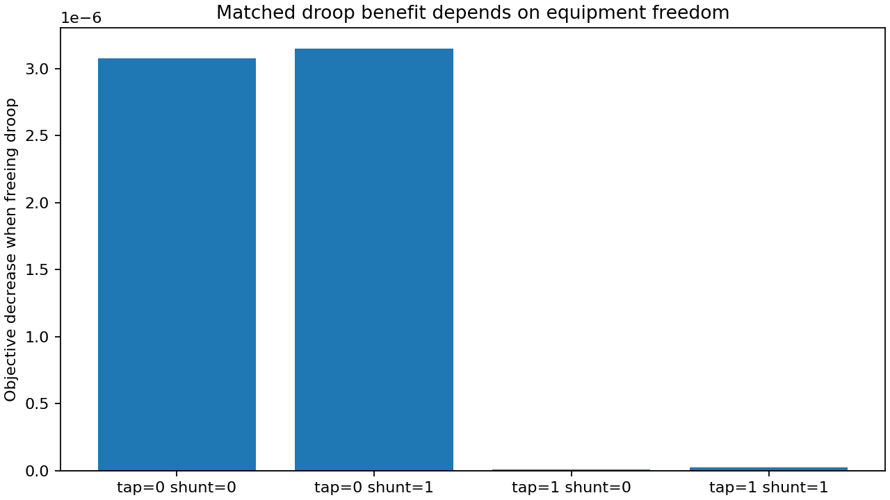

# M7.3 joint equipment and droop design

Acceptance: **PASS**. Synthetic three-bus base-case OPF, 100 MVA. Configuration digits are **tap / shunt / droop**, with 1 free and 0 fixed. Each configuration has two declared starts; every attempt, including failures, is retained in evidence.json. The lowest-objective physically valid run is selected and its spread is reported.

Tap 11 bounds: [0.95,1.05]; simple capacitor bank 201 B: [0,0.06] pu with G=0.05B; control 2 slope: [0.04,0.10]. All other equipment and droop settings stay fixed. The bank 202 reactor remains supplied at B=−0.01. Reference and deadband selection are separately covered by regression tests.

| T/S/D | Valid starts | Objective | Tap | B (pu) | Slope | Objective spread | AC residual |
|---|---:|---:|---:|---:|---:|---:|---:|
| 000 | 2/2 | 3.1653126276776447e-5 | 1.02 | 0.02 | 0.075 | 3.4558944247975454e-19 | 1.915134717478395e-15 |
| 001 | 2/2 | 2.8578305530415847e-5 | 1.02 | 0.02 | 0.0999999030203944 | 5.23072031989306e-6 | 8.430756093247282e-16 |
| 010 | 2/2 | 2.935434633975061e-5 | 1.02 | 3.0243163789540878e-5 | 0.075 | 7.982449658479958e-11 | 1.8265020051977388e-10 |
| 011 | 2/2 | 2.62077110193198e-5 | 1.02 | 1.0617554025605165e-7 | 0.09999990114735562 | 1.7700518164021398e-10 | 1.0341727474383333e-13 |
| 100 | 2/2 | 2.3721099015366167e-5 | 1.002057994305572 | 0.02 | 0.075 | 2.783350264677631e-17 | 1.4602208331382371e-13 |
| 101 | 2/2 | 2.3712396803841378e-5 | 1.0001473768379143 | 0.02 | 0.05446868478947404 | 1.3786308249510992e-17 | 1.1366740881868509e-12 |
| 110 | 2/2 | 2.1830840598066285e-5 | 1.002401314717557 | 4.454692019892765e-5 | 0.075 | 6.579896683392948e-11 | 7.189331518997477e-9 |
| 111 | 2/2 | 2.180809661119947e-5 | 0.9993228214932653 | 1.4809875521302984e-7 | 0.04644218245839616 | 2.098927314505422e-15 | 1.709432595475846e-11 |

| T/S/D | Active-dispatch objective | Reactive-dispatch objective | Branch loss | Shunt consumption | Tap / B / slope spread |
|---|---:|---:|---:|---:|---|
| 000 | 1.5659944448968614e-5 | 1.5993181827803107e-5 | 0.002262357295382489 | 0.003334058921117256 | 0.0 / 0.0 / 0.0 |
| 001 | 1.5579818272933147e-5 | 1.2998487257463764e-5 | 0.002256892753880746 | 0.0033251884204285294 | 0.0 / 0.0 / 0.05999455128233426 |
| 010 | 1.088287057091968e-5 | 1.8471475768815478e-5 | 0.002287728486752849 | 0.0023776469157028163 | 0.0 / 9.748414649677403e-7 / 0.0 |
| 011 | 1.0819024449221774e-5 | 1.538868657009905e-5 | 0.002282337739067053 | 0.0023693332751444584 | 0.0 / 2.083093181686069e-6 / 4.4994639958328975e-9 |
| 100 | 1.489327138523782e-5 | 8.82782763014478e-6 | 0.0021144436453981452 | 0.0033432612540587646 | 0.0 / 0.0 / 0.0 |
| 101 | 1.4900907606249108e-5 | 8.811489197602751e-6 | 0.002110516202045165 | 0.003348587681609807 | 2.3665958082119687e-10 / 0.0 / 2.5301322009729788e-9 |
| 110 | 1.0247786946113837e-5 | 1.1583053651929718e-5 | 0.00214142293753139 | 0.0023857820270099693 | 1.8787930100572225e-8 / 1.0609607456616224e-6 / 0.0 |
| 111 | 1.0240857433546958e-5 | 1.1567239177664527e-5 | 0.0021356557466974957 | 0.0023900171170787455 | 3.0542696149993276e-8 / 1.9417807008442467e-13 / 2.7519700680073145e-7 |

| Equipment freedom held fixed | Objective improvement from freeing droop |
|---|---:|
| tap=0 shunt=0 | 3.074820746360599e-6 |
| tap=0 shunt=1 | 3.1466353204308093e-6 |
| tap=1 shunt=0 | 8.702211524788678e-9 |
| tap=1 shunt=1 | 2.274398686681446e-8 |

The objective is unchanged: sum of squared active dispatch deviations plus 0.001 times squared reactive deviations. Design penalty is zero in all eight configurations. Losses are metrics, not objective terms. Differences among the four matched droop benefits quantify dependence on equipment freedom; do not add independently measured benefits as though interactions were absent. Similar objectives with differing parameters indicate weak identification on this fixture.

Independent replay checks exact curves and all equipment at solved settings (AC tolerance 1e-6, droop 1e-5). Smooth epsilon is 1e-5. Added freedom must not worsen the best observed objective by more than 1e-8. These are local continuous solutions, not proof of global optimality, legal bank positions, dynamic performance or SCOPF security.

Run `julia --project=. examples/m7_3_joint.jl artifacts/m7_3`, then `python3 examples/plot_m7_3_joint.py artifacts/m7_3` with Matplotlib installed. See [full regression](regression-tests.txt). M9 adds coordinated equipment SCOPF; complex bank optimization remains behind the scaling gate.
