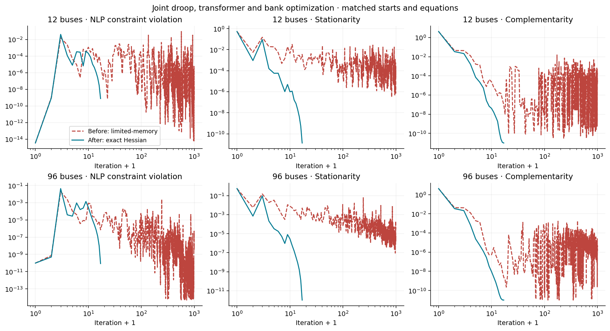
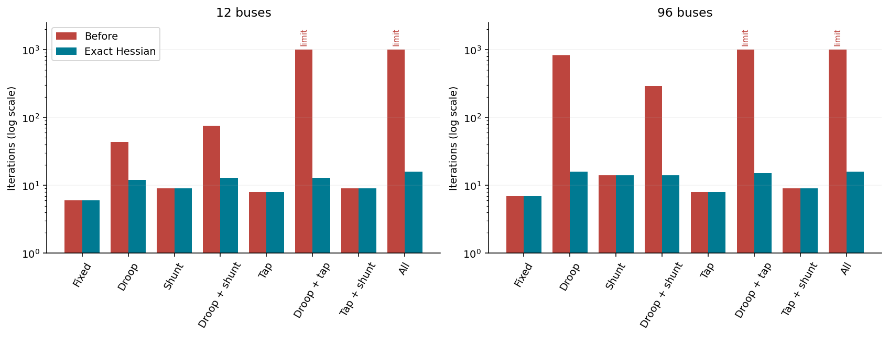
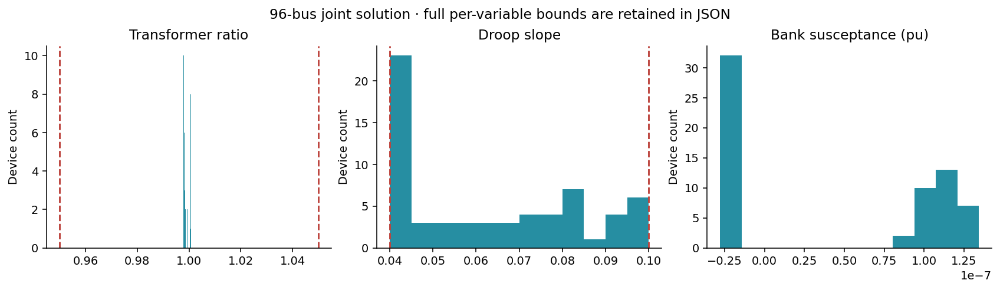

# S1 convergence diagnosis and numerical correction

All eight fixed/free control combinations now converge locally and independently validate at 12 and 96 buses after restoring exact Hessian information. This resolves the reproduced stall on this declared matrix; the full S1 gate remains open.

## Matched experiment

Connected heterogeneous synthetic modules have two droops, one selected transformer and two simple banks per three buses. Each run starts from the same validated fixed-equipment solution for its network size, with supplied design settings. Slope bounds are [0.04, 0.10], ratio bounds [0.95, 1.05], and bank B stays within the legal-count envelope. Reference/deadband settings, dispatch objective, smoothing (1e-6), equipment limits and physical tolerances are unchanged.

Ipopt uses adaptive barrier updates, no bound relaxation, tolerance 1e-8, 1000 iterations and 60 CPU seconds. All original failures remain here; [corrected results](../s1_exact_hessian/summary.json) are separate. The extra scaling experiment multiplies the whole objective by 1000.

| Network | Free families | Before iterations/status | After iterations/status | Before physics/policy | After physics/policy |
|---|---|---|---|---|---|
| 12 | Fixed | 6 / LOCALLY_SOLVED | 6 / LOCALLY_SOLVED | True/True | True/True |
| 12 | Droop | 44 / LOCALLY_SOLVED | 12 / LOCALLY_SOLVED | True/True | True/True |
| 12 | Shunt | 9 / LOCALLY_SOLVED | 9 / LOCALLY_SOLVED | True/True | True/True |
| 12 | Droop + shunt | 75 / LOCALLY_SOLVED | 13 / LOCALLY_SOLVED | True/True | True/True |
| 12 | Tap | 8 / LOCALLY_SOLVED | 8 / LOCALLY_SOLVED | True/True | True/True |
| 12 | Droop + tap | 1000 / ITERATION_LIMIT | 13 / LOCALLY_SOLVED | True/True | True/True |
| 12 | Tap + shunt | 9 / LOCALLY_SOLVED | 9 / LOCALLY_SOLVED | True/True | True/True |
| 12 | All | 1000 / ITERATION_LIMIT | 16 / LOCALLY_SOLVED | True/True | True/True |
| 96 | Fixed | 7 / LOCALLY_SOLVED | 7 / LOCALLY_SOLVED | True/True | True/True |
| 96 | Droop | 818 / ALMOST_LOCALLY_SOLVED | 16 / LOCALLY_SOLVED | True/True | True/True |
| 96 | Shunt | 14 / LOCALLY_SOLVED | 14 / LOCALLY_SOLVED | True/True | True/True |
| 96 | Droop + shunt | 290 / LOCALLY_SOLVED | 14 / LOCALLY_SOLVED | True/True | True/True |
| 96 | Tap | 8 / LOCALLY_SOLVED | 8 / LOCALLY_SOLVED | True/True | True/True |
| 96 | Droop + tap | 1000 / ITERATION_LIMIT | 15 / LOCALLY_SOLVED | True/True | True/True |
| 96 | Tap + shunt | 9 / LOCALLY_SOLVED | 9 / LOCALLY_SOLVED | True/True | True/True |
| 96 | All | 1000 / ITERATION_LIMIT | 16 / LOCALLY_SOLVED | True/True | True/True |

## Diagnosis

The failing pair was optimized tap plus droop slope; free banks were not necessary for failure. Both original joint iterates passed independent AC, exact-droop, limit and policy checks, but stationarity/complementarity remained too large. The original 96-bus droop-only run reached acceptable-level stopping (ALMOST_LOCALLY_SOLVED), distinguished here from full convergence.

The five-argument registered droop function removed Hessian availability from the legacy evaluator. Ipopt therefore selected limited-memory approximation. The fixed-droop model retained Hessians. The [first-order check](../s1_conditioning/first-order-before.log) found no errors at its tested points; this is not an exhaustive derivative proof.

The corrected builder expresses the identical smoothed curve as two scalar softplus operators and ordinary arithmetic, allowing exact second derivatives. Equipment equations, smoothing, objective, ratings and bounds are unchanged. Regression tests compare values and finite-difference derivatives around deadband edges and saturation knees. See [JuMP derivative registration](https://jump.dev/JuMP.jl/stable/manual/nlp/).

| Buses | Encoding | Iterations | NLP constraint violation | Stationarity | Complementarity | Original objective |
|---|---|---|---|---|---|---|
| 12 | Before | 1000 | 2.101e-08 | 1.065e-04 | 2.723e-05 | 0.0009472918849 |
| 12 | Exact Hessian | 16 | 7.754e-10 | 1.327e-11 | 1.004e-11 | 0.0009472698167 |
| 96 | Before | 1000 | 1.159e-08 | 5.817e-06 | 5.204e-06 | 0.0007223235068 |
| 96 | Exact Hessian | 16 | 8.565e-11 | 1.053e-12 | 1.000e-11 | 0.0007223009061 |

Traces retain native unscaled residuals and scaled callback measures, barrier parameter, step lengths, line-search trials, regularization and restoration flags. Bound snapshots include each variable's value and limits. Proximity within 1e-6 is a diagnostic flag, not a multiplier-based active-set certificate. New runs also record model size and derivative availability.

Whole-objective scaling did not rescue the original joint runs; its 12-bus result also failed physics validation. Both scaled runs pass after the derivative correction. Scaling is not promoted as the fix. Residuals must be interpreted with their saved scaling options; reported objectives retain original units.

## Reproduction and limits

Before data use the M7 droop encoding (commit 069bd80) plus the S1 measurement hook. Current code reproduces the corrected encoding. From the repository root:

    julia --project=. examples/s1_convergence.jl artifacts/s1_exact_hessian
    julia --project=. examples/s1_derivatives.jl artifacts/s1_conditioning_after
    julia --project=. examples/s1_public_baseline.jl artifacts/s1_public118
    python examples/plot_s1.py

Elapsed time includes construction, solve and extraction and may include compilation. Julia allocated bytes are cumulative allocation, not peak memory. These results establish neither a scaling law nor a performance budget. Earlier phase/resource measurements in scaling_robustness remain historical evidence.

S1 remains open for independently varied free-device counts, broader conditioning/start/solver comparisons, public controller overlays, 300-bus validation and performance acceptance. The [118-bus fixed-equipment baseline](../s1_public118/report.md) is ready. M9 stays downstream of S1.
