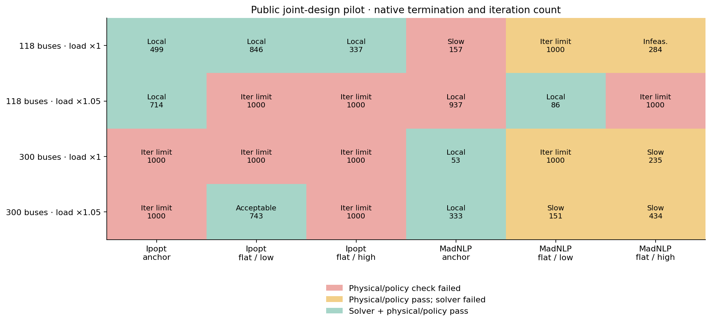
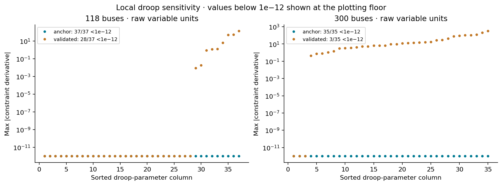

# S1 robustness and public-network checkpoint

**S1 remains open.** All 35 synthetic robustness attempts pass. The initial public matrix passes 13/30 attempts, including both fixed-equipment baselines and validated joint solutions at each network/load combination. Recovery is mixed; no solver configuration is promoted as universally reliable.

## Study design and numerical budget

The 12-/96-bus synthetic cases reuse the heterogeneous connected modules. At 96 buses, one family's free count changes while the other two remain fully free: slopes 0/1/16/32/64, taps 0/1/8/16/32, and banks 0/1/16/32/64. Three starts are used with both solvers: the validated fixed-equipment state with supplied settings, or flat voltage/angle with design settings at 20% or 80% of their allowed intervals.

Every pilot attempt has a 1000-iteration budget, tolerance 1e-8 and zero bound relaxation. Ipopt uses adaptive barrier updates and a 60 CPU-second limit; MadNLP retains its default monotone barrier and a 60 wall-second limit. These are deliberately recorded configurations, not identical algorithms/time-limit semantics. Solver-native MadNLP residuals are scaled; they are not presented as equivalent to Ipopt's unscaled residuals. Independent physical checks use the same unchanged tolerances.

### Explicit public overlays

| Network | Buses / generators / branches | Droops | Candidate tap controls | Added simple banks |
|---|---|---|---|---|
| IEEE 118 | 118 / 54 / 186 | 37 | 11 | 12 |
| IEEE 300 | 300 / 69 / 411 | 35 | 129 | 32 |

Unmodified PGLib v23.07 source files and SHA-256 provenance are retained under test/data/pglib/v23.07. Both fixed-equipment imports solve and validate. Costs and branch angle constraints remain outside the adapter; objective values are project dispatch deviation, not PGLib economic optima. Source branch angle limits are audited separately on physically valid results.

The overlays are synthetic, not measured equipment data. Available generators with more than 1e-3 pu Q headroom at the baseline receive a droop whose q0 and voltage reference reproduce that baseline; half-deadbands are 0.005 pu and nominal slope is 0.04/(Qmax−Qmin), with slope bounds 0.5–2 times nominal. Exclusions are listed. Tap candidates are branches with explicit nonzero source TAP, with an assumed ±5% range; source TAP alone does not establish actual adjustable hardware or its limits. Largest positive-Q load buses receive alternating capacitor/reactor banks with B step ±0.01 pu, G=0, counts 0:4 and initially zero admittance. Original branches, aggregate fixed shunts, generator bounds and dispatch references are unchanged.

Nominal and 1.05-times P/Q demand are tested without recentering droops. Full original/overlay/stressed studies, numerical states, policy starts, designs, traces and failures are retained. Baseline anchoring creates a known feasible nominal witness; it is not a test of an arbitrary real operating point or evidence that every start is numerically reliable.

## Public operating-point checks

Fixed-equipment AC residuals are 1.28e-9 pu (118 buses) and 1.04e-9 pu (300 buses). Every validated pilot/recovery/polishing outcome passes the separate source-angle audit with zero violation. The selected 300-bus joint profile is the one valid nominal result in the initial pilot, not a certified best solution.

## Synthetic robustness

| Network | Solver | Start | Iterations | Objective | Physical/policy valid |
|---|---|---|---|---|---|
| 12 | ipopt | feasible | 16 | 0.0009472698167 | True/True |
| 12 | ipopt | flat_low | 26 | 0.0009472698167 | True/True |
| 12 | ipopt | flat_high | 26 | 0.0009472698167 | True/True |
| 12 | madnlp | feasible | 14 | 0.0009472969314 | True/True |
| 12 | madnlp | flat_low | 23 | 0.0009472969314 | True/True |
| 12 | madnlp | flat_high | 29 | 0.0009472969314 | True/True |
| 96 | ipopt | feasible | 16 | 0.0007223009061 | True/True |
| 96 | ipopt | flat_low | 26 | 0.0007223009061 | True/True |
| 96 | ipopt | flat_high | 21 | 0.0007223009063 | True/True |
| 96 | madnlp | feasible | 15 | 0.0007225224088 | True/True |
| 96 | madnlp | flat_low | 26 | 0.0007225224088 | True/True |
| 96 | madnlp | flat_high | 109 | 0.0007225224088 | True/True |

All count sweeps, the three direct smoothing probes, the three continuation stages and both staged-release solves pass. A small solver-dependent objective difference remains; passing tolerances do not imply identical settings or a unique design.

## Public convergence and design variation

| Network | Load | Valid joint attempts / 6 | Best / worst valid objective | Max slope / tap / bank spread (% of allowed interval) |
|---|---|---|---|---|
| 118 | 1 | 3/6 | 7.59323498 / 7.59402003 | 99.79 / 14.20 / 4.18 |
| 118 | 1.05 | 2/6 | 11.3875076 / 12.1245612 | 63.04 / 60.98 / 51.82 |
| 300 | 1 | 1/6 | 96.3297805 / 96.3297805 | not estimable / not estimable / not estimable |
| 300 | 1.05 | 2/6 | 140.954185 / 141.404724 | 99.95 / 74.26 / 0.00 |

Spreads use validated outcomes only; every failed attempt is retained in the matrix and detailed tables. With one valid attempt, spread cannot be estimated. Lower objective values from infeasible or failed solves are not ranked as successful designs. Material objective variation, particularly under increased demand, prevents treating solver outputs as interchangeable research optima.

## Recovery and smoothing

Reducing bound_push and bound_frac from the defaults to 1e-8 preserves the initial feasible point more closely. For nominal Ipopt, initial unscaled constraint violation changes from 0.2103 to 1.96e-7 at 118 buses and from 0.7034 to 3.51e-7 at 300 buses. The 300-bus small-push attempt validates with acceptable-level termination in 388 iterations. These are initialization options; no physical bounds change.

Coarse smoothing can solve numerically while failing exact-droop validation. A conservative error budget follows from 0 ≤ softplusε(z)−max(z,0) ≤ ε log(2) and the 1-Lipschitz clipping map. With minimum allowed slope m and Q scale qscale, the smooth/exact response error is bounded by 2 ε log(2) (1/m + qscale). Selecting ε so this bound is at most 1e-6 leaves room within the existing 1e-5 exact-droop tolerance; NLP residuals still require independent validation. The public global ε values are about 7.14e-10 and 7.17e-10. This is conservative and can worsen numerical stiffness; it is not a new default or a convergence guarantee.

Continuation uses prior solver-converged, policy-valid states, even if a coarse stage fails exact replay; final stages must pass all physical checks. Unsuccessful intermediate states are retained but not silently accepted. Demand continuation uses steps 1.025 and 1.05 with the installed controller references unchanged. Cross-solver polishing starts from the best validated original-matrix point and is explicitly dependent on that source attempt.

### Polishing attempts

| Attempt | Source | Status | Iterations | Valid |
|---|---|---|---|---|
| public118-load1.0-ipopt-polish | public118-load1.0-ipopt-flat_high | ITERATION_LIMIT | 1000 | False |
| public118-load1.0-madnlp-polish | public118-load1.0-ipopt-flat_high | ITERATION_LIMIT | 1000 | False |
| public118-load1.05-ipopt-polish | public118-load1.05-ipopt-anchor | LOCALLY_SOLVED | 89 | True |
| public118-load1.05-madnlp-polish | public118-load1.05-ipopt-anchor | ITERATION_LIMIT | 1000 | False |
| public300-load1.0-ipopt-polish | public300-load1.0-madnlp-anchor | ITERATION_LIMIT | 1000 | False |
| public300-load1.0-madnlp-polish | public300-load1.0-madnlp-anchor | LOCALLY_SOLVED | 27 | True |
| public300-load1.05-ipopt-polish | public300-load1.05-ipopt-flat_low | ITERATION_LIMIT | 1000 | False |
| public300-load1.05-madnlp-polish | public300-load1.05-ipopt-flat_low | LOCALLY_SOLVED | 93 | True |

## Derivative-scale findings

| Network | Point | Droop columns below 1e-12 | Nonzero row-norm range |
|---|---|---|---|
| 118 | anchor | 37/37 | 2.895e-01–9.329e+02 |
| 118 | validated | 28/37 | 3.215e-01–1.000e+03 |
| 300 | anchor | 35/35 | 2.069e-03–3.420e+04 |
| 300 | validated | 3/35 | 2.131e-03–3.283e+04 |

These are raw nonlinear-constraint Jacobian scales, not a KKT condition number or a proof of singularity. Locally weak droop columns are expected inside deadbands or saturation; the current objective has no direct droop-setting penalty. Parameter variation must therefore be reported alongside objective and feasibility. Adding a penalty would change the research problem and has not been done.

## Decision and next work

The experimental infrastructure and public fixtures are delivered, but the reliability gate is not passed. Next S1 work should test equivalent normalization of droop design variables and residual scales, preservation of primal/dual warm starts, and an explicit failure-aware restart policy. Keep the current failures as regression targets and evaluate any proposed numerical representation against unchanged equations/objective and exact physical validation. Do not begin M9 on the assumption that public joint optimization is already reliable.

No practical performance acceptance budget is declared from these pilot data. Timings include diagnostic callbacks and sometimes compilation; jobs may overlap on the host. Julia allocation is cumulative allocation, and process_lifetime_peak_rss_bytes is a whole-process high-water mark, not per-case memory. An isolated, warmed acceptance run is still required after convergence is reliable.

## Complete attempt ledger

### s1_robustness

| Attempt | Status | Valid | Iterations | Build / solve / extraction / validation seconds |
|---|---|---|---|---|
| [n4-ipopt-feasible](../s1_robustness/n4-ipopt-feasible-diagnostics.json) | LOCALLY_SOLVED | True | 16 | 4.555 / 5.296 / 1 / 1.935 |
| [n4-ipopt-flat_low](../s1_robustness/n4-ipopt-flat_low-diagnostics.json) | LOCALLY_SOLVED | True | 26 | 0.004151 / 0.02569 / 0.0006427 / 0.00196 |
| [n4-ipopt-flat_high](../s1_robustness/n4-ipopt-flat_high-diagnostics.json) | LOCALLY_SOLVED | True | 26 | 0.002336 / 0.02787 / 0.0004309 / 0.002059 |
| [n4-madnlp-feasible](../s1_robustness/n4-madnlp-feasible-diagnostics.json) | LOCALLY_SOLVED | True | 14 | 2.369 / 10.7 / 0.4439 / 0.00161 |
| [n4-madnlp-flat_low](../s1_robustness/n4-madnlp-flat_low-diagnostics.json) | LOCALLY_SOLVED | True | 23 | 0.001996 / 0.01206 / 0.0003907 / 0.001565 |
| [n4-madnlp-flat_high](../s1_robustness/n4-madnlp-flat_high-diagnostics.json) | LOCALLY_SOLVED | True | 29 | 0.06181 / 0.01509 / 0.0003772 / 0.001548 |
| [n32-ipopt-feasible](../s1_robustness/n32-ipopt-feasible-diagnostics.json) | LOCALLY_SOLVED | True | 16 | 0.009439 / 0.1448 / 0.002372 / 0.07107 |
| [n32-ipopt-flat_low](../s1_robustness/n32-ipopt-flat_low-diagnostics.json) | LOCALLY_SOLVED | True | 26 | 0.01066 / 0.139 / 0.002264 / 0.06252 |
| [n32-ipopt-flat_high](../s1_robustness/n32-ipopt-flat_high-diagnostics.json) | LOCALLY_SOLVED | True | 21 | 0.008786 / 0.1077 / 0.002007 / 0.06307 |
| [n32-madnlp-feasible](../s1_robustness/n32-madnlp-feasible-diagnostics.json) | LOCALLY_SOLVED | True | 15 | 0.00878 / 0.06627 / 0.002673 / 0.1016 |
| [n32-madnlp-flat_low](../s1_robustness/n32-madnlp-flat_low-diagnostics.json) | LOCALLY_SOLVED | True | 26 | 0.008645 / 0.09988 / 0.002629 / 0.06128 |
| [n32-madnlp-flat_high](../s1_robustness/n32-madnlp-flat_high-diagnostics.json) | LOCALLY_SOLVED | True | 109 | 0.008862 / 0.5407 / 0.002727 / 0.07652 |
| [count-droop_controls-0](../s1_robustness/count-droop_controls-0-diagnostics.json) | LOCALLY_SOLVED | True | 9 | 0.1389 / 0.08512 / 0.001647 / 0.003792 |
| [count-droop_controls-1](../s1_robustness/count-droop_controls-1-diagnostics.json) | LOCALLY_SOLVED | True | 11 | 0.03259 / 0.06002 / 0.004106 / 0.003831 |
| [count-droop_controls-16](../s1_robustness/count-droop_controls-16-diagnostics.json) | LOCALLY_SOLVED | True | 14 | 0.009406 / 0.07277 / 0.00188 / 0.01888 |
| [count-droop_controls-32](../s1_robustness/count-droop_controls-32-diagnostics.json) | LOCALLY_SOLVED | True | 15 | 0.008055 / 0.07845 / 0.002026 / 0.03287 |
| [count-droop_controls-64](../s1_robustness/count-droop_controls-64-diagnostics.json) | LOCALLY_SOLVED | True | 16 | 0.009955 / 0.0851 / 0.001988 / 0.06131 |
| [count-tap_controls-0](../s1_robustness/count-tap_controls-0-diagnostics.json) | LOCALLY_SOLVED | True | 14 | 0.008702 / 0.07403 / 0.002165 / 0.1065 |
| [count-tap_controls-1](../s1_robustness/count-tap_controls-1-diagnostics.json) | LOCALLY_SOLVED | True | 16 | 0.009322 / 0.07724 / 0.001868 / 0.06136 |
| [count-tap_controls-8](../s1_robustness/count-tap_controls-8-diagnostics.json) | LOCALLY_SOLVED | True | 24 | 0.009164 / 0.114 / 0.001894 / 0.06194 |
| [count-tap_controls-16](../s1_robustness/count-tap_controls-16-diagnostics.json) | LOCALLY_SOLVED | True | 20 | 0.009079 / 0.09793 / 0.002053 / 0.06362 |
| [count-tap_controls-32](../s1_robustness/count-tap_controls-32-diagnostics.json) | LOCALLY_SOLVED | True | 16 | 0.009288 / 0.08289 / 0.002246 / 0.09991 |
| [count-shunt_controls-0](../s1_robustness/count-shunt_controls-0-diagnostics.json) | LOCALLY_SOLVED | True | 15 | 0.009412 / 0.08371 / 0.002062 / 0.06509 |
| [count-shunt_controls-1](../s1_robustness/count-shunt_controls-1-diagnostics.json) | LOCALLY_SOLVED | True | 15 | 0.008744 / 0.08434 / 0.001779 / 0.06427 |
| [count-shunt_controls-16](../s1_robustness/count-shunt_controls-16-diagnostics.json) | LOCALLY_SOLVED | True | 16 | 0.01003 / 0.08832 / 0.002229 / 0.06456 |
| [count-shunt_controls-32](../s1_robustness/count-shunt_controls-32-diagnostics.json) | LOCALLY_SOLVED | True | 15 | 0.009423 / 0.09525 / 0.00227 / 0.1219 |
| [count-shunt_controls-64](../s1_robustness/count-shunt_controls-64-diagnostics.json) | LOCALLY_SOLVED | True | 16 | 0.00974 / 0.0902 / 0.001987 / 0.06354 |
| [smoothing-0.0001](../s1_robustness/smoothing-0.0001-diagnostics.json) | LOCALLY_SOLVED | True | 20 | 0.01148 / 0.1072 / 0.002074 / 0.06004 |
| [smoothing-1.0e-5](../s1_robustness/smoothing-1.0e-5-diagnostics.json) | LOCALLY_SOLVED | True | 16 | 0.009978 / 0.08769 / 0.002228 / 0.06121 |
| [smoothing-1.0e-7](../s1_robustness/smoothing-1.0e-7-diagnostics.json) | LOCALLY_SOLVED | True | 16 | 0.0107 / 0.08367 / 0.002256 / 0.1019 |
| [continuation-0.0001](../s1_robustness/continuation-0.0001-diagnostics.json) | LOCALLY_SOLVED | True | 20 | 0.01106 / 0.189 / 0.002818 / 0.1032 |
| [continuation-1.0e-5](../s1_robustness/continuation-1.0e-5-diagnostics.json) | LOCALLY_SOLVED | True | 16 | 0.01108 / 0.09256 / 0.002348 / 0.06887 |
| [continuation-1.0e-6](../s1_robustness/continuation-1.0e-6-diagnostics.json) | LOCALLY_SOLVED | True | 16 | 0.01105 / 0.08849 / 0.002215 / 0.06752 |
| [staged-droop](../s1_robustness/staged-droop-diagnostics.json) | LOCALLY_SOLVED | True | 16 | 0.00986 / 0.1318 / 0.001894 / 0.06178 |
| [staged-joint](../s1_robustness/staged-joint-diagnostics.json) | LOCALLY_SOLVED | True | 15 | 0.009146 / 0.08051 / 0.00201 / 0.08774 |

### s1_public_controls

| Attempt | Status | Valid | Iterations | Build / solve / extraction / validation seconds |
|---|---|---|---|---|
| [public118-baseline](../s1_public_controls/public118-baseline-diagnostics.json) | LOCALLY_SOLVED | True | 21 | 3.794 / 5.166 / 0.4769 / 1.111 |
| [public118-load1.0-ipopt-anchor](../s1_public_controls/public118-load1.0-ipopt-anchor-diagnostics.json) | LOCALLY_SOLVED | True | 499 | 0.763 / 3.932 / 0.09258 / 0.1016 |
| [public118-load1.0-ipopt-flat_low](../s1_public_controls/public118-load1.0-ipopt-flat_low-diagnostics.json) | LOCALLY_SOLVED | True | 846 | 0.009342 / 6.996 / 0.001741 / 0.04286 |
| [public118-load1.0-ipopt-flat_high](../s1_public_controls/public118-load1.0-ipopt-flat_high-diagnostics.json) | LOCALLY_SOLVED | True | 337 | 0.01117 / 3.032 / 0.001797 / 0.04336 |
| [public118-load1.0-madnlp-anchor](../s1_public_controls/public118-load1.0-madnlp-anchor-diagnostics.json) | SLOW_PROGRESS | False | 157 | 2.168 / 12.08 / 0.3931 / 0.03994 |
| [public118-load1.0-madnlp-flat_low](../s1_public_controls/public118-load1.0-madnlp-flat_low-diagnostics.json) | ITERATION_LIMIT | False | 1000 | 0.0132 / 11.24 / 0.0053 / 0.104 |
| [public118-load1.0-madnlp-flat_high](../s1_public_controls/public118-load1.0-madnlp-flat_high-diagnostics.json) | LOCALLY_INFEASIBLE | False | 284 | 0.01609 / 3.039 / 0.003339 / 0.06212 |
| [public118-load1.05-ipopt-anchor](../s1_public_controls/public118-load1.05-ipopt-anchor-diagnostics.json) | LOCALLY_SOLVED | True | 714 | 0.01469 / 7.45 / 0.001871 / 0.04487 |
| [public118-load1.05-ipopt-flat_low](../s1_public_controls/public118-load1.05-ipopt-flat_low-diagnostics.json) | ITERATION_LIMIT | False | 1000 | 0.01136 / 11.83 / 0.07629 / 0.06519 |
| [public118-load1.05-ipopt-flat_high](../s1_public_controls/public118-load1.05-ipopt-flat_high-diagnostics.json) | ITERATION_LIMIT | False | 1000 | 0.01899 / 9.203 / 0.002168 / 0.05363 |
| [public118-load1.05-madnlp-anchor](../s1_public_controls/public118-load1.05-madnlp-anchor-diagnostics.json) | LOCALLY_SOLVED | False | 937 | 0.01283 / 12.76 / 0.002216 / 0.06219 |
| [public118-load1.05-madnlp-flat_low](../s1_public_controls/public118-load1.05-madnlp-flat_low-diagnostics.json) | LOCALLY_SOLVED | True | 86 | 0.01345 / 0.6351 / 0.002254 / 0.05212 |
| [public118-load1.05-madnlp-flat_high](../s1_public_controls/public118-load1.05-madnlp-flat_high-diagnostics.json) | ITERATION_LIMIT | False | 1000 | 0.01309 / 12.98 / 0.002664 / 0.05177 |
| [public118-count0.0](../s1_public_controls/public118-count0.0-diagnostics.json) | LOCALLY_SOLVED | True | 15 | 0.1909 / 0.1711 / 0.001981 / 0.03916 |
| [public118-count0.5](../s1_public_controls/public118-count0.5-diagnostics.json) | LOCALLY_SOLVED | True | 187 | 0.0114 / 1.608 / 0.001811 / 0.02741 |
| [public300-baseline](../s1_public_controls/public300-baseline-diagnostics.json) | LOCALLY_SOLVED | True | 26 | 0.0248 / 0.5301 / 0.004164 / 0.007437 |
| [public300-load1.0-ipopt-anchor](../s1_public_controls/public300-load1.0-ipopt-anchor-diagnostics.json) | ITERATION_LIMIT | False | 1000 | 0.02593 / 29.95 / 0.006814 / 0.1187 |
| [public300-load1.0-ipopt-flat_low](../s1_public_controls/public300-load1.0-ipopt-flat_low-diagnostics.json) | ITERATION_LIMIT | False | 1000 | 0.03218 / 23.74 / 0.004499 / 0.09782 |
| [public300-load1.0-ipopt-flat_high](../s1_public_controls/public300-load1.0-ipopt-flat_high-diagnostics.json) | ITERATION_LIMIT | False | 1000 | 0.02385 / 24.59 / 0.006833 / 0.09608 |
| [public300-load1.0-madnlp-anchor](../s1_public_controls/public300-load1.0-madnlp-anchor-diagnostics.json) | LOCALLY_SOLVED | True | 53 | 0.4197 / 0.9654 / 0.004309 / 0.09062 |
| [public300-load1.0-madnlp-flat_low](../s1_public_controls/public300-load1.0-madnlp-flat_low-diagnostics.json) | ITERATION_LIMIT | False | 1000 | 0.0272 / 42.66 / 0.004468 / 0.09858 |
| [public300-load1.0-madnlp-flat_high](../s1_public_controls/public300-load1.0-madnlp-flat_high-diagnostics.json) | SLOW_PROGRESS | False | 235 | 0.02875 / 4.008 / 0.004604 / 0.1008 |
| [public300-load1.05-ipopt-anchor](../s1_public_controls/public300-load1.05-ipopt-anchor-diagnostics.json) | ITERATION_LIMIT | False | 1000 | 0.02193 / 23.83 / 0.004756 / 0.11 |
| [public300-load1.05-ipopt-flat_low](../s1_public_controls/public300-load1.05-ipopt-flat_low-diagnostics.json) | ALMOST_LOCALLY_SOLVED | True | 743 | 0.04492 / 19.97 / 0.004648 / 0.1143 |
| [public300-load1.05-ipopt-flat_high](../s1_public_controls/public300-load1.05-ipopt-flat_high-diagnostics.json) | ITERATION_LIMIT | False | 1000 | 0.03606 / 39.38 / 0.008414 / 0.1408 |
| [public300-load1.05-madnlp-anchor](../s1_public_controls/public300-load1.05-madnlp-anchor-diagnostics.json) | LOCALLY_SOLVED | True | 333 | 0.1087 / 10.39 / 0.006127 / 0.2164 |
| [public300-load1.05-madnlp-flat_low](../s1_public_controls/public300-load1.05-madnlp-flat_low-diagnostics.json) | SLOW_PROGRESS | False | 151 | 0.03085 / 3.472 / 0.006625 / 0.1153 |
| [public300-load1.05-madnlp-flat_high](../s1_public_controls/public300-load1.05-madnlp-flat_high-diagnostics.json) | SLOW_PROGRESS | False | 434 | 0.05518 / 33.43 / 0.01034 / 0.1681 |
| [public300-count0.0](../s1_public_controls/public300-count0.0-diagnostics.json) | LOCALLY_SOLVED | True | 22 | 0.05439 / 0.6801 / 0.005016 / 0.01568 |
| [public300-count0.5](../s1_public_controls/public300-count0.5-diagnostics.json) | ITERATION_LIMIT | False | 1000 | 0.04077 / 32.46 / 0.01248 / 0.121 |

### s1_public_recovery

| Attempt | Status | Valid | Iterations | Build / solve / extraction / validation seconds |
|---|---|---|---|---|
| [public118-ipopt-smallpush](../s1_public_recovery/public118-ipopt-smallpush-diagnostics.json) | LOCALLY_SOLVED | True | 465 | 6.918 / 14.23 / 0.888 / 0.7121 |
| [public118-ipopt-cont-0.0001](../s1_public_recovery/public118-ipopt-cont-0.0001-diagnostics.json) | LOCALLY_SOLVED | False | 199 | 0.01702 / 2.179 / 0.002871 / 0.0607 |
| [public118-ipopt-cont-1.0e-5](../s1_public_recovery/public118-ipopt-cont-1.0e-5-diagnostics.json) | ITERATION_LIMIT | False | 1000 | 0.01619 / 12.77 / 0.1218 / 0.07998 |
| [public118-ipopt-cont-1.0e-6](../s1_public_recovery/public118-ipopt-cont-1.0e-6-diagnostics.json) | ITERATION_LIMIT | False | 1000 | 0.03414 / 13.54 / 0.00381 / 0.08787 |
| [public118-ipopt-cont-7.142674709741505e-10](../s1_public_recovery/public118-ipopt-cont-7.142674709741505e-10-diagnostics.json) | ITERATION_LIMIT | False | 1000 | 0.02182 / 19.11 / 0.005528 / 0.08137 |
| [public118-ipopt-load-1.025](../s1_public_recovery/public118-ipopt-load-1.025-diagnostics.json) | ALMOST_LOCALLY_SOLVED | True | 522 | 0.03029 / 8.638 / 0.003807 / 0.08235 |
| [public118-ipopt-load-1.05](../s1_public_recovery/public118-ipopt-load-1.05-diagnostics.json) | LOCALLY_SOLVED | True | 131 | 0.02176 / 1.964 / 0.004437 / 0.07938 |
| [public118-madnlp-smallpush](../s1_public_recovery/public118-madnlp-smallpush-diagnostics.json) | SLOW_PROGRESS | False | 161 | 4.667 / 24.9 / 0.6773 / 0.07282 |
| [public118-madnlp-cont-0.0001](../s1_public_recovery/public118-madnlp-cont-0.0001-diagnostics.json) | SLOW_PROGRESS | False | 82 | 0.0225 / 1.018 / 0.003489 / 0.07426 |
| [public118-madnlp-cont-1.0e-5](../s1_public_recovery/public118-madnlp-cont-1.0e-5-diagnostics.json) | SLOW_PROGRESS | False | 260 | 0.02048 / 3.117 / 0.0033 / 0.07079 |
| [public118-madnlp-cont-1.0e-6](../s1_public_recovery/public118-madnlp-cont-1.0e-6-diagnostics.json) | SLOW_PROGRESS | False | 161 | 0.01916 / 1.941 / 0.003457 / 0.0719 |
| [public118-madnlp-cont-7.142674709741505e-10](../s1_public_recovery/public118-madnlp-cont-7.142674709741505e-10-diagnostics.json) | ITERATION_LIMIT | False | 1000 | 0.01985 / 16.52 / 0.004961 / 0.09601 |
| [public118-madnlp-load-1.025](../s1_public_recovery/public118-madnlp-load-1.025-diagnostics.json) | ITERATION_LIMIT | False | 1000 | 0.02902 / 11.57 / 0.002871 / 0.05348 |
| [public118-madnlp-load-1.05](../s1_public_recovery/public118-madnlp-load-1.05-diagnostics.json) | LOCALLY_SOLVED | True | 67 | 0.01354 / 0.5403 / 0.002439 / 0.05335 |
| [public300-ipopt-smallpush](../s1_public_recovery/public300-ipopt-smallpush-diagnostics.json) | ALMOST_LOCALLY_SOLVED | True | 388 | 0.03895 / 9.538 / 0.005754 / 0.1033 |
| [public300-ipopt-cont-0.0001](../s1_public_recovery/public300-ipopt-cont-0.0001-diagnostics.json) | LOCALLY_SOLVED | False | 162 | 0.03582 / 3.787 / 0.005321 / 0.1028 |
| [public300-ipopt-cont-1.0e-5](../s1_public_recovery/public300-ipopt-cont-1.0e-5-diagnostics.json) | ALMOST_LOCALLY_SOLVED | False | 776 | 0.05187 / 20.23 / 0.005992 / 0.1027 |
| [public300-ipopt-cont-1.0e-6](../s1_public_recovery/public300-ipopt-cont-1.0e-6-diagnostics.json) | ITERATION_LIMIT | False | 1000 | 0.02721 / 34.47 / 0.006749 / 0.1365 |
| [public300-ipopt-cont-7.170331233918775e-10](../s1_public_recovery/public300-ipopt-cont-7.170331233918775e-10-diagnostics.json) | ITERATION_LIMIT | False | 1000 | 0.04111 / 33.85 / 0.007785 / 0.1313 |
| [public300-ipopt-load-1.025](../s1_public_recovery/public300-ipopt-load-1.025-diagnostics.json) | ITERATION_LIMIT | False | 1000 | 0.05309 / 39.43 / 0.0102 / 0.175 |
| [public300-ipopt-load-1.05](../s1_public_recovery/public300-ipopt-load-1.05-diagnostics.json) | ITERATION_LIMIT | False | 1000 | 0.07247 / 40.57 / 0.01516 / 0.607 |
| [public300-madnlp-smallpush](../s1_public_recovery/public300-madnlp-smallpush-diagnostics.json) | LOCALLY_SOLVED | True | 59 | 0.1211 / 2.692 / 0.01015 / 0.2016 |
| [public300-madnlp-cont-0.0001](../s1_public_recovery/public300-madnlp-cont-0.0001-diagnostics.json) | LOCALLY_SOLVED | False | 93 | 0.08313 / 3.591 / 0.009864 / 0.2199 |
| [public300-madnlp-cont-1.0e-5](../s1_public_recovery/public300-madnlp-cont-1.0e-5-diagnostics.json) | LOCALLY_SOLVED | True | 9 | 0.05317 / 0.8706 / 0.009423 / 0.1746 |
| [public300-madnlp-cont-1.0e-6](../s1_public_recovery/public300-madnlp-cont-1.0e-6-diagnostics.json) | LOCALLY_SOLVED | True | 16 | 0.0497 / 0.7855 / 0.01049 / 0.1806 |
| [public300-madnlp-cont-7.170331233918775e-10](../s1_public_recovery/public300-madnlp-cont-7.170331233918775e-10-diagnostics.json) | LOCALLY_SOLVED | True | 4 | 0.05173 / 0.2592 / 0.01009 / 0.1768 |
| [public300-madnlp-load-1.025](../s1_public_recovery/public300-madnlp-load-1.025-diagnostics.json) | SLOW_PROGRESS | False | 70 | 0.04882 / 2.753 / 0.009886 / 0.1784 |
| [public300-madnlp-load-1.05](../s1_public_recovery/public300-madnlp-load-1.05-diagnostics.json) | LOCALLY_SOLVED | True | 18 | 0.04776 / 0.6518 / 0.01038 / 0.1733 |

### s1_public_polish

| Attempt | Status | Valid | Iterations | Build / solve / extraction / validation seconds |
|---|---|---|---|---|
| [public118-load1.0-ipopt-polish](../s1_public_polish/public118-load1.0-ipopt-polish-diagnostics.json) | ITERATION_LIMIT | False | 1000 | 8.152 / 31.06 / 1.473 / 0.9057 |
| [public118-load1.0-madnlp-polish](../s1_public_polish/public118-load1.0-madnlp-polish-diagnostics.json) | ITERATION_LIMIT | False | 1000 | 3.791 / 54.42 / 0.6859 / 0.06966 |
| [public118-load1.05-ipopt-polish](../s1_public_polish/public118-load1.05-ipopt-polish-diagnostics.json) | LOCALLY_SOLVED | True | 89 | 0.02682 / 1.625 / 0.003842 / 0.0688 |
| [public118-load1.05-madnlp-polish](../s1_public_polish/public118-load1.05-madnlp-polish-diagnostics.json) | ITERATION_LIMIT | False | 1000 | 0.01936 / 18.83 / 0.003414 / 0.08484 |
| [public300-load1.0-ipopt-polish](../s1_public_polish/public300-load1.0-ipopt-polish-diagnostics.json) | ITERATION_LIMIT | False | 1000 | 0.03884 / 59.07 / 0.01137 / 0.1917 |
| [public300-load1.0-madnlp-polish](../s1_public_polish/public300-load1.0-madnlp-polish-diagnostics.json) | LOCALLY_SOLVED | True | 27 | 0.09371 / 1.068 / 0.01091 / 0.1843 |
| [public300-load1.05-ipopt-polish](../s1_public_polish/public300-load1.05-ipopt-polish-diagnostics.json) | ITERATION_LIMIT | False | 1000 | 0.0631 / 46.34 / 0.01012 / 0.1697 |
| [public300-load1.05-madnlp-polish](../s1_public_polish/public300-load1.05-madnlp-polish-diagnostics.json) | LOCALLY_SOLVED | True | 93 | 0.04969 / 3.165 / 0.01094 / 0.1677 |

## Reproduction

    julia --project=. examples/s1_robustness.jl artifacts/s1_robustness
    julia --project=. examples/s1_public_controls.jl artifacts/s1_public_controls
    julia --project=. examples/s1_public_recovery.jl artifacts/s1_public_recovery
    julia --project=. examples/s1_public_polish.jl artifacts/s1_public_polish
    julia --project=. examples/s1_conditioning_scan.jl artifacts/s1_conditioning_public
    python examples/plot_s1_extension.py
