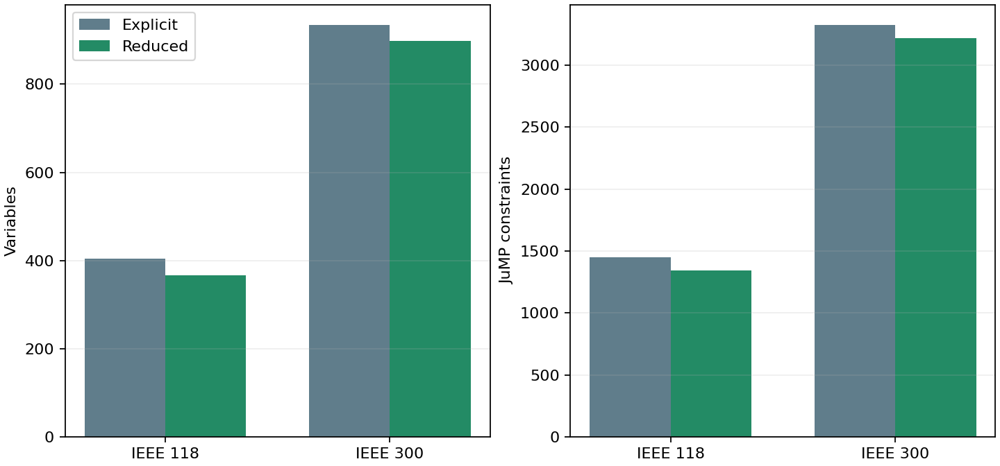
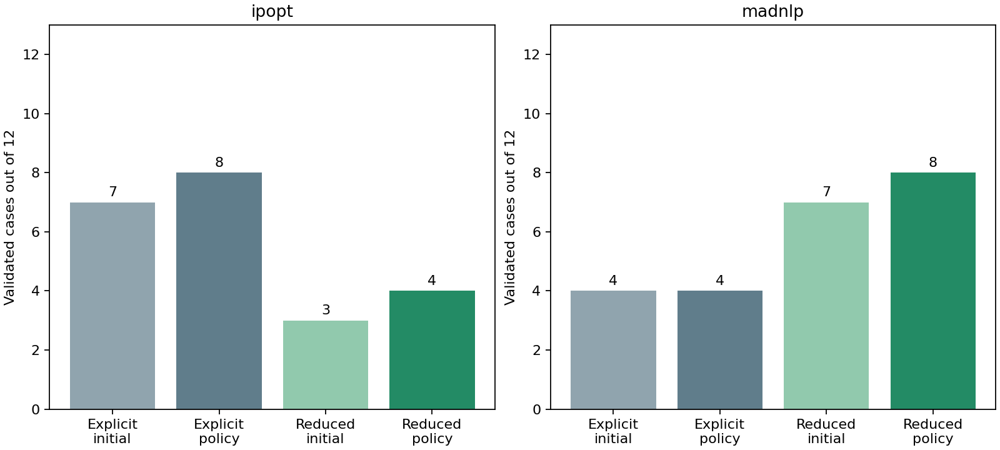

# S1 reduced-space droop-Q formulation

**The reduced formulation is mathematically equivalent on the declared domain, but it is not a general reliability improvement. The explicit formulation remains the default and S1 remains open.**

This checkpoint substitutes each controlled generator's smoothed volt-var response directly into reactive-power balance and the reactive objective term. It is available only through the opt-in `optimize_joint_design(...; droop_q_formulation=:reduced)` path.

## Formulation and equivalence

For an attached available generator, the explicit formulation contains

```math
q_g - \widehat q_g(V_{r(g)},\theta_g)=0,\qquad \underline q_g\le q_g\le\overline q_g.
```

The reduced formulation removes `q_g` and its equality, and uses the smoothed response `\widehat q_g` wherever `q_g` occurs. In particular, the generator contribution in the reactive balance at bus `i` becomes

```math
\sum_{g\in\mathcal G_i^{\rm free}}q_g+\sum_{g\in\mathcal G_i^{\rm droop}}\widehat q_g(V_{r(g)},\theta_g),
```

and a term `c_q q_g^2` becomes `c_q \widehat q_g^2`. The same smoothed curve, controller parameters, network equations and objective coefficients are used. The returned operating point reconstructs each eliminated `q_g` from that curve.

The controller capability interval is validated to lie inside its generator capability interval. Because the smoothed clamp lies inside the controller interval in exact arithmetic, the eliminated generator-Q bounds are implied. Thus every explicit feasible point maps to one reduced feasible point and conversely on the validated domain. Regression tests verify the variable/equality count, endpoint behavior, and matching objective, voltage, Q, tap and shunt results on a small joint case with both solvers.

This is an equivalent physical model but a different numerical problem. It removes the independent `q_g` starting value, changes a quadratic objective representation into a nonlinear expression, and changes the Jacobian/Hessian structure. Restart-context hashes include the formulation so seeds cannot cross modes silently. Independent validation remains unchanged; it checks reconstructed Q values, AC balance, equipment limits and the exact unsmoothed droop curve.

## Structural reduction



| Network | Controlled Q variables removed | Variables, explicit → reduced | Constraints, explicit → reduced |
|---|---:|---:|---:|
| IEEE 118 | 37 | 404 → 367 | 1452 → 1341 |
| IEEE 300 | 35 | 934 → 899 | 3324 → 3219 |

One eliminated controlled Q contributes one variable, its nonlinear droop equality and its two variable-bound constraints to the reported JuMP counts. Unattached and unavailable generator-Q variables remain explicit.

## Frozen public comparison

The comparison uses the same 12 IEEE 118/300 cases per backend, starts, physical coordinates, smoothing width, objective, one-reset policy, 2000-iteration total allowance and 120-second cooperative wall budget as the explicit baseline. Every attempt is retained. Since the two solver matrices ran concurrently, elapsed time is not used to rank formulations.



| Solver | Explicit initial → policy | Reduced initial → policy | Gained / lost | Reduced attempts | Reduced iterations | Iteration / wall overruns |
|---|---|---|---|---:|---:|---|
| ipopt | 7 → 8 | 3 → 4 | 0 / 4 | 21 | 19109 | 0 / 0 |
| madnlp | 4 → 4 | 7 → 8 | 5 / 1 | 15 | 10191 | 0 / 0 |

MadNLP improves from 4/12 to 8/12 accepted cases, gaining five and losing one. Its gains include all three nominal IEEE 118 starts and both additional nominal IEEE 300 starts. The lost case is the stressed IEEE 300 flat-low start. Ipopt falls from 8/12 to 4/12: it retains all nominal IEEE 118 starts and the nominal IEEE 300 anchor, but loses one stressed IEEE 118 case and all three stressed IEEE 300 cases. This backend dependence prevents promotion as a common default.

Two reduced MadNLP attempts terminate locally solved but fail the unchanged physical droop check by small margins: their maximum exact-curve residuals are 1.04e-5 and 1.12e-5 against a 1e-5 tolerance. The reduced equality uses the smoothed response exactly; the validator deliberately compares against the exact curve. Iteration-limit failures primarily retain AC power-balance violations. Solver termination alone therefore remains insufficient for acceptance.

## Paired ledger

| Case | Explicit / reduced valid | Explicit / reduced iterations | Explicit / reduced accepted objective | Reduced final status and physical failure |
|---|---|---|---|---|
| [public118-load1.0-ipopt-anchor](public118-load1.0-ipopt-anchor-policy.json) | True / True | 465 / 1075 | 7.594008 / 7.59402003 | LOCALLY_SOLVED; none |
| [public118-load1.0-ipopt-flat_low](public118-load1.0-ipopt-flat_low-policy.json) | True / True | 846 / 752 | 7.59401684 / 7.59402003 | LOCALLY_SOLVED; none |
| [public118-load1.0-ipopt-flat_high](public118-load1.0-ipopt-flat_high-policy.json) | True / True | 337 / 787 | 7.59323498 / 7.59401684 | LOCALLY_SOLVED; none |
| [public118-load1.05-ipopt-anchor](public118-load1.05-ipopt-anchor-policy.json) | True / False | 320 / 2000 | 11.3874284 / — | ITERATION_LIMIT; power_balance |
| [public118-load1.05-ipopt-flat_low](public118-load1.05-ipopt-flat_low-policy.json) | False / False | 2000 / 2000 | — / — | ITERATION_LIMIT; power_balance |
| [public118-load1.05-ipopt-flat_high](public118-load1.05-ipopt-flat_high-policy.json) | False / False | 2000 / 2000 | — / — | ITERATION_LIMIT; power_balance |
| [public300-load1.0-ipopt-anchor](public300-load1.0-ipopt-anchor-policy.json) | True / True | 388 / 495 | 89.2260441 / 89.4550243 | LOCALLY_SOLVED; none |
| [public300-load1.0-ipopt-flat_low](public300-load1.0-ipopt-flat_low-policy.json) | False / False | 2000 / 2000 | — / — | ITERATION_LIMIT; power_balance |
| [public300-load1.0-ipopt-flat_high](public300-load1.0-ipopt-flat_high-policy.json) | False / False | 2000 / 2000 | — / — | ITERATION_LIMIT; power_balance, droop |
| [public300-load1.05-ipopt-anchor](public300-load1.05-ipopt-anchor-policy.json) | True / False | 1040 / 2000 | 140.953331 / — | ITERATION_LIMIT; power_balance |
| [public300-load1.05-ipopt-flat_low](public300-load1.05-ipopt-flat_low-policy.json) | True / False | 352 / 2000 | 140.954185 / — | ITERATION_LIMIT; power_balance |
| [public300-load1.05-ipopt-flat_high](public300-load1.05-ipopt-flat_high-policy.json) | True / False | 637 / 2000 | 140.954185 / — | ITERATION_LIMIT; power_balance |
| [public118-load1.0-madnlp-anchor](public118-load1.0-madnlp-anchor-policy.json) | False / True | 198 / 568 | — / 7.59402008 | LOCALLY_SOLVED; none |
| [public118-load1.0-madnlp-flat_low](public118-load1.0-madnlp-flat_low-policy.json) | False / True | 1216 / 1356 | — / 7.59402016 | LOCALLY_SOLVED; none |
| [public118-load1.0-madnlp-flat_high](public118-load1.0-madnlp-flat_high-policy.json) | False / True | 284 / 660 | — / 7.59402016 | LOCALLY_SOLVED; none |
| [public118-load1.05-madnlp-anchor](public118-load1.05-madnlp-anchor-policy.json) | False / False | 1434 / 246 | — / — | LOCALLY_SOLVED; droop |
| [public118-load1.05-madnlp-flat_low](public118-load1.05-madnlp-flat_low-policy.json) | True / True | 86 / 497 | 12.1245612 / 11.3891217 | LOCALLY_SOLVED; none |
| [public118-load1.05-madnlp-flat_high](public118-load1.05-madnlp-flat_high-policy.json) | False / False | 1215 / 737 | — / — | LOCALLY_SOLVED; droop |
| [public300-load1.0-madnlp-anchor](public300-load1.0-madnlp-anchor-policy.json) | True / True | 59 / 758 | 96.3297805 / 89.455563 | LOCALLY_SOLVED; none |
| [public300-load1.0-madnlp-flat_low](public300-load1.0-madnlp-flat_low-policy.json) | False / True | 2000 / 601 | — / 89.455563 | LOCALLY_SOLVED; none |
| [public300-load1.0-madnlp-flat_high](public300-load1.0-madnlp-flat_high-policy.json) | False / True | 412 / 423 | — / 89.4557566 | LOCALLY_SOLVED; none |
| [public300-load1.05-madnlp-anchor](public300-load1.05-madnlp-anchor-policy.json) | True / True | 232 / 345 | 149.055741 / 141.405505 | LOCALLY_SOLVED; none |
| [public300-load1.05-madnlp-flat_low](public300-load1.05-madnlp-flat_low-policy.json) | True / False | 165 / 2000 | 148.855557 / — | ITERATION_LIMIT; power_balance |
| [public300-load1.05-madnlp-flat_high](public300-load1.05-madnlp-flat_high-policy.json) | False / False | 495 / 2000 | — / — | ITERATION_LIMIT; power_balance |

## Decision and next experiment

Keep `droop_q_formulation=:explicit` as the default. Retain `:reduced` as an opt-in S1 diagnostic because it substantially helps MadNLP on this matrix and cleanly removes the locally dependent droop-Q row, but it regresses Ipopt and one prior MadNLP success. The experiment establishes local algebraic equivalence and backend-specific numerical value; it does not establish general convergence or global optimality.

The full regression suite passes 1551/1551 tests. During verification, preserving the legacy explicit nonlinear-constraint insertion order was necessary to retain the existing M2 complementarity solve; this order is now covered by the full regression result. Reduced mode retains its required early substitution.

S1 remains open and M9 remains gated. The next small step is to use the retained paired failures to test a smooth-clamp representation or targeted equality treatment that keeps explicit Q limits and has non-flat saturation derivatives, first on the two-variable reproducer and then on this frozen matrix. Only a candidate that preserves prior accepted cases should proceed to new controller placements, additional loading levels and larger holdout networks.
