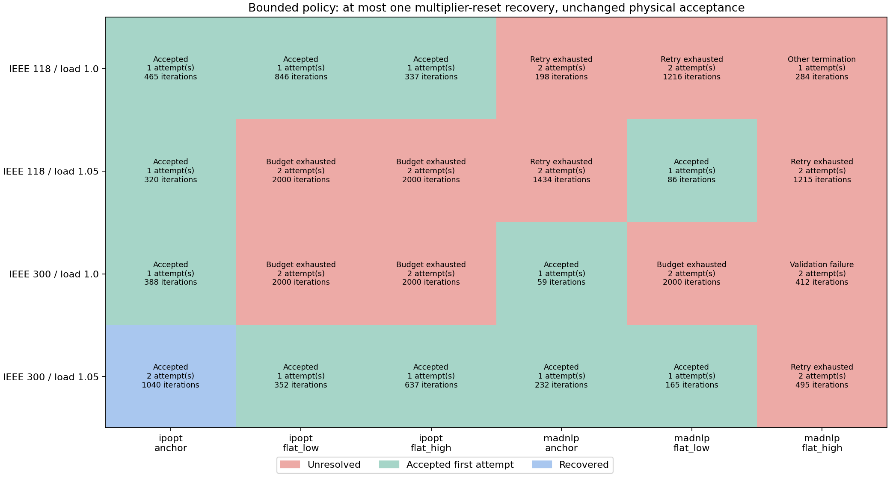
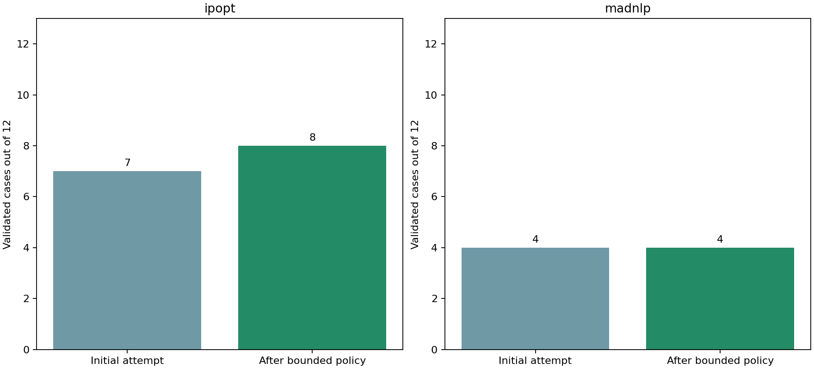

# S1 bounded restart policy

The runner accepts the first independently validated solution and stops. A finite, compatible iterate after an iteration limit, time limit, interruption or slow progress may receive one multiplier-reset recovery. Solver convergence with failed physical/policy validation stops for diagnosis; other termination reasons and missing seeds are unresolved. No other initialization or backend switch occurs silently. A failed attempt is never returned as an accepted design. This is experimental execution logic outside the core equipment formulation.

Each policy run has a total allowance of 2000 iterations and 120 wall seconds, with at most 1000 iterations and 60 seconds per attempt. The recovery receives only remaining budget. Both adapters check wall deadlines at iteration callbacks; model construction, a long solver step and validation cannot be preempted, so this is a cooperative deadline, not a hard process timeout. Elapsed time and overruns are retained. Native Ipopt CPU and MadNLP wall limits are supplementary. Runs include compilation and some concurrent regression work; no isolated runtime ranking is claimed.

Context hashes include full physical case data, declared controls, smoothing, backend and version. A model-layout signature, array dimensions and finite-value checks are also required. Persisted recovery seeds override the builder defaults recorded in start files. Seeds contain numerical iterates, not assertions of physical validity. The policy preserves an accepted result by returning immediately; it does not perform optional objective polishing or import an external incumbent.

Ipopt recovery uses warm-start initialization with zero constraint and bound dual starts. MadNLP recovery sets zero constraint multipliers and dual_initialized=true; the installed solver initializes bound multipliers internally to one. This behavior was checked in a native callback test. The two adapters are explicit solver-specific implementations, not identical numerical algorithms. Full saved-bound-multiplier restoration in MadNLP is not implemented.

| Solver | Initial valid / 12 | Final valid / 12 | Recovered | Attempts |
|---|---|---|---|---|
| ipopt | 7 | 8 | 1 | 17 |
| madnlp | 4 | 4 | 0 | 19 |

## Complete policy ledger

| Case / solver / start | Outcome | Attempts | Total iterations | Final decision | Accepted objective |
|---|---|---|---|---|---|
| [public118-load1.0-ipopt-anchor](public118-load1.0-ipopt-anchor-policy.json) | Accepted | 1 | 465 | accept | 7.594008005 |
| [public118-load1.0-ipopt-flat_low](public118-load1.0-ipopt-flat_low-policy.json) | Accepted | 1 | 846 | accept | 7.59401684 |
| [public118-load1.0-ipopt-flat_high](public118-load1.0-ipopt-flat_high-policy.json) | Accepted | 1 | 337 | accept | 7.593234983 |
| [public118-load1.05-ipopt-anchor](public118-load1.05-ipopt-anchor-policy.json) | Accepted | 1 | 320 | accept | 11.38742842 |
| [public118-load1.05-ipopt-flat_low](public118-load1.05-ipopt-flat_low-policy.json) | Unresolved | 2 | 2000 | budget_exhausted | — |
| [public118-load1.05-ipopt-flat_high](public118-load1.05-ipopt-flat_high-policy.json) | Unresolved | 2 | 2000 | budget_exhausted | — |
| [public300-load1.0-ipopt-anchor](public300-load1.0-ipopt-anchor-policy.json) | Accepted | 1 | 388 | accept | 89.22604414 |
| [public300-load1.0-ipopt-flat_low](public300-load1.0-ipopt-flat_low-policy.json) | Unresolved | 2 | 2000 | budget_exhausted | — |
| [public300-load1.0-ipopt-flat_high](public300-load1.0-ipopt-flat_high-policy.json) | Unresolved | 2 | 2000 | budget_exhausted | — |
| [public300-load1.05-ipopt-anchor](public300-load1.05-ipopt-anchor-policy.json) | Accepted | 2 | 1040 | accept | 140.953331 |
| [public300-load1.05-ipopt-flat_low](public300-load1.05-ipopt-flat_low-policy.json) | Accepted | 1 | 352 | accept | 140.9541846 |
| [public300-load1.05-ipopt-flat_high](public300-load1.05-ipopt-flat_high-policy.json) | Accepted | 1 | 637 | accept | 140.9541846 |
| [public118-load1.0-madnlp-anchor](public118-load1.0-madnlp-anchor-policy.json) | Unresolved | 2 | 198 | retry_limit_reached | — |
| [public118-load1.0-madnlp-flat_low](public118-load1.0-madnlp-flat_low-policy.json) | Unresolved | 2 | 1216 | retry_limit_reached | — |
| [public118-load1.0-madnlp-flat_high](public118-load1.0-madnlp-flat_high-policy.json) | Unresolved | 1 | 284 | termination_not_retryable | — |
| [public118-load1.05-madnlp-anchor](public118-load1.05-madnlp-anchor-policy.json) | Unresolved | 2 | 1434 | retry_limit_reached | — |
| [public118-load1.05-madnlp-flat_low](public118-load1.05-madnlp-flat_low-policy.json) | Accepted | 1 | 86 | accept | 12.12456118 |
| [public118-load1.05-madnlp-flat_high](public118-load1.05-madnlp-flat_high-policy.json) | Unresolved | 2 | 1215 | retry_limit_reached | — |
| [public300-load1.0-madnlp-anchor](public300-load1.0-madnlp-anchor-policy.json) | Accepted | 1 | 59 | accept | 96.32978052 |
| [public300-load1.0-madnlp-flat_low](public300-load1.0-madnlp-flat_low-policy.json) | Unresolved | 2 | 2000 | budget_exhausted | — |
| [public300-load1.0-madnlp-flat_high](public300-load1.0-madnlp-flat_high-policy.json) | Unresolved | 2 | 412 | diagnose_validation_failure | — |
| [public300-load1.05-madnlp-anchor](public300-load1.05-madnlp-anchor-policy.json) | Accepted | 1 | 232 | accept | 149.055741 |
| [public300-load1.05-madnlp-flat_low](public300-load1.05-madnlp-flat_low-policy.json) | Accepted | 1 | 165 | accept | 148.855557 |
| [public300-load1.05-madnlp-flat_high](public300-load1.05-madnlp-flat_high-policy.json) | Unresolved | 2 | 495 | retry_limit_reached | — |

## Every attempt and physical failure category

| Attempt | Native status | Valid | Physical failures |
|---|---|---|---|
| [public118-load1.0-ipopt-anchor-attempt1](public118-load1.0-ipopt-anchor-attempt1-diagnostics.json) | LOCALLY_SOLVED | True | none |
| [public118-load1.0-ipopt-flat_low-attempt1](public118-load1.0-ipopt-flat_low-attempt1-diagnostics.json) | LOCALLY_SOLVED | True | none |
| [public118-load1.0-ipopt-flat_high-attempt1](public118-load1.0-ipopt-flat_high-attempt1-diagnostics.json) | LOCALLY_SOLVED | True | none |
| [public118-load1.05-ipopt-anchor-attempt1](public118-load1.05-ipopt-anchor-attempt1-diagnostics.json) | LOCALLY_SOLVED | True | none |
| [public118-load1.05-ipopt-flat_low-attempt1](public118-load1.05-ipopt-flat_low-attempt1-diagnostics.json) | ITERATION_LIMIT | False | power_balance, droop |
| [public118-load1.05-ipopt-flat_low-attempt2](public118-load1.05-ipopt-flat_low-attempt2-diagnostics.json) | ITERATION_LIMIT | False | power_balance, droop |
| [public118-load1.05-ipopt-flat_high-attempt1](public118-load1.05-ipopt-flat_high-attempt1-diagnostics.json) | ITERATION_LIMIT | False | power_balance, droop |
| [public118-load1.05-ipopt-flat_high-attempt2](public118-load1.05-ipopt-flat_high-attempt2-diagnostics.json) | ITERATION_LIMIT | False | power_balance, droop |
| [public300-load1.0-ipopt-anchor-attempt1](public300-load1.0-ipopt-anchor-attempt1-diagnostics.json) | ALMOST_LOCALLY_SOLVED | True | none |
| [public300-load1.0-ipopt-flat_low-attempt1](public300-load1.0-ipopt-flat_low-attempt1-diagnostics.json) | ITERATION_LIMIT | False | power_balance, droop |
| [public300-load1.0-ipopt-flat_low-attempt2](public300-load1.0-ipopt-flat_low-attempt2-diagnostics.json) | ITERATION_LIMIT | False | power_balance, droop |
| [public300-load1.0-ipopt-flat_high-attempt1](public300-load1.0-ipopt-flat_high-attempt1-diagnostics.json) | ITERATION_LIMIT | False | power_balance, droop |
| [public300-load1.0-ipopt-flat_high-attempt2](public300-load1.0-ipopt-flat_high-attempt2-diagnostics.json) | ITERATION_LIMIT | False | power_balance, droop |
| [public300-load1.05-ipopt-anchor-attempt1](public300-load1.05-ipopt-anchor-attempt1-diagnostics.json) | ITERATION_LIMIT | False | power_balance, droop |
| [public300-load1.05-ipopt-anchor-attempt2](public300-load1.05-ipopt-anchor-attempt2-diagnostics.json) | ALMOST_LOCALLY_SOLVED | True | none |
| [public300-load1.05-ipopt-flat_low-attempt1](public300-load1.05-ipopt-flat_low-attempt1-diagnostics.json) | ALMOST_LOCALLY_SOLVED | True | none |
| [public300-load1.05-ipopt-flat_high-attempt1](public300-load1.05-ipopt-flat_high-attempt1-diagnostics.json) | ALMOST_LOCALLY_SOLVED | True | none |
| [public118-load1.0-madnlp-anchor-attempt1](public118-load1.0-madnlp-anchor-attempt1-diagnostics.json) | SLOW_PROGRESS | False | droop |
| [public118-load1.0-madnlp-anchor-attempt2](public118-load1.0-madnlp-anchor-attempt2-diagnostics.json) | SLOW_PROGRESS | False | droop |
| [public118-load1.0-madnlp-flat_low-attempt1](public118-load1.0-madnlp-flat_low-attempt1-diagnostics.json) | ITERATION_LIMIT | False | none |
| [public118-load1.0-madnlp-flat_low-attempt2](public118-load1.0-madnlp-flat_low-attempt2-diagnostics.json) | SLOW_PROGRESS | False | none |
| [public118-load1.0-madnlp-flat_high-attempt1](public118-load1.0-madnlp-flat_high-attempt1-diagnostics.json) | LOCALLY_INFEASIBLE | False | none |
| [public118-load1.05-madnlp-anchor-attempt1](public118-load1.05-madnlp-anchor-attempt1-diagnostics.json) | ITERATION_LIMIT | False | none |
| [public118-load1.05-madnlp-anchor-attempt2](public118-load1.05-madnlp-anchor-attempt2-diagnostics.json) | SLOW_PROGRESS | False | none |
| [public118-load1.05-madnlp-flat_low-attempt1](public118-load1.05-madnlp-flat_low-attempt1-diagnostics.json) | LOCALLY_SOLVED | True | none |
| [public118-load1.05-madnlp-flat_high-attempt1](public118-load1.05-madnlp-flat_high-attempt1-diagnostics.json) | ITERATION_LIMIT | False | power_balance, droop |
| [public118-load1.05-madnlp-flat_high-attempt2](public118-load1.05-madnlp-flat_high-attempt2-diagnostics.json) | SLOW_PROGRESS | False | none |
| [public300-load1.0-madnlp-anchor-attempt1](public300-load1.0-madnlp-anchor-attempt1-diagnostics.json) | LOCALLY_SOLVED | True | none |
| [public300-load1.0-madnlp-flat_low-attempt1](public300-load1.0-madnlp-flat_low-attempt1-diagnostics.json) | ITERATION_LIMIT | False | power_balance |
| [public300-load1.0-madnlp-flat_low-attempt2](public300-load1.0-madnlp-flat_low-attempt2-diagnostics.json) | ITERATION_LIMIT | False | none |
| [public300-load1.0-madnlp-flat_high-attempt1](public300-load1.0-madnlp-flat_high-attempt1-diagnostics.json) | SLOW_PROGRESS | False | none |
| [public300-load1.0-madnlp-flat_high-attempt2](public300-load1.0-madnlp-flat_high-attempt2-diagnostics.json) | LOCALLY_SOLVED | False | droop |
| [public300-load1.05-madnlp-anchor-attempt1](public300-load1.05-madnlp-anchor-attempt1-diagnostics.json) | LOCALLY_SOLVED | True | none |
| [public300-load1.05-madnlp-flat_low-attempt1](public300-load1.05-madnlp-flat_low-attempt1-diagnostics.json) | LOCALLY_SOLVED | True | none |
| [public300-load1.05-madnlp-flat_high-attempt1](public300-load1.05-madnlp-flat_high-attempt1-diagnostics.json) | SLOW_PROGRESS | False | none |
| [public300-load1.05-madnlp-flat_high-attempt2](public300-load1.05-madnlp-flat_high-attempt2-diagnostics.json) | SLOW_PROGRESS | False | droop |

## Remaining acceptance gate

This paired matrix measures recovery within the declared starts and budget. It does not establish global optimality, universal convergence or scalability under contingencies. The policy stops at the first validated solution, so objective-quality comparisons need a separately declared study budget. No equipment equations, objective terms or physical tolerances changed. Variable normalization and broader reliability/quality studies remain open before M9. CCOpt is not part of this smooth joint-design policy.
