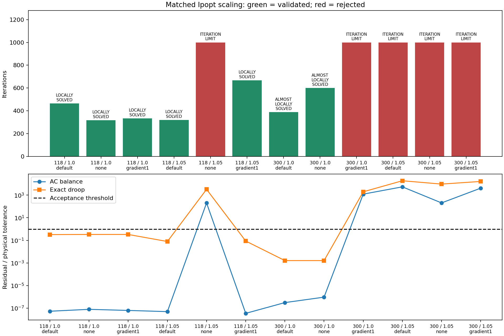

# S1 matched numerical scaling

**7/12 attempts validate. S1 remains open.**

The three arms use identical baseline primal states, control settings, smoothing (1e-6), small bound pushes (1e-8), objective, physical tolerances and iteration/time budgets. Only Ipopt numerical scaling changes: default gradient scaling, no scaling, or gradient scaling with maximum gradient 1. This tests solver scaling, not a new normalized-variable formulation. No equipment equation or physical bound changes.

These are dependent benchmark cases, not independent statistical trials or a general convergence guarantee. Timing includes diagnostic overhead and concurrent regression work; it is not isolated performance evidence. Only validated objectives may be compared. Source angle constraints are separately audited for physically valid results.

| Attempt | Status | Valid | Iterations | Valid objective | Physical failures |
|---|---|---|---|---|---|
| [public118-load1.0-default](public118-load1.0-default-diagnostics.json) | LOCALLY_SOLVED | True | 465 | 7.594008 | none |
| [public118-load1.0-none](public118-load1.0-none-diagnostics.json) | LOCALLY_SOLVED | True | 317 | 7.59401684 | none |
| [public118-load1.0-gradient1](public118-load1.0-gradient1-diagnostics.json) | LOCALLY_SOLVED | True | 333 | 7.59401684 | none |
| [public118-load1.05-default](public118-load1.05-default-diagnostics.json) | LOCALLY_SOLVED | True | 320 | 11.3874284 | none |
| [public118-load1.05-none](public118-load1.05-none-diagnostics.json) | ITERATION_LIMIT | False | 1000 | — | power_balance, droop |
| [public118-load1.05-gradient1](public118-load1.05-gradient1-diagnostics.json) | LOCALLY_SOLVED | True | 667 | 11.3891216 | none |
| [public300-load1.0-default](public300-load1.0-default-diagnostics.json) | ALMOST_LOCALLY_SOLVED | True | 388 | 89.2260441 | none |
| [public300-load1.0-none](public300-load1.0-none-diagnostics.json) | ALMOST_LOCALLY_SOLVED | True | 600 | 89.2260441 | none |
| [public300-load1.0-gradient1](public300-load1.0-gradient1-diagnostics.json) | ITERATION_LIMIT | False | 1000 | — | power_balance, droop |
| [public300-load1.05-default](public300-load1.05-default-diagnostics.json) | ITERATION_LIMIT | False | 1000 | — | power_balance, droop |
| [public300-load1.05-none](public300-load1.05-none-diagnostics.json) | ITERATION_LIMIT | False | 1000 | — | power_balance, droop |
| [public300-load1.05-gradient1](public300-load1.05-gradient1-diagnostics.json) | ITERATION_LIMIT | False | 1000 | — | power_balance, droop |

## Physical failure locations

Every failure is retained in JSON. The table below shows the largest exceedance per attempt and category, in original per-unit quantities. Exceedance is violation minus tolerance; branch limits use apparent power at the named terminal. Missing physical checks are explicitly marked, never treated as a pass.

| Attempt | Category | Equipment ID | Component | Violation (pu) | Tolerance (pu) | Exceedance (pu) |
|---|---|---|---|---|---|---|
| public118-load1.05-none | droop | generator 25 | control 16, regulated bus 59 | 0.03253 | 1e-05 | 0.03252 |
| public118-load1.05-none | power_balance | bus 63 | Q | 0.0002024 | 1e-06 | 0.0002014 |
| public300-load1.0-gradient1 | droop | generator 10 | control 4, regulated bus 108 | 0.01966 | 1e-05 | 0.01965 |
| public300-load1.0-gradient1 | power_balance | bus 85 | Q | 0.001225 | 1e-06 | 0.001224 |
| public300-load1.05-default | droop | generator 42 | control 26, regulated bus 239 | 0.1868 | 1e-05 | 0.1868 |
| public300-load1.05-default | power_balance | bus 229 | Q | 0.005403 | 1e-06 | 0.005402 |
| public300-load1.05-none | droop | generator 38 | control 23, regulated bus 230 | 0.09489 | 1e-05 | 0.09488 |
| public300-load1.05-none | power_balance | bus 230 | Q | 0.0002051 | 1e-06 | 0.0002041 |
| public300-load1.05-gradient1 | droop | generator 40 | control 25, regulated bus 236 | 0.1621 | 1e-05 | 0.1621 |
| public300-load1.05-gradient1 | power_balance | bus 236 | Q | 0.004137 | 1e-06 | 0.004136 |

## Retained-run audit

All 30 original public attempts were rechecked without rerunning the solver or modifying historical evidence. Equipment-level failure categories agree with the independent validator. See [the complete location audit](retained-public-failures.json).

## Scope and next gate

No scaling setting is promoted automatically. A candidate needs matched start variation and both physical and solution-quality checks. Primal/dual warm starts, explicit variable normalization and a declared restart/selection policy remain open. M9 is not unlocked.
