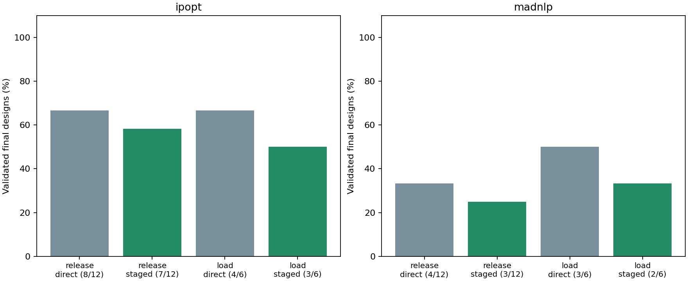
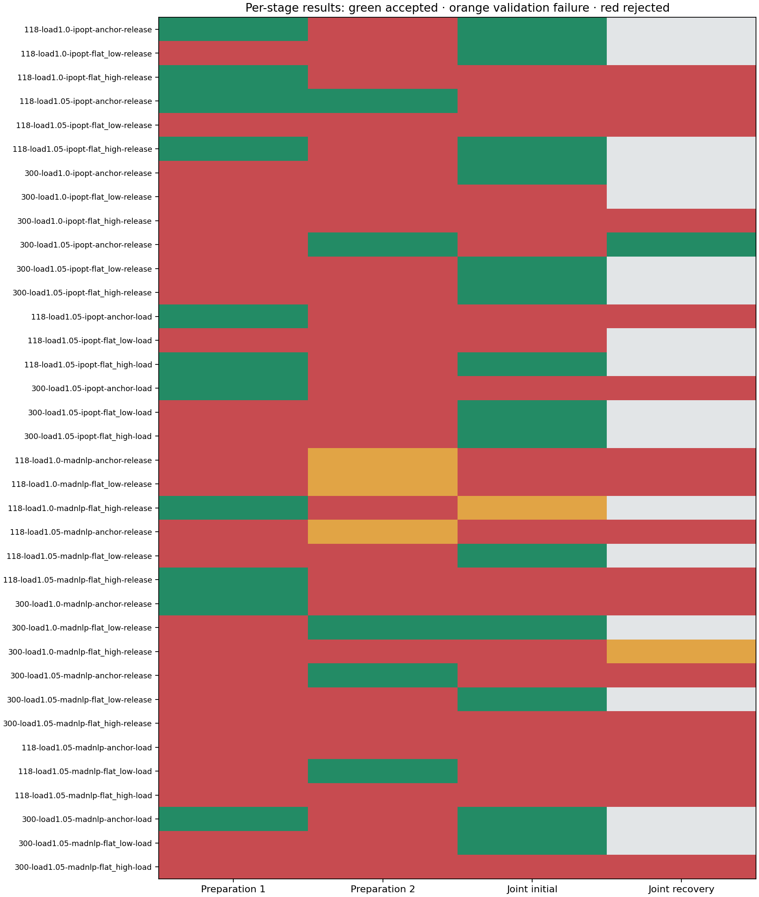

# S1 staged initialization and load continuation

Two separate experiments use the existing physical coordinates and the frozen direct-solve baseline. Equipment equations, objective, limits, smoothing (epsilon 1e-6), and physical validation tolerances are unchanged. These experimental runners do not change the default optimizer API.

**Control release:** first fix selected taps, banks and all selected droop parameters at their declared initial settings; next free taps and banks while keeping droops fixed; finally free every selected setting to its original design bounds. In this public matrix only droop slopes are design variables. All stages use the target demand.

**Load continuation:** solve the full joint problem at nominal load, then +2.5%, then the target +5%. This is tested separately from control release. P and Q loads change together; droop references, generator dispatch references, equipment models and bounds remain unchanged.

Only stages that pass native termination, independent physical checks and controller-policy checks can seed the next stage. Transferred settings must also satisfy the strict initialization domain. Otherwise the last accepted seed (or declared initialization) remains in use. No duals transfer between changed formulations. Failed preparation stages do not establish infeasibility.

Every workflow shares 2000 iterations and 120 seconds of cooperative wall budget, including preparation. Each preparation receives at most 500 iterations and 30 seconds; the final joint policy receives the remaining budget and permits at most one multiplier-reset recovery. The clock is checked at solver callbacks and cannot preempt construction, factorization or validation. Timing includes compilation and concurrent work and is not an isolated performance comparison. A validated restricted preparation point is retained separately and never counted as a converged final joint design.

The pinned PGLib IEEE 118/300 cases use the same synthetic overlays as the baseline: respectively 37/35 droops, 11/129 taps and 12/32 banks. Three declared starts are anchor, flat/20% settings, and flat/80% settings. Release has 12 cases per solver; load continuation has the six stressed cases per solver. These are repeated tuning cases, not independent holdout validation.

| Solver | Strategy | Direct accepted | Staged accepted | Gained / lost cases | Preparation seeds transferred | Iteration / wall overruns |
|---|---|---|---|---|---|---|
| ipopt | release | 8/12 | 7/12 | 1 / 2 | 6/24 | 0 / 0 |
| ipopt | load | 4/6 | 3/6 | 1 / 2 | 3/12 | 0 / 0 |
| madnlp | release | 4/12 | 3/12 | 1 / 2 | 5/24 | 0 / 0 |
| madnlp | load | 3/6 | 2/6 | 0 / 1 | 2/12 | 0 / 0 |

## Paired case ledger

| Case | Direct / staged valid | Total iterations direct / staged | Joint seed | Direct / staged objective | Retained restricted points |
|---|---|---|---|---|---|
| [public118-load1.0-ipopt-anchor-release](public118-load1.0-ipopt-anchor-release-staged.json) | True / True | 465 / 1316 | stage-prep1 | 7.594008 / 7.5940168 | 1 |
| [public118-load1.0-ipopt-flat_low-release](public118-load1.0-ipopt-flat_low-release-staged.json) | True / True | 846 / 1635 | declared_initialization | 7.5940168 / 7.5940168 | 0 |
| [public118-load1.0-ipopt-flat_high-release](public118-load1.0-ipopt-flat_high-release-staged.json) | True / False | 337 / 2000 | stage-prep1 | 7.593235 / — | 1 |
| [public118-load1.05-ipopt-anchor-release](public118-load1.05-ipopt-anchor-release-staged.json) | True / False | 320 / 2000 | stage-prep2 | 11.387428 / — | 2 |
| [public118-load1.05-ipopt-flat_low-release](public118-load1.05-ipopt-flat_low-release-staged.json) | False / False | 2000 / 2000 | declared_initialization | — / — | 0 |
| [public118-load1.05-ipopt-flat_high-release](public118-load1.05-ipopt-flat_high-release-staged.json) | False / True | 2000 / 999 | stage-prep1 | — / 11.389122 | 1 |
| [public300-load1.0-ipopt-anchor-release](public300-load1.0-ipopt-anchor-release-staged.json) | True / True | 388 / 1388 | declared_initialization | 89.226044 / 89.226044 | 0 |
| [public300-load1.0-ipopt-flat_low-release](public300-load1.0-ipopt-flat_low-release-staged.json) | False / False | 2000 / 2000 | declared_initialization | — / — | 0 |
| [public300-load1.0-ipopt-flat_high-release](public300-load1.0-ipopt-flat_high-release-staged.json) | False / False | 2000 / 2000 | declared_initialization | — / — | 0 |
| [public300-load1.05-ipopt-anchor-release](public300-load1.05-ipopt-anchor-release-staged.json) | True / True | 1040 / 1669 | stage-prep2 | 140.95333 / 140.95418 | 1 |
| [public300-load1.05-ipopt-flat_low-release](public300-load1.05-ipopt-flat_low-release-staged.json) | True / True | 352 / 1352 | declared_initialization | 140.95418 / 140.95418 | 0 |
| [public300-load1.05-ipopt-flat_high-release](public300-load1.05-ipopt-flat_high-release-staged.json) | True / True | 637 / 1565 | declared_initialization | 140.95418 / 140.95418 | 0 |
| [public118-load1.05-ipopt-anchor-load](public118-load1.05-ipopt-anchor-load-staged.json) | True / False | 320 / 2000 | stage-prep1 | 11.387428 / — | 0 |
| [public118-load1.05-ipopt-flat_low-load](public118-load1.05-ipopt-flat_low-load-staged.json) | False / False | 2000 / 2000 | declared_initialization | — / — | 0 |
| [public118-load1.05-ipopt-flat_high-load](public118-load1.05-ipopt-flat_high-load-staged.json) | False / True | 2000 / 1086 | stage-prep1 | — / 11.389107 | 0 |
| [public300-load1.05-ipopt-anchor-load](public300-load1.05-ipopt-anchor-load-staged.json) | True / False | 1040 / 2000 | stage-prep1 | 140.95333 / — | 0 |
| [public300-load1.05-ipopt-flat_low-load](public300-load1.05-ipopt-flat_low-load-staged.json) | True / True | 352 / 1352 | declared_initialization | 140.95418 / 140.95418 | 0 |
| [public300-load1.05-ipopt-flat_high-load](public300-load1.05-ipopt-flat_high-load-staged.json) | True / True | 637 / 1637 | declared_initialization | 140.95418 / 140.95418 | 0 |
| [public118-load1.0-madnlp-anchor-release](public118-load1.0-madnlp-anchor-release-staged.json) | False / False | 198 / 273 | declared_initialization | — / — | 0 |
| [public118-load1.0-madnlp-flat_low-release](public118-load1.0-madnlp-flat_low-release-staged.json) | False / False | 1216 / 1849 | declared_initialization | — / — | 0 |
| [public118-load1.0-madnlp-flat_high-release](public118-load1.0-madnlp-flat_high-release-staged.json) | False / False | 284 / 194 | stage-prep1 | — / — | 1 |
| [public118-load1.05-madnlp-anchor-release](public118-load1.05-madnlp-anchor-release-staged.json) | False / False | 1434 / 1621 | declared_initialization | — / — | 0 |
| [public118-load1.05-madnlp-flat_low-release](public118-load1.05-madnlp-flat_low-release-staged.json) | True / True | 86 / 700 | declared_initialization | 12.124561 / 12.124561 | 0 |
| [public118-load1.05-madnlp-flat_high-release](public118-load1.05-madnlp-flat_high-release-staged.json) | False / False | 1215 / 713 | stage-prep1 | — / — | 1 |
| [public300-load1.0-madnlp-anchor-release](public300-load1.0-madnlp-anchor-release-staged.json) | True / False | 59 / 1239 | stage-prep1 | 96.329781 / — | 1 |
| [public300-load1.0-madnlp-flat_low-release](public300-load1.0-madnlp-flat_low-release-staged.json) | False / True | 2000 / 787 | stage-prep2 | — / 96.343697 | 1 |
| [public300-load1.0-madnlp-flat_high-release](public300-load1.0-madnlp-flat_high-release-staged.json) | False / False | 412 / 1023 | declared_initialization | — / — | 0 |
| [public300-load1.05-madnlp-anchor-release](public300-load1.05-madnlp-anchor-release-staged.json) | True / False | 232 / 558 | stage-prep2 | 149.05574 / — | 1 |
| [public300-load1.05-madnlp-flat_low-release](public300-load1.05-madnlp-flat_low-release-staged.json) | True / True | 165 / 770 | declared_initialization | 148.85556 / 148.85556 | 0 |
| [public300-load1.05-madnlp-flat_high-release](public300-load1.05-madnlp-flat_high-release-staged.json) | False / False | 495 / 920 | declared_initialization | — / — | 0 |
| [public118-load1.05-madnlp-anchor-load](public118-load1.05-madnlp-anchor-load-staged.json) | False / False | 1434 / 1533 | declared_initialization | — / — | 0 |
| [public118-load1.05-madnlp-flat_low-load](public118-load1.05-madnlp-flat_low-load-staged.json) | True / False | 86 / 752 | stage-prep2 | 12.124561 / — | 0 |
| [public118-load1.05-madnlp-flat_high-load](public118-load1.05-madnlp-flat_high-load-staged.json) | False / False | 1215 / 1629 | declared_initialization | — / — | 0 |
| [public300-load1.05-madnlp-anchor-load](public300-load1.05-madnlp-anchor-load-staged.json) | True / True | 232 / 568 | stage-prep1 | 149.05574 / 148.70505 | 0 |
| [public300-load1.05-madnlp-flat_low-load](public300-load1.05-madnlp-flat_low-load-staged.json) | True / True | 165 / 1165 | declared_initialization | 148.85556 / 148.85556 | 0 |
| [public300-load1.05-madnlp-flat_high-load](public300-load1.05-madnlp-flat_high-load-staged.json) | False / False | 495 / 1105 | declared_initialization | — / — | 0 |

## Stage acceptance and failures

Green denotes independently accepted, orange denotes native convergence rejected by validation, and red denotes other rejected attempts. Gray means no attempt. A green preparation cell does not count as a final joint-design success.

| Attempt | Status | Accepted | Seed transferred | Physical failure categories | Seed transfer error |
|---|---|---|---|---|---|
| [public118-load1.0-ipopt-anchor-release-prep1](public118-load1.0-ipopt-anchor-release-prep1-diagnostics.json) | LOCALLY_SOLVED | True | True | none | — |
| [public118-load1.0-ipopt-anchor-release-prep2](public118-load1.0-ipopt-anchor-release-prep2-diagnostics.json) | ITERATION_LIMIT | False | False | power_balance, droop | — |
| [public118-load1.0-ipopt-anchor-release-joint-attempt1](public118-load1.0-ipopt-anchor-release-joint-attempt1-diagnostics.json) | LOCALLY_SOLVED | True | final stage | none | — |
| [public118-load1.0-ipopt-flat_low-release-prep1](public118-load1.0-ipopt-flat_low-release-prep1-diagnostics.json) | LOCALLY_INFEASIBLE | False | False | power_balance | — |
| [public118-load1.0-ipopt-flat_low-release-prep2](public118-load1.0-ipopt-flat_low-release-prep2-diagnostics.json) | ITERATION_LIMIT | False | False | power_balance, droop | — |
| [public118-load1.0-ipopt-flat_low-release-joint-attempt1](public118-load1.0-ipopt-flat_low-release-joint-attempt1-diagnostics.json) | LOCALLY_SOLVED | True | final stage | none | — |
| [public118-load1.0-ipopt-flat_high-release-prep1](public118-load1.0-ipopt-flat_high-release-prep1-diagnostics.json) | LOCALLY_SOLVED | True | True | none | — |
| [public118-load1.0-ipopt-flat_high-release-prep2](public118-load1.0-ipopt-flat_high-release-prep2-diagnostics.json) | ITERATION_LIMIT | False | False | power_balance, droop | — |
| [public118-load1.0-ipopt-flat_high-release-joint-attempt1](public118-load1.0-ipopt-flat_high-release-joint-attempt1-diagnostics.json) | ITERATION_LIMIT | False | final stage | power_balance, droop | — |
| [public118-load1.0-ipopt-flat_high-release-joint-attempt2](public118-load1.0-ipopt-flat_high-release-joint-attempt2-diagnostics.json) | ITERATION_LIMIT | False | final stage | power_balance, droop | — |
| [public118-load1.05-ipopt-anchor-release-prep1](public118-load1.05-ipopt-anchor-release-prep1-diagnostics.json) | LOCALLY_SOLVED | True | True | none | — |
| [public118-load1.05-ipopt-anchor-release-prep2](public118-load1.05-ipopt-anchor-release-prep2-diagnostics.json) | LOCALLY_SOLVED | True | True | none | — |
| [public118-load1.05-ipopt-anchor-release-joint-attempt1](public118-load1.05-ipopt-anchor-release-joint-attempt1-diagnostics.json) | ITERATION_LIMIT | False | final stage | power_balance, droop | — |
| [public118-load1.05-ipopt-anchor-release-joint-attempt2](public118-load1.05-ipopt-anchor-release-joint-attempt2-diagnostics.json) | ITERATION_LIMIT | False | final stage | power_balance, droop | — |
| [public118-load1.05-ipopt-flat_low-release-prep1](public118-load1.05-ipopt-flat_low-release-prep1-diagnostics.json) | LOCALLY_INFEASIBLE | False | False | power_balance | — |
| [public118-load1.05-ipopt-flat_low-release-prep2](public118-load1.05-ipopt-flat_low-release-prep2-diagnostics.json) | ITERATION_LIMIT | False | False | power_balance, droop | — |
| [public118-load1.05-ipopt-flat_low-release-joint-attempt1](public118-load1.05-ipopt-flat_low-release-joint-attempt1-diagnostics.json) | ITERATION_LIMIT | False | final stage | power_balance, droop | — |
| [public118-load1.05-ipopt-flat_low-release-joint-attempt2](public118-load1.05-ipopt-flat_low-release-joint-attempt2-diagnostics.json) | ITERATION_LIMIT | False | final stage | power_balance, droop | — |
| [public118-load1.05-ipopt-flat_high-release-prep1](public118-load1.05-ipopt-flat_high-release-prep1-diagnostics.json) | LOCALLY_SOLVED | True | True | none | — |
| [public118-load1.05-ipopt-flat_high-release-prep2](public118-load1.05-ipopt-flat_high-release-prep2-diagnostics.json) | ITERATION_LIMIT | False | False | power_balance, droop | — |
| [public118-load1.05-ipopt-flat_high-release-joint-attempt1](public118-load1.05-ipopt-flat_high-release-joint-attempt1-diagnostics.json) | LOCALLY_SOLVED | True | final stage | none | — |
| [public300-load1.0-ipopt-anchor-release-prep1](public300-load1.0-ipopt-anchor-release-prep1-diagnostics.json) | ITERATION_LIMIT | False | False | power_balance, droop | — |
| [public300-load1.0-ipopt-anchor-release-prep2](public300-load1.0-ipopt-anchor-release-prep2-diagnostics.json) | ITERATION_LIMIT | False | False | power_balance, droop | — |
| [public300-load1.0-ipopt-anchor-release-joint-attempt1](public300-load1.0-ipopt-anchor-release-joint-attempt1-diagnostics.json) | ALMOST_LOCALLY_SOLVED | True | final stage | none | — |
| [public300-load1.0-ipopt-flat_low-release-prep1](public300-load1.0-ipopt-flat_low-release-prep1-diagnostics.json) | ITERATION_LIMIT | False | False | power_balance, droop | — |
| [public300-load1.0-ipopt-flat_low-release-prep2](public300-load1.0-ipopt-flat_low-release-prep2-diagnostics.json) | ITERATION_LIMIT | False | False | power_balance, droop | — |
| [public300-load1.0-ipopt-flat_low-release-joint-attempt1](public300-load1.0-ipopt-flat_low-release-joint-attempt1-diagnostics.json) | ITERATION_LIMIT | False | final stage | power_balance, droop | — |
| [public300-load1.0-ipopt-flat_high-release-prep1](public300-load1.0-ipopt-flat_high-release-prep1-diagnostics.json) | INTERRUPTED | False | False | power_balance, droop | — |
| [public300-load1.0-ipopt-flat_high-release-prep2](public300-load1.0-ipopt-flat_high-release-prep2-diagnostics.json) | ITERATION_LIMIT | False | False | power_balance, droop | — |
| [public300-load1.0-ipopt-flat_high-release-joint-attempt1](public300-load1.0-ipopt-flat_high-release-joint-attempt1-diagnostics.json) | ITERATION_LIMIT | False | final stage | power_balance, droop | — |
| [public300-load1.0-ipopt-flat_high-release-joint-attempt2](public300-load1.0-ipopt-flat_high-release-joint-attempt2-diagnostics.json) | ITERATION_LIMIT | False | final stage | power_balance, droop | — |
| [public300-load1.05-ipopt-anchor-release-prep1](public300-load1.05-ipopt-anchor-release-prep1-diagnostics.json) | LOCALLY_INFEASIBLE | False | False | power_balance | — |
| [public300-load1.05-ipopt-anchor-release-prep2](public300-load1.05-ipopt-anchor-release-prep2-diagnostics.json) | ALMOST_LOCALLY_SOLVED | True | True | none | — |
| [public300-load1.05-ipopt-anchor-release-joint-attempt1](public300-load1.05-ipopt-anchor-release-joint-attempt1-diagnostics.json) | ITERATION_LIMIT | False | final stage | power_balance, droop | — |
| [public300-load1.05-ipopt-anchor-release-joint-attempt2](public300-load1.05-ipopt-anchor-release-joint-attempt2-diagnostics.json) | ALMOST_LOCALLY_SOLVED | True | final stage | none | — |
| [public300-load1.05-ipopt-flat_low-release-prep1](public300-load1.05-ipopt-flat_low-release-prep1-diagnostics.json) | ITERATION_LIMIT | False | False | power_balance, droop | — |
| [public300-load1.05-ipopt-flat_low-release-prep2](public300-load1.05-ipopt-flat_low-release-prep2-diagnostics.json) | ITERATION_LIMIT | False | False | power_balance, droop | — |
| [public300-load1.05-ipopt-flat_low-release-joint-attempt1](public300-load1.05-ipopt-flat_low-release-joint-attempt1-diagnostics.json) | ALMOST_LOCALLY_SOLVED | True | final stage | none | — |
| [public300-load1.05-ipopt-flat_high-release-prep1](public300-load1.05-ipopt-flat_high-release-prep1-diagnostics.json) | LOCALLY_INFEASIBLE | False | False | power_balance, droop | — |
| [public300-load1.05-ipopt-flat_high-release-prep2](public300-load1.05-ipopt-flat_high-release-prep2-diagnostics.json) | ITERATION_LIMIT | False | False | power_balance, droop | — |
| [public300-load1.05-ipopt-flat_high-release-joint-attempt1](public300-load1.05-ipopt-flat_high-release-joint-attempt1-diagnostics.json) | ALMOST_LOCALLY_SOLVED | True | final stage | none | — |
| [public118-load1.05-ipopt-anchor-load-prep1](public118-load1.05-ipopt-anchor-load-prep1-diagnostics.json) | LOCALLY_SOLVED | True | True | none | — |
| [public118-load1.05-ipopt-anchor-load-prep2](public118-load1.05-ipopt-anchor-load-prep2-diagnostics.json) | ITERATION_LIMIT | False | False | power_balance, droop | — |
| [public118-load1.05-ipopt-anchor-load-joint-attempt1](public118-load1.05-ipopt-anchor-load-joint-attempt1-diagnostics.json) | ITERATION_LIMIT | False | final stage | power_balance, droop | — |
| [public118-load1.05-ipopt-anchor-load-joint-attempt2](public118-load1.05-ipopt-anchor-load-joint-attempt2-diagnostics.json) | ITERATION_LIMIT | False | final stage | power_balance, droop | — |
| [public118-load1.05-ipopt-flat_low-load-prep1](public118-load1.05-ipopt-flat_low-load-prep1-diagnostics.json) | ITERATION_LIMIT | False | False | power_balance, droop | — |
| [public118-load1.05-ipopt-flat_low-load-prep2](public118-load1.05-ipopt-flat_low-load-prep2-diagnostics.json) | ITERATION_LIMIT | False | False | power_balance, droop | — |
| [public118-load1.05-ipopt-flat_low-load-joint-attempt1](public118-load1.05-ipopt-flat_low-load-joint-attempt1-diagnostics.json) | ITERATION_LIMIT | False | final stage | power_balance, droop | — |
| [public118-load1.05-ipopt-flat_high-load-prep1](public118-load1.05-ipopt-flat_high-load-prep1-diagnostics.json) | LOCALLY_SOLVED | True | True | none | — |
| [public118-load1.05-ipopt-flat_high-load-prep2](public118-load1.05-ipopt-flat_high-load-prep2-diagnostics.json) | ITERATION_LIMIT | False | False | power_balance, droop | — |
| [public118-load1.05-ipopt-flat_high-load-joint-attempt1](public118-load1.05-ipopt-flat_high-load-joint-attempt1-diagnostics.json) | LOCALLY_SOLVED | True | final stage | none | — |
| [public300-load1.05-ipopt-anchor-load-prep1](public300-load1.05-ipopt-anchor-load-prep1-diagnostics.json) | ALMOST_LOCALLY_SOLVED | True | True | none | — |
| [public300-load1.05-ipopt-anchor-load-prep2](public300-load1.05-ipopt-anchor-load-prep2-diagnostics.json) | ITERATION_LIMIT | False | False | power_balance, droop | — |
| [public300-load1.05-ipopt-anchor-load-joint-attempt1](public300-load1.05-ipopt-anchor-load-joint-attempt1-diagnostics.json) | ITERATION_LIMIT | False | final stage | power_balance, droop | — |
| [public300-load1.05-ipopt-anchor-load-joint-attempt2](public300-load1.05-ipopt-anchor-load-joint-attempt2-diagnostics.json) | ITERATION_LIMIT | False | final stage | power_balance, droop | — |
| [public300-load1.05-ipopt-flat_low-load-prep1](public300-load1.05-ipopt-flat_low-load-prep1-diagnostics.json) | ITERATION_LIMIT | False | False | power_balance, droop | — |
| [public300-load1.05-ipopt-flat_low-load-prep2](public300-load1.05-ipopt-flat_low-load-prep2-diagnostics.json) | ITERATION_LIMIT | False | False | power_balance, droop | — |
| [public300-load1.05-ipopt-flat_low-load-joint-attempt1](public300-load1.05-ipopt-flat_low-load-joint-attempt1-diagnostics.json) | ALMOST_LOCALLY_SOLVED | True | final stage | none | — |
| [public300-load1.05-ipopt-flat_high-load-prep1](public300-load1.05-ipopt-flat_high-load-prep1-diagnostics.json) | ITERATION_LIMIT | False | False | power_balance, droop | — |
| [public300-load1.05-ipopt-flat_high-load-prep2](public300-load1.05-ipopt-flat_high-load-prep2-diagnostics.json) | ITERATION_LIMIT | False | False | power_balance, droop | — |
| [public300-load1.05-ipopt-flat_high-load-joint-attempt1](public300-load1.05-ipopt-flat_high-load-joint-attempt1-diagnostics.json) | ALMOST_LOCALLY_SOLVED | True | final stage | none | — |
| [public118-load1.0-madnlp-anchor-release-prep1](public118-load1.0-madnlp-anchor-release-prep1-diagnostics.json) | INTERRUPTED | False | False | power_balance | — |
| [public118-load1.0-madnlp-anchor-release-prep2](public118-load1.0-madnlp-anchor-release-prep2-diagnostics.json) | LOCALLY_SOLVED | False | False | droop | — |
| [public118-load1.0-madnlp-anchor-release-joint-attempt1](public118-load1.0-madnlp-anchor-release-joint-attempt1-diagnostics.json) | SLOW_PROGRESS | False | final stage | droop | — |
| [public118-load1.0-madnlp-anchor-release-joint-attempt2](public118-load1.0-madnlp-anchor-release-joint-attempt2-diagnostics.json) | SLOW_PROGRESS | False | final stage | droop | — |
| [public118-load1.0-madnlp-flat_low-release-prep1](public118-load1.0-madnlp-flat_low-release-prep1-diagnostics.json) | ITERATION_LIMIT | False | False | power_balance | — |
| [public118-load1.0-madnlp-flat_low-release-prep2](public118-load1.0-madnlp-flat_low-release-prep2-diagnostics.json) | LOCALLY_SOLVED | False | False | droop | — |
| [public118-load1.0-madnlp-flat_low-release-joint-attempt1](public118-load1.0-madnlp-flat_low-release-joint-attempt1-diagnostics.json) | ITERATION_LIMIT | False | final stage | none | — |
| [public118-load1.0-madnlp-flat_low-release-joint-attempt2](public118-load1.0-madnlp-flat_low-release-joint-attempt2-diagnostics.json) | SLOW_PROGRESS | False | final stage | none | — |
| [public118-load1.0-madnlp-flat_high-release-prep1](public118-load1.0-madnlp-flat_high-release-prep1-diagnostics.json) | LOCALLY_SOLVED | True | True | none | — |
| [public118-load1.0-madnlp-flat_high-release-prep2](public118-load1.0-madnlp-flat_high-release-prep2-diagnostics.json) | SLOW_PROGRESS | False | False | none | — |
| [public118-load1.0-madnlp-flat_high-release-joint-attempt1](public118-load1.0-madnlp-flat_high-release-joint-attempt1-diagnostics.json) | LOCALLY_SOLVED | False | final stage | droop | — |
| [public118-load1.05-madnlp-anchor-release-prep1](public118-load1.05-madnlp-anchor-release-prep1-diagnostics.json) | SLOW_PROGRESS | False | False | none | — |
| [public118-load1.05-madnlp-anchor-release-prep2](public118-load1.05-madnlp-anchor-release-prep2-diagnostics.json) | LOCALLY_SOLVED | False | False | droop | — |
| [public118-load1.05-madnlp-anchor-release-joint-attempt1](public118-load1.05-madnlp-anchor-release-joint-attempt1-diagnostics.json) | ITERATION_LIMIT | False | final stage | none | — |
| [public118-load1.05-madnlp-anchor-release-joint-attempt2](public118-load1.05-madnlp-anchor-release-joint-attempt2-diagnostics.json) | SLOW_PROGRESS | False | final stage | none | — |
| [public118-load1.05-madnlp-flat_low-release-prep1](public118-load1.05-madnlp-flat_low-release-prep1-diagnostics.json) | ITERATION_LIMIT | False | False | power_balance | — |
| [public118-load1.05-madnlp-flat_low-release-prep2](public118-load1.05-madnlp-flat_low-release-prep2-diagnostics.json) | SLOW_PROGRESS | False | False | none | — |
| [public118-load1.05-madnlp-flat_low-release-joint-attempt1](public118-load1.05-madnlp-flat_low-release-joint-attempt1-diagnostics.json) | LOCALLY_SOLVED | True | final stage | none | — |
| [public118-load1.05-madnlp-flat_high-release-prep1](public118-load1.05-madnlp-flat_high-release-prep1-diagnostics.json) | LOCALLY_SOLVED | True | True | none | — |
| [public118-load1.05-madnlp-flat_high-release-prep2](public118-load1.05-madnlp-flat_high-release-prep2-diagnostics.json) | ITERATION_LIMIT | False | False | power_balance | — |
| [public118-load1.05-madnlp-flat_high-release-joint-attempt1](public118-load1.05-madnlp-flat_high-release-joint-attempt1-diagnostics.json) | SLOW_PROGRESS | False | final stage | none | — |
| [public118-load1.05-madnlp-flat_high-release-joint-attempt2](public118-load1.05-madnlp-flat_high-release-joint-attempt2-diagnostics.json) | SLOW_PROGRESS | False | final stage | none | — |
| [public300-load1.0-madnlp-anchor-release-prep1](public300-load1.0-madnlp-anchor-release-prep1-diagnostics.json) | LOCALLY_SOLVED | True | True | none | — |
| [public300-load1.0-madnlp-anchor-release-prep2](public300-load1.0-madnlp-anchor-release-prep2-diagnostics.json) | SLOW_PROGRESS | False | False | none | — |
| [public300-load1.0-madnlp-anchor-release-joint-attempt1](public300-load1.0-madnlp-anchor-release-joint-attempt1-diagnostics.json) | ITERATION_LIMIT | False | final stage | power_balance, droop, branch_thermal | — |
| [public300-load1.0-madnlp-anchor-release-joint-attempt2](public300-load1.0-madnlp-anchor-release-joint-attempt2-diagnostics.json) | SLOW_PROGRESS | False | final stage | none | — |
| [public300-load1.0-madnlp-flat_low-release-prep1](public300-load1.0-madnlp-flat_low-release-prep1-diagnostics.json) | ITERATION_LIMIT | False | False | power_balance, droop, branch_thermal | — |
| [public300-load1.0-madnlp-flat_low-release-prep2](public300-load1.0-madnlp-flat_low-release-prep2-diagnostics.json) | LOCALLY_SOLVED | True | True | none | — |
| [public300-load1.0-madnlp-flat_low-release-joint-attempt1](public300-load1.0-madnlp-flat_low-release-joint-attempt1-diagnostics.json) | LOCALLY_SOLVED | True | final stage | none | — |
| [public300-load1.0-madnlp-flat_high-release-prep1](public300-load1.0-madnlp-flat_high-release-prep1-diagnostics.json) | ITERATION_LIMIT | False | False | power_balance, droop | — |
| [public300-load1.0-madnlp-flat_high-release-prep2](public300-load1.0-madnlp-flat_high-release-prep2-diagnostics.json) | SLOW_PROGRESS | False | False | none | — |
| [public300-load1.0-madnlp-flat_high-release-joint-attempt1](public300-load1.0-madnlp-flat_high-release-joint-attempt1-diagnostics.json) | SLOW_PROGRESS | False | final stage | none | — |
| [public300-load1.0-madnlp-flat_high-release-joint-attempt2](public300-load1.0-madnlp-flat_high-release-joint-attempt2-diagnostics.json) | LOCALLY_SOLVED | False | final stage | droop | — |
| [public300-load1.05-madnlp-anchor-release-prep1](public300-load1.05-madnlp-anchor-release-prep1-diagnostics.json) | LOCALLY_INFEASIBLE | False | False | power_balance | — |
| [public300-load1.05-madnlp-anchor-release-prep2](public300-load1.05-madnlp-anchor-release-prep2-diagnostics.json) | LOCALLY_SOLVED | True | True | none | — |
| [public300-load1.05-madnlp-anchor-release-joint-attempt1](public300-load1.05-madnlp-anchor-release-joint-attempt1-diagnostics.json) | SLOW_PROGRESS | False | final stage | none | — |
| [public300-load1.05-madnlp-anchor-release-joint-attempt2](public300-load1.05-madnlp-anchor-release-joint-attempt2-diagnostics.json) | SLOW_PROGRESS | False | final stage | none | — |
| [public300-load1.05-madnlp-flat_low-release-prep1](public300-load1.05-madnlp-flat_low-release-prep1-diagnostics.json) | ITERATION_LIMIT | False | False | power_balance, droop, branch_thermal | — |
| [public300-load1.05-madnlp-flat_low-release-prep2](public300-load1.05-madnlp-flat_low-release-prep2-diagnostics.json) | SLOW_PROGRESS | False | False | none | — |
| [public300-load1.05-madnlp-flat_low-release-joint-attempt1](public300-load1.05-madnlp-flat_low-release-joint-attempt1-diagnostics.json) | LOCALLY_SOLVED | True | final stage | none | — |
| [public300-load1.05-madnlp-flat_high-release-prep1](public300-load1.05-madnlp-flat_high-release-prep1-diagnostics.json) | LOCALLY_INFEASIBLE | False | False | power_balance, droop | — |
| [public300-load1.05-madnlp-flat_high-release-prep2](public300-load1.05-madnlp-flat_high-release-prep2-diagnostics.json) | SLOW_PROGRESS | False | False | none | — |
| [public300-load1.05-madnlp-flat_high-release-joint-attempt1](public300-load1.05-madnlp-flat_high-release-joint-attempt1-diagnostics.json) | SLOW_PROGRESS | False | final stage | none | — |
| [public300-load1.05-madnlp-flat_high-release-joint-attempt2](public300-load1.05-madnlp-flat_high-release-joint-attempt2-diagnostics.json) | SLOW_PROGRESS | False | final stage | droop | — |
| [public118-load1.05-madnlp-anchor-load-prep1](public118-load1.05-madnlp-anchor-load-prep1-diagnostics.json) | INTERRUPTED | False | False | power_balance | — |
| [public118-load1.05-madnlp-anchor-load-prep2](public118-load1.05-madnlp-anchor-load-prep2-diagnostics.json) | SLOW_PROGRESS | False | False | none | — |
| [public118-load1.05-madnlp-anchor-load-joint-attempt1](public118-load1.05-madnlp-anchor-load-joint-attempt1-diagnostics.json) | ITERATION_LIMIT | False | final stage | none | — |
| [public118-load1.05-madnlp-anchor-load-joint-attempt2](public118-load1.05-madnlp-anchor-load-joint-attempt2-diagnostics.json) | SLOW_PROGRESS | False | final stage | none | — |
| [public118-load1.05-madnlp-flat_low-load-prep1](public118-load1.05-madnlp-flat_low-load-prep1-diagnostics.json) | ITERATION_LIMIT | False | False | power_balance, droop | — |
| [public118-load1.05-madnlp-flat_low-load-prep2](public118-load1.05-madnlp-flat_low-load-prep2-diagnostics.json) | LOCALLY_SOLVED | True | True | none | — |
| [public118-load1.05-madnlp-flat_low-load-joint-attempt1](public118-load1.05-madnlp-flat_low-load-joint-attempt1-diagnostics.json) | SLOW_PROGRESS | False | final stage | none | — |
| [public118-load1.05-madnlp-flat_low-load-joint-attempt2](public118-load1.05-madnlp-flat_low-load-joint-attempt2-diagnostics.json) | SLOW_PROGRESS | False | final stage | none | — |
| [public118-load1.05-madnlp-flat_high-load-prep1](public118-load1.05-madnlp-flat_high-load-prep1-diagnostics.json) | LOCALLY_INFEASIBLE | False | False | none | — |
| [public118-load1.05-madnlp-flat_high-load-prep2](public118-load1.05-madnlp-flat_high-load-prep2-diagnostics.json) | SLOW_PROGRESS | False | False | droop | — |
| [public118-load1.05-madnlp-flat_high-load-joint-attempt1](public118-load1.05-madnlp-flat_high-load-joint-attempt1-diagnostics.json) | ITERATION_LIMIT | False | final stage | power_balance, droop | — |
| [public118-load1.05-madnlp-flat_high-load-joint-attempt2](public118-load1.05-madnlp-flat_high-load-joint-attempt2-diagnostics.json) | SLOW_PROGRESS | False | final stage | none | — |
| [public300-load1.05-madnlp-anchor-load-prep1](public300-load1.05-madnlp-anchor-load-prep1-diagnostics.json) | LOCALLY_SOLVED | True | True | none | — |
| [public300-load1.05-madnlp-anchor-load-prep2](public300-load1.05-madnlp-anchor-load-prep2-diagnostics.json) | ITERATION_LIMIT | False | False | power_balance, droop, branch_thermal | — |
| [public300-load1.05-madnlp-anchor-load-joint-attempt1](public300-load1.05-madnlp-anchor-load-joint-attempt1-diagnostics.json) | LOCALLY_SOLVED | True | final stage | none | — |
| [public300-load1.05-madnlp-flat_low-load-prep1](public300-load1.05-madnlp-flat_low-load-prep1-diagnostics.json) | ITERATION_LIMIT | False | False | power_balance | — |
| [public300-load1.05-madnlp-flat_low-load-prep2](public300-load1.05-madnlp-flat_low-load-prep2-diagnostics.json) | ITERATION_LIMIT | False | False | power_balance, droop | — |
| [public300-load1.05-madnlp-flat_low-load-joint-attempt1](public300-load1.05-madnlp-flat_low-load-joint-attempt1-diagnostics.json) | LOCALLY_SOLVED | True | final stage | none | — |
| [public300-load1.05-madnlp-flat_high-load-prep1](public300-load1.05-madnlp-flat_high-load-prep1-diagnostics.json) | SLOW_PROGRESS | False | False | none | — |
| [public300-load1.05-madnlp-flat_high-load-prep2](public300-load1.05-madnlp-flat_high-load-prep2-diagnostics.json) | SLOW_PROGRESS | False | False | none | — |
| [public300-load1.05-madnlp-flat_high-load-joint-attempt1](public300-load1.05-madnlp-flat_high-load-joint-attempt1-diagnostics.json) | SLOW_PROGRESS | False | final stage | none | — |
| [public300-load1.05-madnlp-flat_high-load-joint-attempt2](public300-load1.05-madnlp-flat_high-load-joint-attempt2-diagnostics.json) | SLOW_PROGRESS | False | final stage | droop | — |

## Interpretation and scope

The paired ledger reports gains and regressions, so a better aggregate count alone is insufficient to promote a default. Objectives are the existing dispatch-deviation objective and are shown only for accepted final designs. Preparation objectives belong to more restricted problems or different load levels and are not compared as joint-design quality.

Run `julia --project=. examples/s1_staged_matrix.jl artifacts/s1_release_ipopt ipopt release` (substitute `madnlp` for the other backend and `load` for the continuation strategy), then `python examples/plot_s1_staged.py` after all four matrices finish. The plotting script verifies baseline hashes, accepted-seed gates and total iteration accounting before generating the tables and figures.

No global optimum or infeasibility certificate is claimed. Source branch-angle audits accompany accepted final cases in the machine-readable summary; source economic costs and angle limits are not part of this adapter’s optimization formulation. S1 remains open until reliability generalizes beyond the tuning matrix. Transformer AVR, complex bank models and M9 remain deferred.
