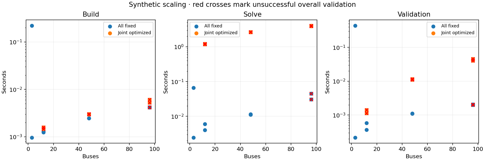
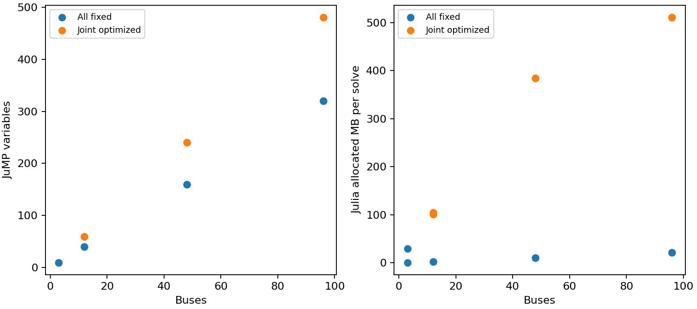

# S1 initial connected-network scaling experiment

Synthetic connected three-bus modules, 100 MVA base. Each module has two droop generators, one transformer, one simple capacitor and one simple reactor. A chain of ties connects modules; only the first reference angle is fixed. Loads vary by 1+0.1sin(module index), so this is not independent identical island replication. A uniform-load version has an independently validated feasible witness.

| Buses | Free controls | Sample | Valid | Build (s) | Solve (s) | Validate (s) | Variables | AC residual |
|---|---|---:|---|---:|---:|---:|---:|---:|
| 3 | false | 1 | true | 0.22225716710090637 | 0.06660125032067299 | 0.43963325 | 10 | 2.0816681711721685e-15 |
| 3 | false | 2 | true | 0.0009642522782087326 | 0.0024528317153453827 | 0.00021775 | 10 | 2.0816681711721685e-15 |
| 3 | true | 1 | false | failed | failed | failed | — | — |
| 3 | true | 2 | false | failed | failed | failed | — | — |
| 12 | false | 1 | true | 0.0012414995580911636 | 0.004050916060805321 | 0.000367875 | 40 | 1.767336277325171e-14 |
| 12 | false | 2 | true | 0.0013205409049987793 | 0.006035083904862404 | 0.000583875 | 40 | 1.767336277325171e-14 |
| 12 | true | 1 | false | 0.0015857089310884476 | 1.217650292441249 | 0.001130625 | 60 | 4.618429583214123e-9 |
| 12 | true | 2 | false | 0.0014493316411972046 | 1.1761577911674976 | 0.001409334 | 60 | 4.618429583214123e-9 |
| 48 | false | 1 | true | 0.0024559572339057922 | 0.01147545874118805 | 0.001102208 | 160 | 1.1903351568308773e-12 |
| 48 | false | 2 | true | 0.0024703312665224075 | 0.011198624968528748 | 0.001121083 | 160 | 1.1903351568308773e-12 |
| 48 | true | 1 | false | 0.00294383242726326 | 2.657713668420911 | 0.011646292 | 240 | 7.0637939941775585e-15 |
| 48 | true | 2 | false | 0.0030362512916326523 | 2.6264809984713793 | 0.01109775 | 240 | 7.0637939941775585e-15 |
| 96 | false | 1 | false | 0.004195917397737503 | 0.03066479228436947 | 0.002052083 | 320 | 1.0369309530163565e-14 |
| 96 | false | 2 | false | 0.0041409991681575775 | 0.04498725011944771 | 0.0020105 | 320 | 1.0369309530163565e-14 |
| 96 | true | 1 | false | 0.005243957042694092 | 3.934309918433428 | 0.040760667 | 480 | 2.7683244585574585e-11 |
| 96 | true | 2 | false | 0.0060730427503585815 | 4.080455541610718 | 0.045978041 | 480 | 2.7683244585574585e-11 |

All attempts are retained. One excluded warm-up per path; two measured runs use the same declared start, so they measure repeatability, not multi-start robustness. Build includes configuration/parameter construction and model-size sampling overhead; solve includes solver setup and iterations; extraction and independent validation are separate. Allocation bytes are Julia allocations. Peak RSS is a lifetime process high-water mark, not incremental model memory. Solver budget: 1000 iterations / 60 CPU seconds per solve.

This is an initial structural stress test, not completion of the scalability gate. Next acceptance requires pinned medium public cases, physically justified control overlays, varied load/initial conditions, larger device counts and contingency-count scaling after M9. No general feasibility, runtime or global optimality guarantee follows. Discrete implementability of continuous bank outputs needs legal-state recovery and a fresh physical solve. AVR and complex-bank optimization are deferred.

Run `julia --project=. examples/scaling_workflow.jl artifacts/scaling_initial` and `python3 examples/plot_scaling.py artifacts/scaling_initial`.
