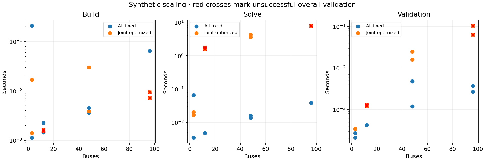
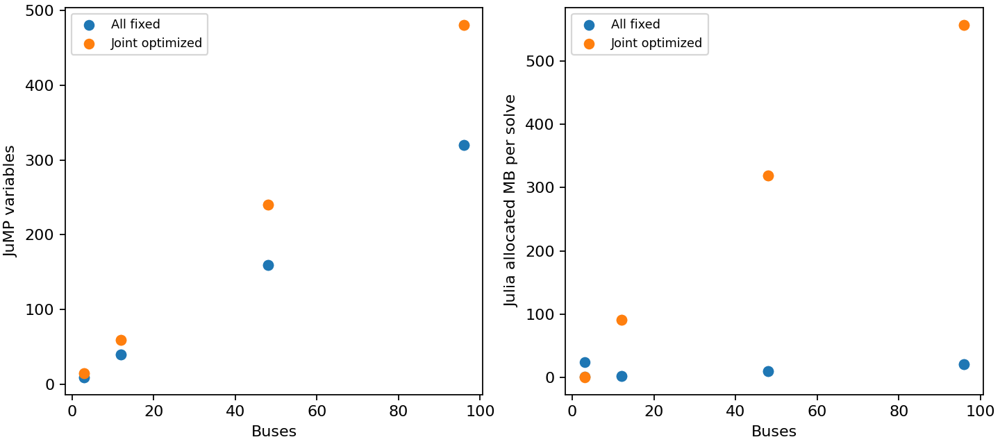

# S1 initial connected-network scaling experiment

Synthetic connected three-bus modules, 100 MVA base. Each module has two droop generators, one transformer, one simple capacitor and one simple reactor. A chain of ties connects modules; only the first reference angle is fixed. Loads vary by 1+0.1sin(module index), so this is not independent identical island replication. A uniform-load version has an independently validated feasible witness.

| Buses | Free controls | Sample | Valid | Build (s) | Solve (s) | Validate (s) | Variables | AC residual |
|---|---|---:|---|---:|---:|---:|---:|---:|
| 3 | false | 1 | true | 0.21004324778914452 | 0.06565099954605103 | 0.000270041 | 10 | 5.10702591327572e-15 |
| 3 | false | 2 | true | 0.0011371690779924393 | 0.003514247015118599 | 0.000211375 | 10 | 5.10702591327572e-15 |
| 3 | true | 1 | true | 0.016804208979010582 | 0.016641583293676376 | 0.000339583 | 15 | 1.3351542094142133e-12 |
| 3 | true | 2 | true | 0.0014064610004425049 | 0.02017650008201599 | 0.000346458 | 15 | 1.3351542094142133e-12 |
| 12 | false | 1 | true | 0.0014529172331094742 | 0.00473487563431263 | 0.000419958 | 40 | 2.5045070184415152e-15 |
| 12 | false | 2 | true | 0.002255834639072418 | 0.004765667021274567 | 0.00042125 | 40 | 2.5045070184415152e-15 |
| 12 | true | 1 | false | 0.0016375426203012466 | 1.5991900004446507 | 0.001226791 | 60 | 3.345425533818336e-9 |
| 12 | true | 2 | false | 0.0015406645834445953 | 1.7763280421495438 | 0.001302208 | 60 | 3.345425533818336e-9 |
| 48 | false | 1 | true | 0.004504874348640442 | 0.013410832732915878 | 0.004807542 | 160 | 1.3345564237043916e-11 |
| 48 | false | 2 | true | 0.003576751798391342 | 0.015729665756225586 | 0.001187708 | 160 | 1.3345564237043916e-11 |
| 48 | true | 1 | true | 0.003814045339822769 | 3.5678286645561457 | 0.02493025 | 240 | 7.767675391789908e-13 |
| 48 | true | 2 | true | 0.029913585633039474 | 4.203664623200893 | 0.0159555 | 240 | 7.767675391789908e-13 |
| 96 | false | 1 | true | 0.007101038470864296 | 0.03831433691084385 | 0.002708125 | 320 | 7.40118383246724e-12 |
| 96 | false | 2 | true | 0.06438774988055229 | 0.038327665999531746 | 0.003726292 | 320 | 7.40118383246724e-12 |
| 96 | true | 1 | false | 0.007199250161647797 | 7.759050289168954 | 0.06344325 | 480 | 1.9522577998642987e-12 |
| 96 | true | 2 | false | 0.009437542408704758 | 7.964038917794824 | 0.105806083 | 480 | 1.9522577998642987e-12 |

All attempts are retained. One excluded warm-up per path; two measured runs use the same declared start, so they measure repeatability, not multi-start robustness. Build includes configuration/parameter construction and model-size sampling overhead; solve includes solver setup and iterations; extraction and independent validation are separate. Allocation bytes are Julia allocations. Peak RSS is a lifetime process high-water mark, not incremental model memory. Solver budget: 1000 iterations / 60 CPU seconds per solve.

This is an initial structural stress test, not completion of the scalability gate. Next acceptance requires pinned medium public cases, physically justified control overlays, varied load/initial conditions, larger device counts and contingency-count scaling after M9. No general feasibility, runtime or global optimality guarantee follows. Discrete implementability of continuous bank outputs needs legal-state recovery and a fresh physical solve. AVR and complex-bank optimization are deferred.

Run `julia --project=. examples/scaling_workflow.jl artifacts/scaling_initial` and `python3 examples/plot_scaling.py artifacts/scaling_initial`.

This is the revised numerical variant: epsilon=1e-6, zero bound relaxation, adaptive barrier strategy, and heterogeneous fixed-case warm starts. Reproduce by adding `robust` after the output directory. See [the decision and convergence breakdown](decision.md).
