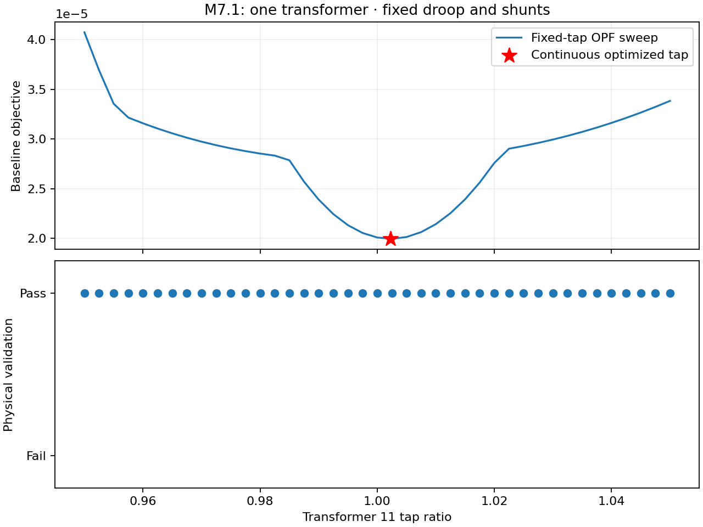
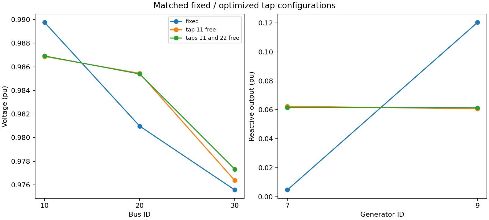
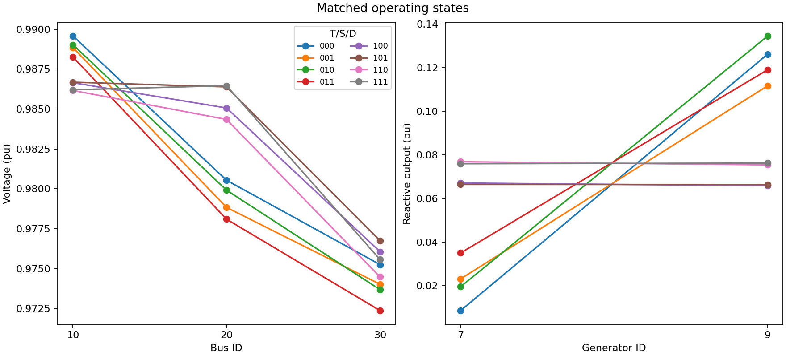
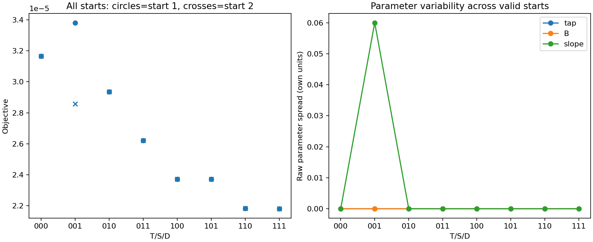

# M7 equipment and joint droop optimization

These synthetic three-bus studies demonstrate base-case continuous optimization. They do not establish security-constrained equipment performance, discrete implementability or scalability. All three slices use the same dispatch-deviation objective; losses and setting deviations are separate metrics.

The numerical tables and figures below are generated from retained evidence. Reproduce the solve and plot workflows in [Examples](examples.md), then run `python3 examples/build_m7_gallery.py`. Input studies, versioned designs, detailed reports and regression logs remain under `artifacts/m7_1`, `artifacts/m7_2` and `artifacts/m7_3`.

## M7.1 — Transformer taps

Fixed-bound and standalone equivalence, a 41-point tap sweep and one/two-free-tap comparisons. Transformer phase shifts, shunts and droops stay fixed.

| Configuration | Objective | Tap 11 | AC residual (pu) | Branch loss (pu) |
|---|---|---|---|---|
| fixed | 2.760045e-05 | 1.02 | 2.431215e-15 | 0.002264238 |
| tap 11 free | 1.994948e-05 | 1.0023 | 2.870759e-13 | 0.002113501 |
| taps 11 and 22 free | 1.993398e-05 | 1.001548 | 5.830753e-14 | 0.002108155 |

[Download tap sweep as PDF](assets/m7_1/tap_sweep.pdf)

[Download operating points as PDF](assets/m7_1/operating_points.pdf)

[Download tap settings as PDF](assets/m7_1/tap_settings.pdf)

[Machine-readable evidence](assets/m7_1/evidence.json)

## M7.2 — Simple capacitor/reactor banks

Each bank has one step type. A fractional count scales G and B together. Taps and droops stay fixed. Each capacitor/reactor sweep contains 31 points. Complex-bank optimization is deferred until simple-bank/transformer/droop scaling is demonstrated.

| Equipment | Mode | Objective | AC residual (pu) | Branch loss (pu) | Shunt active consumption (pu) |
|---|---|---|---|---|---|
| capacitor | fixed | 3.165313e-05 | 3.969047e-15 | 0.002262357 | 0.003334059 |
| capacitor | one free | 2.935443e-05 | 2.124758e-09 | 0.002287727 | 0.002377693 |
| capacitor | both free | 2.557165e-05 | 2.245834e-11 | 0.002289527 | 0.001899371 |
| reactor | fixed | 3.726789e-05 | 5.172945e-15 | 0.002329133 | 0.003314389 |
| reactor | one free | 2.935434e-05 | 1.236122e-12 | 0.002287783 | 0.002376528 |
| reactor | both free | 2.557165e-05 | 6.664602e-11 | 0.002289591 | 0.001898015 |

[Download susceptance sweep as PDF](assets/m7_2/susceptance_sweep.pdf)

[Download bank envelopes as PDF](assets/m7_2/bank_envelopes.pdf)

[Download operating points as PDF](assets/m7_2/operating_points.pdf)

[Download active losses as PDF](assets/m7_2/active_losses.pdf)

[Machine-readable evidence](assets/m7_2/evidence.json)

## M7.3 — Joint equipment and droop design

Digits denote **tap / shunt / droop**, with 1 free and 0 fixed. Each configuration has two starts. Tables select the lowest-objective physically valid attempt; the evidence retains every attempt and failure. Tap 11 is bounded to [0.95,1.05], bank 201 B to [0,0.06] pu, and droop 2 slope to [0.04,0.10]. Other parameters are fixed in this grid; separate regression tests exercise reference and asymmetric deadband selection.

| T/S/D | Valid starts | Objective | Tap | B (pu) | Slope | AC residual (pu) |
|---|---|---|---|---|---|---|
| 000 | 2/2 | 3.165313e-05 | 1.02 | 0.02 | 0.075 | 1.915135e-15 |
| 001 | 2/2 | 2.857831e-05 | 1.02 | 0.02 | 0.0999999 | 8.430756e-16 |
| 010 | 2/2 | 2.935435e-05 | 1.02 | 3.024316e-05 | 0.075 | 1.826502e-10 |
| 011 | 2/2 | 2.620771e-05 | 1.02 | 1.061755e-07 | 0.0999999 | 1.034173e-13 |
| 100 | 2/2 | 2.37211e-05 | 1.002058 | 0.02 | 0.075 | 1.460221e-13 |
| 101 | 2/2 | 2.37124e-05 | 1.000147 | 0.02 | 0.05446868 | 1.136674e-12 |
| 110 | 2/2 | 2.183084e-05 | 1.002401 | 4.454692e-05 | 0.075 | 7.189332e-09 |
| 111 | 2/2 | 2.18081e-05 | 0.9993228 | 1.480988e-07 | 0.04644218 | 1.709433e-11 |

| T/S/D | Active objective | Reactive objective | Branch loss | Shunt consumption | Objective spread | Slope spread |
|---|---|---|---|---|---|---|
| 000 | 1.565994e-05 | 1.599318e-05 | 0.002262357 | 0.003334059 | 3.455894e-19 | 0 |
| 001 | 1.557982e-05 | 1.299849e-05 | 0.002256893 | 0.003325188 | 5.23072e-06 | 0.05999455 |
| 010 | 1.088287e-05 | 1.847148e-05 | 0.002287728 | 0.002377647 | 7.98245e-11 | 0 |
| 011 | 1.081902e-05 | 1.538869e-05 | 0.002282338 | 0.002369333 | 1.770052e-10 | 4.499464e-09 |
| 100 | 1.489327e-05 | 8.827828e-06 | 0.002114444 | 0.003343261 | 2.78335e-17 | 0 |
| 101 | 1.490091e-05 | 8.811489e-06 | 0.002110516 | 0.003348588 | 1.378631e-17 | 2.530132e-09 |
| 110 | 1.024779e-05 | 1.158305e-05 | 0.002141423 | 0.002385782 | 6.579897e-11 | 0 |
| 111 | 1.024086e-05 | 1.156724e-05 | 0.002135656 | 0.002390017 | 2.098927e-15 | 2.75197e-07 |

The objective is the sum of the two listed components. Design penalty is zero in every configuration. Loss quantities are in pu. The second-start design values are tap=1, B=0.04 and slope=0.095 for enabled families, with the solved fixed operating state; the first start uses supplied settings and the declared proportional-regime state.

### Matched attribution and interactions

Each comparison below changes only droop freedom. Variation across these four benefits measures its dependence on equipment freedom; isolated benefits must not be added without accounting for interactions.

| Equipment freedom held fixed | Objective decrease from freeing droop |
|---|---|
| tap=0 shunt=0 | 3.074821e-06 |
| tap=0 shunt=1 | 3.146635e-06 |
| tap=1 shunt=0 | 8.702212e-09 |
| tap=1 shunt=1 | 2.274399e-08 |

Some starts may reach different valid local solutions. Similar objectives with different settings indicate weak parameter identification on this case. Multi-start evidence is not a global-optimality certificate.

[Download objectives as PDF](assets/m7_3/objectives.pdf)

[Download settings as PDF](assets/m7_3/settings.pdf)

[Download operating points as PDF](assets/m7_3/operating_points.pdf)

[Download multistart as PDF](assets/m7_3/multistart.pdf)

[Download matched benefits as PDF](assets/m7_3/matched_benefits.pdf)

[Machine-readable evidence](assets/m7_3/evidence.json)

## Acceptance and next scope

Independent AC and exact-droop tolerances are 1e-6 and 1e-5 pu. Smooth epsilon is 1e-5. Fixed/free comparisons allow objective differences of 1e-8 for numerical equivalence. The full suite checks policy perturbations, physical replay, serialization and Ipopt/MadNLP agreement. M8 adds steady-state transformer AVR; M9 adds coordinated equipment decisions and response policies across contingencies.
