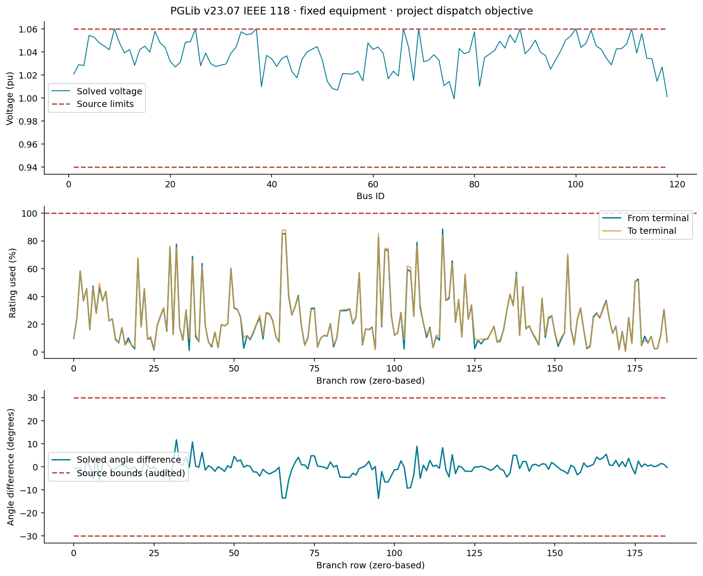

# S1 convergence evidence

This is the first S1 checkpoint. See [extended public-case evidence](s1_extension.md) for the current reliability gate.

The [implemented formulation](joint_formulation.md) retains the M7 equipment laws, smoothing and dispatch objective. The variable-droop encoding now preserves exact Hessians. All eight control combinations converge locally and independently validate at 12 and 96 buses; both full joint runs take 16 iterations instead of reaching the 1000-iteration limit.

Full regression: **966/966 tests pass**. First/second derivative checks report no errors at their tested points. Unit checks cover smooth-curve values and derivatives at deadband edges and saturation knees. Failed pre-correction attempts and complete diagnostic records remain in artifacts/s1_convergence.

| Buses | Free slopes / taps / banks in joint run | Before | After |
|---|---|---|---|
| 12 | 8 / 4 / 8 | 1000 iterations, iteration limit | 16 iterations, valid |
| 96 | 64 / 32 / 64 | 1000 iterations, iteration limit | 16 iterations, valid |

The former five-argument legacy operator removed Hessian availability. Equivalent scalar softplus composition supplies exact second derivatives without changing the response. Before/after runs use matched feasible fixed-control starts, smoothing 1e-6, adaptive Ipopt, no bound relaxation, tolerance 1e-8 and the same iteration budget. Broader robustness remains to be tested.

[Download convergence PDF](assets/s1/convergence.pdf)

[Download control families PDF](assets/s1/control_families.pdf)

[Download joint settings PDF](assets/s1/settings.pdf)

[Synthetic summary data](assets/s1/synthetic-summary.json)

## Public 118-bus baseline

PGLib v23.07 IEEE 118 imports as 118 buses, 54 generators, 186 branches and 14 fixed shunts after correcting inline-comment parsing. The fixed-equipment solve converges locally and validates, with maximum AC-balance residual 1.28e-9 pu. Source branch angle bounds pass a separate post-solve audit.

No droop or adjustable-bank overlays are included yet. The adapter omits economic costs and branch angle constraints; the objective is the project's dispatch deviation. This is not a reproduction of the published PGLib cost optimum or an operating-point replay with fixed P/Q/V.

[Download public-case figure PDF](assets/s1/validation.pdf) · [Public-case data](assets/s1/public118-summary.json)

## Remaining S1 work

Independent control-count sweeps, broader conditioning and state/design-start studies, medium-case Ipopt/MadNLP comparisons, explicit public controller overlays, 300-bus validation and performance acceptance remain. S1 is active and M9 stays downstream.

## Reproduction

    julia --project=. examples/s1_convergence.jl artifacts/s1_exact_hessian
    julia --project=. examples/s1_derivatives.jl artifacts/s1_conditioning_after
    julia --project=. examples/s1_public_baseline.jl artifacts/s1_public118
    python examples/plot_s1.py

Timing may include compilation and does not establish a scaling law. Native unscaled solver residuals must still be read with the recorded whole-objective scaling. Physical validation tolerances remain unchanged.
