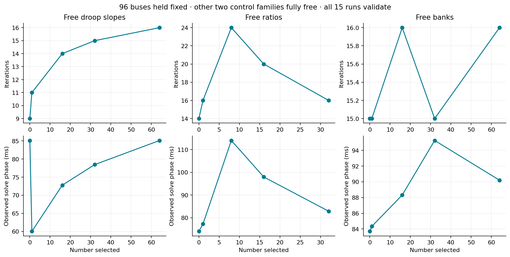
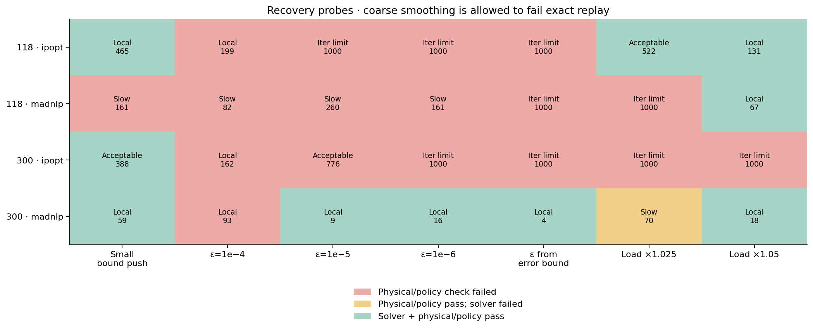
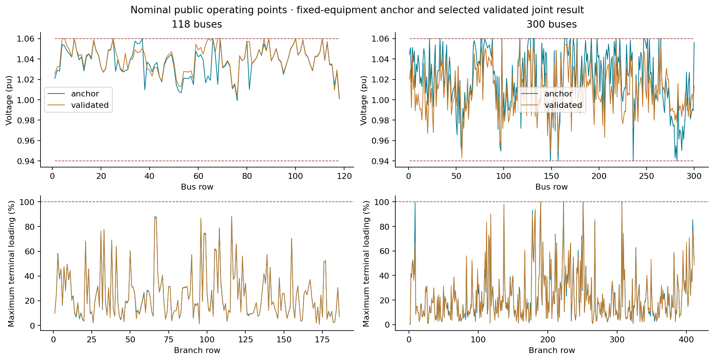

# S1 extended robustness and public cases

**The S1 reliability gate remains open.** The synthetic matrix passes 35/35 attempts; the initial public matrix passes 13/30. Both imported baselines and at least one joint solution at each tested network/loading condition validate, but solver/start reliability and solution quality are inconsistent.

The studies use 37 droops, 11 candidate taps and 12 banks at 118 buses; 35 droops, 129 candidate taps and 32 banks at 300 buses. These controls are explicit synthetic overlays, not measured hardware. Source data and capability limits remain unchanged. Added banks start disconnected. Loads are tested at 1.0 and 1.05 times nominal with controller references held fixed.

All attempts retain starts, settings, traces, phase times, allocation and independently checked results. Failed statuses are not hidden. Native solver residual scales differ; physical acceptance tolerances do not.

## Independent 96-bus control counts

[PDF figure](assets/s1_extension/control_counts.pdf)

## Initial public solver/start matrix

[PDF figure](assets/s1_extension/public_matrix.pdf)

## Recovery experiments

[PDF figure](assets/s1_extension/recovery_matrix.pdf)

## Raw derivative scales

[PDF figure](assets/s1_extension/derivative_scales.pdf)

## Public operating points

[PDF figure](assets/s1_extension/operating_points.pdf)

## Interpretation and next work

Smaller bound pushes preserve feasible starting points better. Coarse smoothing can satisfy the numerical model but fail exact-droop replay; the example runner now computes a conservative smoothing-error budget from allowed slopes and Q capability. Very small smoothing can also increase stiffness. Continuation and cross-solver polishing are mixed remedies, not promoted defaults.

Weak local droop-parameter Jacobian columns occur in deadband/saturated regions; this is a sensitivity observation, not a KKT condition number. Validated objectives and settings vary across starts/backends. The full attempt ledger and spread tables are in artifacts/s1_extension/report.md.

Next: equivalent parameter/residual normalization, primal/dual warm-start preservation and a declared restart policy, followed by isolated performance acceptance. No equipment equations, hidden objective penalties or validation tolerances have changed. M9 remains downstream of this gate.

## Machine-readable summaries

- [s1_robustness](assets/s1_extension/s1_robustness.json)
- [s1_public_controls](assets/s1_extension/s1_public_controls.json)
- [s1_public_recovery](assets/s1_extension/s1_public_recovery.json)
- [s1_public_polish](assets/s1_extension/s1_public_polish.json)
