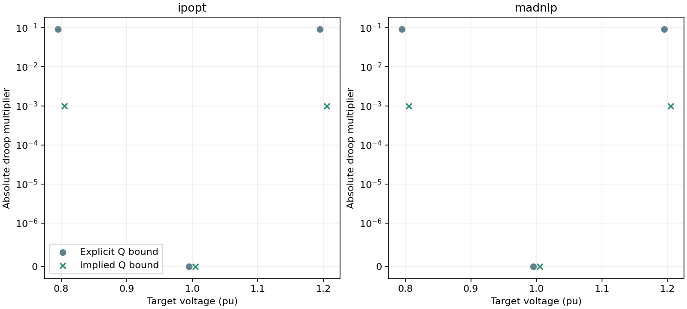
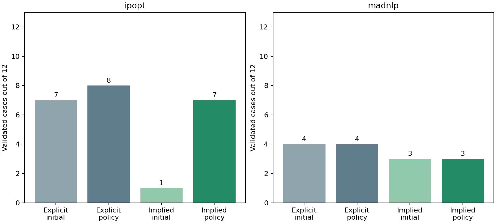

# S1 saturated droop reproducer and implied Q-bound formulation

This checkpoint isolates the numerical dependence between a saturated droop equality and an active generator reactive-power bound, then evaluates an opt-in equivalent formulation on the frozen IEEE 118/300 tuning matrix. The existing `droop_q_bounds=:explicit` formulation remains the default.

For a positive smoothing width, the softplus derivative lies strictly between zero and one. By the mean-value theorem,

```math
0 < \operatorname{softplus}_\epsilon(r-q_{\min})-\operatorname{softplus}_\epsilon(r-q_{\max}) < q_{\max}-q_{\min}.
```

Therefore the smoothed droop response lies inside its control capability in exact arithmetic. Case validation already requires that capability interval to lie inside the attached generator limits. In `:implied` mode only those redundant generator-Q variable bounds are omitted. The `qg` variable, droop equality, AC balances, objective, controller limits, smoothing and extracted result are unchanged. Unattached and unavailable generators retain their bounds.

The difference-of-softplus floating-point evaluation can exceed an endpoint by roundoff. A voltage sweep in the regression test observes a positive excursion and bounds it by `16eps(Float64)`; the maximum is around 1e-15 in the current cases. Independent physical validation remains unchanged at 1e-6 and checks every returned generator Q value. No result is accepted merely because its bound was omitted from the optimization model.

## Minimal reproducer

The two-variable model retains the package droop evaluator, a voltage variable, a reactive-power variable, the droop equality and the same small reactive objective weight. It targets lower saturation, deadband and upper saturation with both solvers. In explicit mode the saturation rows have droop gradient `[0, 1]`, parallel to the active Q bound `[0, 1]`; the stacked matrix has a zero singular value. Implied mode removes that duplicate active row. This reproducer demonstrates local numerical dependence, not full-network reliability.



| Solver | Target V | Explicit / implied status | Explicit / implied objective | Explicit droop / active-bound dual | Implied droop dual |
|---|---|---|---|---|---|
| ipopt | 0.8 | LOCALLY_SOLVED / LOCALLY_SOLVED | 0.00025000203 / 0.000250001815 | 0.0919090966 / -0.0909090966 | 0.001 |
| ipopt | 1.0 | LOCALLY_SOLVED / LOCALLY_SOLVED | 0 / 0 | -0 / — | 0 |
| ipopt | 1.2 | LOCALLY_SOLVED / LOCALLY_SOLVED | 0.00025000203 / 0.000250001815 | -0.0919090895 / 0.0909090895 | -0.001 |
| madnlp | 0.8 | LOCALLY_SOLVED / LOCALLY_SOLVED | 0.000250002031 / 0.000250001946 | 0.0919091078 / -0.0909091087 | 0.001 |
| madnlp | 1.0 | LOCALLY_SOLVED / LOCALLY_SOLVED | 0 / 0 | -0 / — | -0 |
| madnlp | 1.2 | LOCALLY_SOLVED / LOCALLY_SOLVED | 0.000250002031 / 0.000250001946 | -0.0919090895 / 0.0909090905 | -0.001 |

## Frozen public comparison

Each backend uses the same 12 cases, declared physical starts, epsilon 1e-6, physical controller coordinates, objective, one-reset policy, 2000-iteration total allowance and 120-second cooperative wall budget as its frozen baseline. Every failed attempt is retained. Runs were concurrent, so elapsed time is not an isolated performance comparison.



| Solver | Explicit initial → policy | Implied initial → policy | Gained / lost cases | Attempts | Iteration / wall overruns |
|---|---|---|---|---|---|
| ipopt | 7 → 8 | 1 → 7 | 0 / 1 | 23 | 0 / 0 |
| madnlp | 4 → 4 | 3 → 3 | 3 / 4 | 19 | 0 / 0 |

## Paired ledger

| Case | Explicit / implied valid | Explicit / implied iterations | Explicit / implied accepted objective | Implied final decision |
|---|---|---|---|---|
| [public118-load1.0-ipopt-anchor](assets/s1_implied_q/public118-load1.0-ipopt-anchor-policy.json) | True / True | 465 / 1199 | 7.594008 / 7.59323493 | accept |
| [public118-load1.0-ipopt-flat_low](assets/s1_implied_q/public118-load1.0-ipopt-flat_low-policy.json) | True / True | 846 / 1418 | 7.59401684 / 7.59323493 | accept |
| [public118-load1.0-ipopt-flat_high](assets/s1_implied_q/public118-load1.0-ipopt-flat_high-policy.json) | True / True | 337 / 379 | 7.59323498 / 7.59323494 | accept |
| [public118-load1.05-ipopt-anchor](assets/s1_implied_q/public118-load1.05-ipopt-anchor-policy.json) | True / False | 320 / 2000 | 11.3874284 / — | budget_exhausted |
| [public118-load1.05-ipopt-flat_low](assets/s1_implied_q/public118-load1.05-ipopt-flat_low-policy.json) | False / False | 2000 / 2000 | — / — | budget_exhausted |
| [public118-load1.05-ipopt-flat_high](assets/s1_implied_q/public118-load1.05-ipopt-flat_high-policy.json) | False / False | 2000 / 2000 | — / — | budget_exhausted |
| [public300-load1.0-ipopt-anchor](assets/s1_implied_q/public300-load1.0-ipopt-anchor-policy.json) | True / True | 388 / 1135 | 89.2260441 / 89.4550243 | accept |
| [public300-load1.0-ipopt-flat_low](assets/s1_implied_q/public300-load1.0-ipopt-flat_low-policy.json) | False / False | 2000 / 2000 | — / — | budget_exhausted |
| [public300-load1.0-ipopt-flat_high](assets/s1_implied_q/public300-load1.0-ipopt-flat_high-policy.json) | False / False | 2000 / 2000 | — / — | budget_exhausted |
| [public300-load1.05-ipopt-anchor](assets/s1_implied_q/public300-load1.05-ipopt-anchor-policy.json) | True / True | 1040 / 1585 | 140.953331 / 141.405505 | accept |
| [public300-load1.05-ipopt-flat_low](assets/s1_implied_q/public300-load1.05-ipopt-flat_low-policy.json) | True / True | 352 / 1339 | 140.954185 / 141.405505 | accept |
| [public300-load1.05-ipopt-flat_high](assets/s1_implied_q/public300-load1.05-ipopt-flat_high-policy.json) | True / True | 637 / 1553 | 140.954185 / 141.405505 | accept |
| [public118-load1.0-madnlp-anchor](assets/s1_implied_q/public118-load1.0-madnlp-anchor-policy.json) | False / True | 198 / 444 | — / 7.59402016 | accept |
| [public118-load1.0-madnlp-flat_low](assets/s1_implied_q/public118-load1.0-madnlp-flat_low-policy.json) | False / True | 1216 / 602 | — / 7.59401697 | accept |
| [public118-load1.0-madnlp-flat_high](assets/s1_implied_q/public118-load1.0-madnlp-flat_high-policy.json) | False / True | 284 / 610 | — / 7.59402016 | accept |
| [public118-load1.05-madnlp-anchor](assets/s1_implied_q/public118-load1.05-madnlp-anchor-policy.json) | False / False | 1434 / 496 | — / — | diagnose_validation_failure |
| [public118-load1.05-madnlp-flat_low](assets/s1_implied_q/public118-load1.05-madnlp-flat_low-policy.json) | True / False | 86 / 1266 | 12.1245612 / — | diagnose_validation_failure |
| [public118-load1.05-madnlp-flat_high](assets/s1_implied_q/public118-load1.05-madnlp-flat_high-policy.json) | False / False | 1215 / 339 | — / — | diagnose_validation_failure |
| [public300-load1.0-madnlp-anchor](assets/s1_implied_q/public300-load1.0-madnlp-anchor-policy.json) | True / False | 59 / 2000 | 96.3297805 / — | budget_exhausted |
| [public300-load1.0-madnlp-flat_low](assets/s1_implied_q/public300-load1.0-madnlp-flat_low-policy.json) | False / False | 2000 / 2000 | — / — | budget_exhausted |
| [public300-load1.0-madnlp-flat_high](assets/s1_implied_q/public300-load1.0-madnlp-flat_high-policy.json) | False / False | 412 / 2000 | — / — | budget_exhausted |
| [public300-load1.05-madnlp-anchor](assets/s1_implied_q/public300-load1.05-madnlp-anchor-policy.json) | True / False | 232 / 2000 | 149.055741 / — | budget_exhausted |
| [public300-load1.05-madnlp-flat_low](assets/s1_implied_q/public300-load1.05-madnlp-flat_low-policy.json) | True / False | 165 / 2000 | 148.855557 / — | budget_exhausted |
| [public300-load1.05-madnlp-flat_high](assets/s1_implied_q/public300-load1.05-madnlp-flat_high-policy.json) | False / False | 495 / 2000 | — / — | budget_exhausted |

## Decision

The implied-bound formulation validates 7/12 Ipopt cases versus 8/12 explicitly bounded, and 3/12 MadNLP cases versus 4/12. MadNLP gains all three nominal IEEE 118 starts but loses four previously accepted stressed or larger cases. Ipopt loses one stressed IEEE 118 anchor. The formulation changes numerical trajectories rather than providing a general reliability improvement.

This result narrows the diagnosis: the saturated-droop/active-Q-bound dependence is real, but it is not the only source of failure. `:implied` remains opt-in and S1 remains open. The next experiment should preserve explicit physical bounds while preventing saturated equalities from becoming numerically flat, or use a reduced-space substitution whose derivative and endpoint behavior are verified before public benchmarking. No further equipment-model change is made in this checkpoint.
