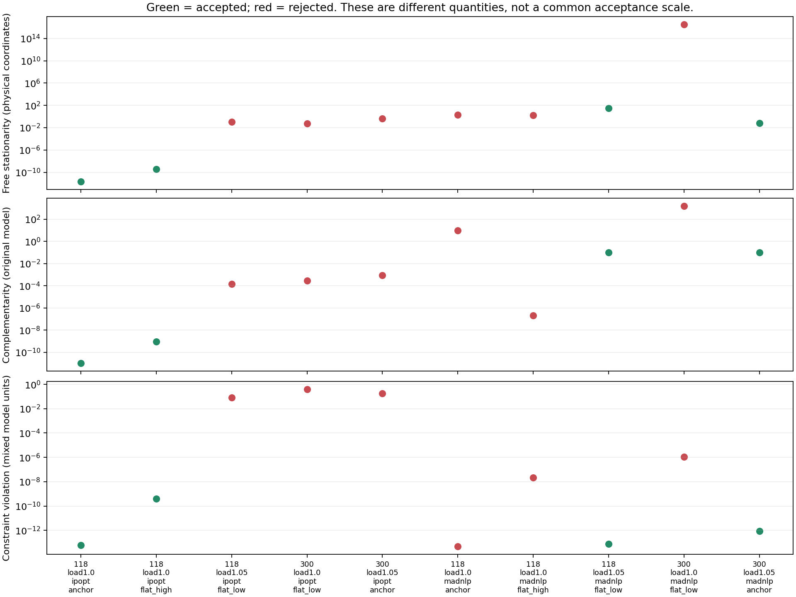
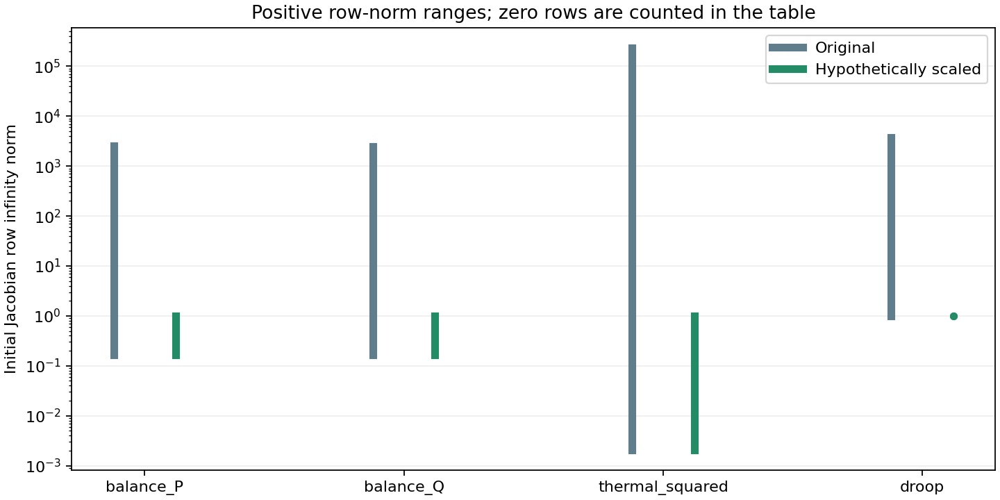

# S1 residual scaling, stationarity and active bounds

This is a read-only diagnostic checkpoint. Ten declared runs cover accepted cases, numerical failures, physically feasible rejected solver outcomes, and a stalled recovery source on IEEE 118/300 with both Ipopt and MadNLP. The sample is selected from the existing tuning cases; it is not new reliability evidence or a solver-ranking study. Each run repeats the direct initial solve with physical coordinates, epsilon 1e-6, bound push/fraction 1e-8, at most 1000 iterations and a 60-second native solver time limit. No restart or staged preparation is added. Instrumentation and compilation affect elapsed time; no performance claim is made.

## What is computed

For the existing minimization model, the physical-coordinate Lagrangian gradient is reconstructed as

```math
\nabla_x L = \nabla_x f - J_g^\mathsf{T} y_g - J_b^\mathsf{T} y_b.
```

The signs follow JuMP/MOI dual conventions. The report separates the dispatch objective gradient, nonlinear constraint contribution, and regular constraint/bound contribution for every variable. Fixed variables are excluded from the headline free-variable norm; their entries remain in JSON. Inequality dual-sign errors and complementarity are computed separately. Unit tests exercise equality duals, active bounds, active nonlinear inequalities, quadratic cross terms and reused nonlinear subexpressions on both solvers.

Row and column infinity norms are computed from the original nonlinear Jacobian. These are derivative magnitudes in the current units, not singular values or condition numbers. Bus-balance rows are in pu power, thermal rows use squared apparent power, and droop rows are smooth reactive-power residuals. A near-bound flag means distance at most 1e-6 in that variable’s physical units; it does not establish a nonzero multiplier or causation.

## Solver termination versus physical and KKT checks



| Case | Native termination | Accepted / physically valid | Free stationarity | Complementarity | Worst free coordinate | Worst exact physical failure |
|---|---|---|---|---|---|---|
| [public118-load1.0-ipopt-anchor](assets/s1_kkt/public118-load1.0-ipopt-anchor-kkt.json) | LOCALLY_SOLVED | True / True | 2.06e-12 | 1e-11 | vm[87] | none |
| [public118-load1.0-ipopt-flat_high](assets/s1_kkt/public118-load1.0-ipopt-flat_high-kkt.json) | LOCALLY_SOLVED | True / True | 3.89e-10 | 9.49e-10 | vm[87] | none |
| [public118-load1.05-ipopt-flat_low](assets/s1_kkt/public118-load1.05-ipopt-flat_low-kkt.json) | ITERATION_LIMIT | False / False | 0.107 | 0.000142 | vm[59] | droop: generator 26 control 17, regulated bus 61 (0.079 > 1e-05) |
| [public300-load1.0-ipopt-flat_low](assets/s1_kkt/public300-load1.0-ipopt-flat_low-kkt.json) | ITERATION_LIMIT | False / False | 0.0575 | 0.000277 | vm[212] | droop: generator 39 control 24, regulated bus 233 (0.397 > 1e-05) |
| [public300-load1.05-ipopt-anchor](assets/s1_kkt/public300-load1.05-ipopt-anchor-kkt.json) | ITERATION_LIMIT | False / False | 0.413 | 0.000911 | vm[218] | droop: generator 42 control 26, regulated bus 239 (0.187 > 1e-05) |
| [public118-load1.0-madnlp-anchor](assets/s1_kkt/public118-load1.0-madnlp-anchor-kkt.json) | SLOW_PROGRESS | False / False | 2.08 | 10.1 | pg[5] | droop: generator 28 control 19, regulated bus 65 (2.44e-05 > 1e-05) |
| [public118-load1.0-madnlp-flat_high](assets/s1_kkt/public118-load1.0-madnlp-flat_high-kkt.json) | LOCALLY_INFEASIBLE | False / True | 1.6 | 2.16e-07 | pg[5] | none |
| [public118-load1.05-madnlp-flat_low](assets/s1_kkt/public118-load1.05-madnlp-flat_low-kkt.json) | LOCALLY_SOLVED | True / True | 32 | 0.1 | qg[17] | none |
| [public300-load1.0-madnlp-flat_low](assets/s1_kkt/public300-load1.0-madnlp-flat_low-kkt.json) | ITERATION_LIMIT | False / False | 3.38e+16 | 1.53e+03 | qg[39] | power_balance: bus 139 Q (1.11e-06 > 1e-06) |
| [public300-load1.05-madnlp-anchor](assets/s1_kkt/public300-load1.05-madnlp-anchor-kkt.json) | LOCALLY_SOLVED | True / True | 0.0625 | 0.1 | qg[39] | none |

## What row equilibration would change

For diagnosis only, freeze a positive factor from each initial Jacobian row:

```math
\alpha_i = 1/\max(1,\|J_{g_i}(x_0)\|_\infty),\qquad \widetilde g_i=\alpha_i g_i,\qquad \widetilde y_i=y_i/\alpha_i.
```

With both the constraint function and its bound scaled, this preserves the exact feasible set. Transforming the multiplier as shown preserves the Lagrangian gradient and complementarity. The snapshots verify this identity numerically at the final points. No scaled formulation is sent to the solver in this checkpoint.

A small scaled residual alone does not prove a small physical residual: a scaled tolerance of 1e-8 permits an original-row error of 1e-8/alpha. The next table reports the largest such allowance per family across the ten starts. This is a hypothetical tolerance conversion, not a recommended stopping tolerance. Thermal values are in squared-power units, so they must not be compared directly with the independent apparent-power tolerance.



| Equation family | Initial row norm min / max | Zero rows | Minimum alpha | Largest raw allowance at scaled 1e-8 |
|---|---|---|---|---|
| balance_P | 0.166 / 2.55e+03 | 0 | 0.000393 | 2.55e-05 |
| balance_Q | 0.168 / 2.46e+03 | 0 | 0.000406 | 2.46e-05 |
| thermal_squared | 0 / 2.34e+05 | 200 | 4.27e-06 | 0.00234 |
| droop | 1 / 3.7e+03 | 0 | 0.00027 | 3.7e-05 |

## Controller bounds and weak derivative columns

Counts below refer to free controller variables. Weak means nonlinear Jacobian column infinity norm below 1e-10 at the final iterate. A weak droop slope column can occur in a deadband or saturated region; it alone neither proves rank deficiency nor explains the solver termination.

| Case | Controllers near bounds / total | Weak controller columns | Maximum controller stationarity | Largest free objective / nonlinear / bound contributions |
|---|---|---|---|---|
| public118-load1.0-ipopt-anchor | 21/60 | 27 | 3.36e-14 | 1.59 / 1.29e+04 / 1.29e+04 |
| public118-load1.0-ipopt-flat_high | 22/60 | 28 | 3.22e-12 | 1.58 / 2.12e+06 / 2.12e+06 |
| public118-load1.05-ipopt-flat_low | 0/60 | 7 | 0.0488 | 1.98 / 3.31e+09 / 3.31e+09 |
| public300-load1.0-ipopt-flat_low | 0/196 | 18 | 0.0218 | 9.08 / 1.16e+08 / 1.16e+08 |
| public300-load1.05-ipopt-anchor | 0/196 | 8 | 0.0908 | 12.4 / 76.4 / 76.4 |
| public118-load1.0-madnlp-anchor | 0/60 | 2 | 0 | 2.08 / 0 / 0 |
| public118-load1.0-madnlp-flat_high | 0/60 | 27 | 4.14e-07 | 1.6 / 493 / 493 |
| public118-load1.05-madnlp-flat_low | 0/60 | 3 | 2.35e-13 | 2.62 / 3.6e+15 / 3.6e+15 |
| public300-load1.0-madnlp-flat_low | 0/196 | 8 | 23.8 | 9.75 / 3.45e+16 / 1.76e+16 |
| public300-load1.05-madnlp-anchor | 0/196 | 3 | 3.38e-12 | 12.9 / 1.96e+14 / 1.96e+14 |

## Saturated droops and active reactive-power bounds

At a fully saturated droop point, the computed droop equality can have derivative 1 with respect to generator Q and zero derivatives with respect to all other variables. When Q is also at its capability bound, this row is numerically parallel to the active bound. The supplemental geometry pass rebuilds the identical formulation and evaluates its Jacobian at each retained final point without solving. It checks all variable names and regular constraint layouts before using saved multipliers.

This behavior appears in both accepted and rejected runs and on both solvers. It is evidence of local numerical dependence, not proof that it causes every failure or that the smooth model is exactly rank-deficient in real arithmetic. Removing a bound based on this observation would require a separate formulation review; no bound is removed here.

| Case | Droop rows parallel to active Q bounds | Largest absolute droop multiplier | Maximum relative stationarity |
|---|---|---|---|
| [public118-load1.0-ipopt-anchor](assets/s1_kkt/public118-load1.0-ipopt-anchor-geometry.json) | 2 | 1.29e+04 | 8.79e-13 |
| [public118-load1.0-ipopt-flat_high](assets/s1_kkt/public118-load1.0-ipopt-flat_high-geometry.json) | 2 | 2.12e+06 | 1.66e-10 |
| [public118-load1.05-ipopt-flat_low](assets/s1_kkt/public118-load1.05-ipopt-flat_low-geometry.json) | 2 | 3.31e+09 | 0.0488 |
| [public300-load1.0-ipopt-flat_low](assets/s1_kkt/public300-load1.0-ipopt-flat_low-geometry.json) | 1 | 1.16e+08 | 0.0289 |
| [public300-load1.05-ipopt-anchor](assets/s1_kkt/public300-load1.05-ipopt-anchor-geometry.json) | 0 | 1.21 | 0.0908 |
| [public118-load1.0-madnlp-anchor](assets/s1_kkt/public118-load1.0-madnlp-anchor-geometry.json) | 1 | 0 | 0.51 |
| [public118-load1.0-madnlp-flat_high](assets/s1_kkt/public118-load1.0-madnlp-flat_high-geometry.json) | 1 | 493 | 1 |
| [public118-load1.05-madnlp-flat_low](assets/s1_kkt/public118-load1.05-madnlp-flat_low-geometry.json) | 3 | 3.6e+15 | 7.5e-14 |
| [public300-load1.0-madnlp-flat_low](assets/s1_kkt/public300-load1.0-madnlp-flat_low-geometry.json) | 6 | 3.45e+16 | 1 |
| [public300-load1.05-madnlp-anchor](assets/s1_kkt/public300-load1.05-madnlp-anchor-geometry.json) | 1 | 1.96e+14 | 9.08e-13 |

For the accepted MadNLP IEEE 118 +5% flat-low case, generators 8 and 17 have droop multipliers about 1.8e15 and 3.6e15, balanced by reactive-power bound multipliers of the opposite sign. Their off-Q Jacobian derivatives evaluate to zero. The reconstructed maximum raw stationarity is 32, while the maximum coordinatewise relative residual is about 7.5e-14. The latter divides each residual by max(1, the sum of absolute individual Lagrangian-gradient contributions). These two quantities answer different questions; the relative value is not an optimality certificate. Extremely large cancelling terms make absolute residuals sensitive to floating-point precision.

The accepted MadNLP IEEE 300 +5% anchor likewise has a saturated generator-39 row and a multiplier around 2e14. The stalled nominal IEEE 300 flat-low case has six parallel rows and a relative stationarity residual of 1, so cancellation alone does not explain away that failure.

Installed MadNLP 0.10.1 computes native dual and complementarity measures with multiplier-dependent divisors (`get_sd`, `get_sc`, `get_inf_du`, `get_inf_compl` in `src/IPM/kernels.jl`). These can be large when multipliers are large, explaining why native scaled convergence can coexist with larger reconstructed raw residuals. The saved native values and raw decompositions are both retained. This does not change the existing native-plus-physical acceptance gate; it identifies a separate solution-quality issue to resolve.

**Next priority:** isolate saturated-droop/active-Q-bound numerical dependence in a small reproducer, compare multiplier behavior and stopping rules, then test an explicitly equivalent numerical remedy. Blind row equilibration is not sufficient: multiplying parallel rows by positive constants cannot make them independent. Full-network scaling experiments and holdout studies follow this focused investigation.


## Limits and next decision

All ten runs reproduce the frozen direct first-attempt status, acceptance decision and objective exactly. All original termination and independent physical-validation decisions are retained. A low KKT residual does not establish global optimality, and a low physical residual does not establish convergence. The diagnostic does not override either gate. Solver-native scaled norms and these reconstructed physical-coordinate norms need not coincide.

The initial adapter pilot failed when converting reused nonlinear expressions through JuMP’s expression-conversion API. Its outputs are retained in `artifacts/s1_kkt_adapter_pilot_ipopt` and `artifacts/s1_kkt_adapter_pilot_madnlp`; those interrupted development runs are excluded from the ten-case diagnostic sample. The corrected adapter reads nonlinear constraint sets directly from the installed JuMP nonlinear model and is covered by a subexpression regression test.

No equipment, objective, bounds, smoothing or acceptance tolerances changed. S1 remains open. Any row-scaling solve experiment must preserve physical validation, explicitly account for transformed stopping tolerances and multipliers, and use the frozen paired cases before broader holdout validation.
