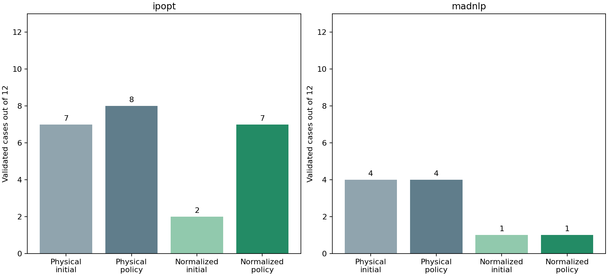
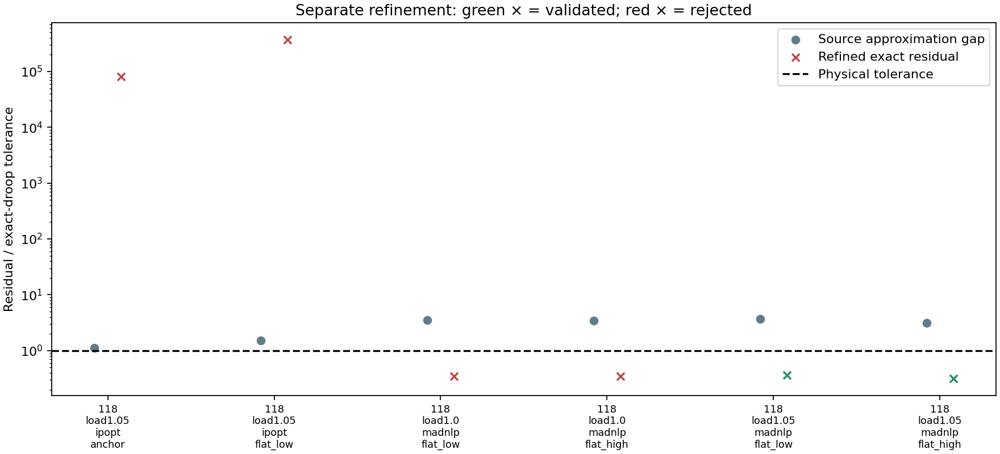

# S1 equivalent controller normalization

Free settings use physical value = lower + (upper − lower) × z, with 0 ≤ z ≤ 1. Fixed settings remain fixed. This is an opt-in coordinate transformation (`control_normalization=:bounds`); the default `:none` retains physical coordinates. Equipment equations, objective, physical limits, smoothing, and independent validation tolerances are unchanged. Results and design JSON contain physical settings.

The 24-case benchmark and baseline hashes are frozen. Each normalized run uses the same network, loading, declared physical start, policy, numerical options and cumulative budget as its baseline. Solver bound pushes operate in the chosen numerical coordinates, so their physical displacement changes with interval width. This is part of the coordinate experiment, not a new initialization policy. Raw stationarity norms also depend on coordinates and are not directly compared as physical quantities.

The same one-reset policy and 2000-iteration/120-second cooperative wall budget apply. At most 1000 iterations/60 seconds are allowed per attempt. The clock is checked at callbacks, not a hard process timeout. Timing includes compilation and some concurrent work and is not an isolated performance benchmark. No extra smoothing or staged release is introduced in this comparison.

| Solver | Baseline initial → policy | Normalized initial → policy | Gained cases | Lost cases |
|---|---|---|---|---|
| ipopt | 7 → 8 | 2 → 7 | 2 | 3 |
| madnlp | 4 → 4 | 1 → 1 | 1 | 4 |

## Paired case ledger

| Case | Baseline valid / iterations | Normalized valid / iterations | Normalized final decision | Baseline / normalized accepted objective |
|---|---|---|---|---|
| [public118-load1.0-ipopt-anchor](assets/s1_normalization/public118-load1.0-ipopt-anchor-policy.json) | True / 465 | True / 1210 | accept | 7.594008005 / 7.593238756 |
| [public118-load1.0-ipopt-flat_low](assets/s1_normalization/public118-load1.0-ipopt-flat_low-policy.json) | True / 846 | True / 1206 | accept | 7.59401684 / 7.594008005 |
| [public118-load1.0-ipopt-flat_high](assets/s1_normalization/public118-load1.0-ipopt-flat_high-policy.json) | True / 337 | True / 1335 | accept | 7.593234983 / 7.593234951 |
| [public118-load1.05-ipopt-anchor](assets/s1_normalization/public118-load1.05-ipopt-anchor-policy.json) | True / 320 | False / 524 | diagnose_validation_failure | 11.38742842 / — |
| [public118-load1.05-ipopt-flat_low](assets/s1_normalization/public118-load1.05-ipopt-flat_low-policy.json) | False / 2000 | False / 1711 | diagnose_validation_failure | — / — |
| [public118-load1.05-ipopt-flat_high](assets/s1_normalization/public118-load1.05-ipopt-flat_high-policy.json) | False / 2000 | False / 2000 | budget_exhausted | — / — |
| [public300-load1.0-ipopt-anchor](assets/s1_normalization/public300-load1.0-ipopt-anchor-policy.json) | True / 388 | False / 2000 | budget_exhausted | 89.22604414 / — |
| [public300-load1.0-ipopt-flat_low](assets/s1_normalization/public300-load1.0-ipopt-flat_low-policy.json) | False / 2000 | True / 1226 | accept | — / 89.22529645 |
| [public300-load1.0-ipopt-flat_high](assets/s1_normalization/public300-load1.0-ipopt-flat_high-policy.json) | False / 2000 | True / 697 | accept | — / 89.2262374 |
| [public300-load1.05-ipopt-anchor](assets/s1_normalization/public300-load1.05-ipopt-anchor-policy.json) | True / 1040 | True / 1046 | accept | 140.953331 / 140.9534036 |
| [public300-load1.05-ipopt-flat_low](assets/s1_normalization/public300-load1.05-ipopt-flat_low-policy.json) | True / 352 | True / 289 | accept | 140.9541846 / 141.4047237 |
| [public300-load1.05-ipopt-flat_high](assets/s1_normalization/public300-load1.05-ipopt-flat_high-policy.json) | True / 637 | False / 2000 | budget_exhausted | 140.9541846 / — |
| [public118-load1.0-madnlp-anchor](assets/s1_normalization/public118-load1.0-madnlp-anchor-policy.json) | False / 198 | True / 77 | accept | — / 8.203807464 |
| [public118-load1.0-madnlp-flat_low](assets/s1_normalization/public118-load1.0-madnlp-flat_low-policy.json) | False / 1216 | False / 203 | diagnose_validation_failure | — / — |
| [public118-load1.0-madnlp-flat_high](assets/s1_normalization/public118-load1.0-madnlp-flat_high-policy.json) | False / 284 | False / 140 | diagnose_validation_failure | — / — |
| [public118-load1.05-madnlp-anchor](assets/s1_normalization/public118-load1.05-madnlp-anchor-policy.json) | False / 1434 | False / 232 | retry_limit_reached | — / — |
| [public118-load1.05-madnlp-flat_low](assets/s1_normalization/public118-load1.05-madnlp-flat_low-policy.json) | True / 86 | False / 190 | diagnose_validation_failure | 12.12456118 / — |
| [public118-load1.05-madnlp-flat_high](assets/s1_normalization/public118-load1.05-madnlp-flat_high-policy.json) | False / 1215 | False / 69 | diagnose_validation_failure | — / — |
| [public300-load1.0-madnlp-anchor](assets/s1_normalization/public300-load1.0-madnlp-anchor-policy.json) | True / 59 | False / 156 | retry_limit_reached | 96.32978052 / — |
| [public300-load1.0-madnlp-flat_low](assets/s1_normalization/public300-load1.0-madnlp-flat_low-policy.json) | False / 2000 | False / 1876 | retry_limit_reached | — / — |
| [public300-load1.0-madnlp-flat_high](assets/s1_normalization/public300-load1.0-madnlp-flat_high-policy.json) | False / 412 | False / 1242 | retry_limit_reached | — / — |
| [public300-load1.05-madnlp-anchor](assets/s1_normalization/public300-load1.05-madnlp-anchor-policy.json) | True / 232 | False / 132 | retry_limit_reached | 149.055741 / — |
| [public300-load1.05-madnlp-flat_low](assets/s1_normalization/public300-load1.05-madnlp-flat_low-policy.json) | True / 165 | False / 290 | retry_limit_reached | 148.855557 / — |
| [public300-load1.05-madnlp-flat_high](assets/s1_normalization/public300-load1.05-madnlp-flat_high-policy.json) | False / 495 | False / 352 | retry_limit_reached | — / — |

## Numerical convergence versus exact-droop validation

| Attempt | Solver status | Valid | Smooth/exact droop gap (pu) | Exact droop residual (pu) | AC residual (pu) | Failure categories |
|---|---|---|---|---|---|---|
| [public118-load1.0-ipopt-anchor-attempt1](assets/s1_normalization/public118-load1.0-ipopt-anchor-attempt1-diagnostics.json) | ITERATION_LIMIT | False | 8.07631317e-07 | 0.2447745355 | 0.004471153984 | power_balance, droop |
| [public118-load1.0-ipopt-anchor-attempt2](assets/s1_normalization/public118-load1.0-ipopt-anchor-attempt2-diagnostics.json) | LOCALLY_SOLVED | True | 1.33226763e-15 | 7.699421656e-11 | 1.630392391e-09 |  |
| [public118-load1.0-ipopt-flat_low-attempt1](assets/s1_normalization/public118-load1.0-ipopt-flat_low-attempt1-diagnostics.json) | ITERATION_LIMIT | False | 3.108624469e-15 | 0.2287482775 | 0.007590637253 | power_balance, droop |
| [public118-load1.0-ipopt-flat_low-attempt2](assets/s1_normalization/public118-load1.0-ipopt-flat_low-attempt2-diagnostics.json) | LOCALLY_SOLVED | True | 3.229037641e-06 | 3.229037641e-06 | 1.167121955e-13 |  |
| [public118-load1.0-ipopt-flat_high-attempt1](assets/s1_normalization/public118-load1.0-ipopt-flat_high-attempt1-diagnostics.json) | ITERATION_LIMIT | False | 1.598721155e-14 | 3.71731901 | 0.02266372331 | power_balance, droop |
| [public118-load1.0-ipopt-flat_high-attempt2](assets/s1_normalization/public118-load1.0-ipopt-flat_high-attempt2-diagnostics.json) | LOCALLY_SOLVED | True | 1.33226763e-15 | 3.22035662e-11 | 5.736241204e-10 |  |
| [public118-load1.05-ipopt-anchor-attempt1](assets/s1_normalization/public118-load1.05-ipopt-anchor-attempt1-diagnostics.json) | LOCALLY_SOLVED | False | 1.122037954e-05 | 1.122037954e-05 | 1.036115638e-13 | droop |
| [public118-load1.05-ipopt-flat_low-attempt1](assets/s1_normalization/public118-load1.05-ipopt-flat_low-attempt1-diagnostics.json) | ITERATION_LIMIT | False | 5.812988979e-13 | 1.710182635 | 0.006430838471 | power_balance, droop |
| [public118-load1.05-ipopt-flat_low-attempt2](assets/s1_normalization/public118-load1.05-ipopt-flat_low-attempt2-diagnostics.json) | LOCALLY_SOLVED | False | 1.526506473e-05 | 1.526506473e-05 | 1.219441215e-13 | droop |
| [public118-load1.05-ipopt-flat_high-attempt1](assets/s1_normalization/public118-load1.05-ipopt-flat_high-attempt1-diagnostics.json) | ITERATION_LIMIT | False | 1.915640527e-06 | 0.01534238772 | 0.0001076156816 | power_balance, droop |
| [public118-load1.05-ipopt-flat_high-attempt2](assets/s1_normalization/public118-load1.05-ipopt-flat_high-attempt2-diagnostics.json) | ITERATION_LIMIT | False | 2.164934898e-15 | 0.03286483271 | 0.0004864280279 | power_balance, droop |
| [public300-load1.0-ipopt-anchor-attempt1](assets/s1_normalization/public300-load1.0-ipopt-anchor-attempt1-diagnostics.json) | ITERATION_LIMIT | False | 4.085620731e-14 | 1.219507556 | 0.00537727256 | power_balance, droop |
| [public300-load1.0-ipopt-anchor-attempt2](assets/s1_normalization/public300-load1.0-ipopt-anchor-attempt2-diagnostics.json) | ITERATION_LIMIT | False | 5.151434834e-14 | 1.560930804 | 0.005822715482 | power_balance, droop |
| [public300-load1.0-ipopt-flat_low-attempt1](assets/s1_normalization/public300-load1.0-ipopt-flat_low-attempt1-diagnostics.json) | ITERATION_LIMIT | False | 8.881784197e-15 | 0.02111109532 | 3.128552227e-07 | droop |
| [public300-load1.0-ipopt-flat_low-attempt2](assets/s1_normalization/public300-load1.0-ipopt-flat_low-attempt2-diagnostics.json) | ALMOST_LOCALLY_SOLVED | True | 1.622952239e-08 | 1.622952284e-08 | 4.371988882e-13 |  |
| [public300-load1.0-ipopt-flat_high-attempt1](assets/s1_normalization/public300-load1.0-ipopt-flat_high-attempt1-diagnostics.json) | ALMOST_LOCALLY_SOLVED | True | 4.153704774e-06 | 4.153704774e-06 | 1.021627227e-12 |  |
| [public300-load1.05-ipopt-anchor-attempt1](assets/s1_normalization/public300-load1.05-ipopt-anchor-attempt1-diagnostics.json) | ITERATION_LIMIT | False | 1.110223025e-14 | 0.6554661521 | 0.08702046832 | power_balance, droop |
| [public300-load1.05-ipopt-anchor-attempt2](assets/s1_normalization/public300-load1.05-ipopt-anchor-attempt2-diagnostics.json) | ALMOST_LOCALLY_SOLVED | True | 2.551490863e-08 | 2.55149093e-08 | 6.011025011e-13 |  |
| [public300-load1.05-ipopt-flat_low-attempt1](assets/s1_normalization/public300-load1.05-ipopt-flat_low-attempt1-diagnostics.json) | LOCALLY_SOLVED | True | 1.123939747e-06 | 1.123939747e-06 | 1.005417971e-12 |  |
| [public300-load1.05-ipopt-flat_high-attempt1](assets/s1_normalization/public300-load1.05-ipopt-flat_high-attempt1-diagnostics.json) | ITERATION_LIMIT | False | 1.243449788e-14 | 0.3577318336 | 0.01206778919 | power_balance, droop |
| [public300-load1.05-ipopt-flat_high-attempt2](assets/s1_normalization/public300-load1.05-ipopt-flat_high-attempt2-diagnostics.json) | ITERATION_LIMIT | False | 1.776356839e-14 | 0.7796923024 | 0.002006133669 | power_balance, droop |
| [public118-load1.0-madnlp-anchor-attempt1](assets/s1_normalization/public118-load1.0-madnlp-anchor-attempt1-diagnostics.json) | LOCALLY_SOLVED | True | 2.220446049e-15 | 3.375077995e-14 | 6.77236045e-14 |  |
| [public118-load1.0-madnlp-flat_low-attempt1](assets/s1_normalization/public118-load1.0-madnlp-flat_low-attempt1-diagnostics.json) | SLOW_PROGRESS | False | 3.489708384e-05 | 3.489708384e-05 | 5.362377209e-14 | droop |
| [public118-load1.0-madnlp-flat_low-attempt2](assets/s1_normalization/public118-load1.0-madnlp-flat_low-attempt2-diagnostics.json) | LOCALLY_SOLVED | False | 3.489708384e-05 | 3.489708384e-05 | 3.601563492e-13 | droop |
| [public118-load1.0-madnlp-flat_high-attempt1](assets/s1_normalization/public118-load1.0-madnlp-flat_high-attempt1-diagnostics.json) | LOCALLY_SOLVED | False | 3.478385881e-05 | 3.478385864e-05 | 9.331424522e-14 | droop |
| [public118-load1.05-madnlp-anchor-attempt1](assets/s1_normalization/public118-load1.05-madnlp-anchor-attempt1-diagnostics.json) | SLOW_PROGRESS | False | 1.644220414e-05 | 1.644220414e-05 | 1.341704525e-13 | droop |
| [public118-load1.05-madnlp-anchor-attempt2](assets/s1_normalization/public118-load1.05-madnlp-anchor-attempt2-diagnostics.json) | SLOW_PROGRESS | False | 1.644220414e-05 | 1.644220414e-05 | 7.932543511e-14 | droop |
| [public118-load1.05-madnlp-flat_low-attempt1](assets/s1_normalization/public118-load1.05-madnlp-flat_low-attempt1-diagnostics.json) | SLOW_PROGRESS | False | 3.66412869e-05 | 3.66412869e-05 | 8.190670364e-14 | droop |
| [public118-load1.05-madnlp-flat_low-attempt2](assets/s1_normalization/public118-load1.05-madnlp-flat_low-attempt2-diagnostics.json) | LOCALLY_SOLVED | False | 3.664128689e-05 | 3.664128689e-05 | 1.282307593e-13 | droop |
| [public118-load1.05-madnlp-flat_high-attempt1](assets/s1_normalization/public118-load1.05-madnlp-flat_high-attempt1-diagnostics.json) | LOCALLY_SOLVED | False | 3.147925062e-05 | 3.147925062e-05 | 1.039446307e-13 | droop |
| [public300-load1.0-madnlp-anchor-attempt1](assets/s1_normalization/public300-load1.0-madnlp-anchor-attempt1-diagnostics.json) | SLOW_PROGRESS | False | 5.107025913e-15 | 3.108624469e-14 | 1.05031539e-11 |  |
| [public300-load1.0-madnlp-anchor-attempt2](assets/s1_normalization/public300-load1.0-madnlp-anchor-attempt2-diagnostics.json) | SLOW_PROGRESS | False | 6.661338148e-15 | 1.287858709e-14 | 7.713829575e-13 |  |
| [public300-load1.0-madnlp-flat_low-attempt1](assets/s1_normalization/public300-load1.0-madnlp-flat_low-attempt1-diagnostics.json) | INTERRUPTED | False | 4.884981308e-15 | 1.777924197e-10 | 1.039795694e-09 |  |
| [public300-load1.0-madnlp-flat_low-attempt2](assets/s1_normalization/public300-load1.0-madnlp-flat_low-attempt2-diagnostics.json) | ITERATION_LIMIT | False | 4.030835057e-07 | 0.0001391461573 | 0.003488109298 | power_balance, droop |
| [public300-load1.0-madnlp-flat_high-attempt1](assets/s1_normalization/public300-load1.0-madnlp-flat_high-attempt1-diagnostics.json) | SLOW_PROGRESS | False | 7.105427358e-15 | 1.527666882e-13 | 1.388666959e-11 |  |
| [public300-load1.0-madnlp-flat_high-attempt2](assets/s1_normalization/public300-load1.0-madnlp-flat_high-attempt2-diagnostics.json) | ITERATION_LIMIT | False | 4.963491484e-08 | 4.963491662e-08 | 2.04208872e-12 |  |
| [public300-load1.05-madnlp-anchor-attempt1](assets/s1_normalization/public300-load1.05-madnlp-anchor-attempt1-diagnostics.json) | SLOW_PROGRESS | False | 9.769962617e-15 | 4.751754545e-14 | 3.124167591e-12 |  |
| [public300-load1.05-madnlp-anchor-attempt2](assets/s1_normalization/public300-load1.05-madnlp-anchor-attempt2-diagnostics.json) | SLOW_PROGRESS | False | 6.661338148e-15 | 2.26485497e-14 | 3.360423051e-12 |  |
| [public300-load1.05-madnlp-flat_low-attempt1](assets/s1_normalization/public300-load1.05-madnlp-flat_low-attempt1-diagnostics.json) | SLOW_PROGRESS | False | 4.440892099e-15 | 2.371436381e-13 | 3.008526761e-11 |  |
| [public300-load1.05-madnlp-flat_low-attempt2](assets/s1_normalization/public300-load1.05-madnlp-flat_low-attempt2-diagnostics.json) | SLOW_PROGRESS | False | 1.094631275e-05 | 1.094631275e-05 | 8.406608742e-13 | droop |
| [public300-load1.05-madnlp-flat_high-attempt1](assets/s1_normalization/public300-load1.05-madnlp-flat_high-attempt1-diagnostics.json) | SLOW_PROGRESS | False | 7.327471963e-15 | 1.719735465e-13 | 6.646738715e-12 |  |
| [public300-load1.05-madnlp-flat_high-attempt2](assets/s1_normalization/public300-load1.05-madnlp-flat_high-attempt2-diagnostics.json) | SLOW_PROGRESS | False | 1.1016512e-05 | 1.1016512e-05 | 8.043010702e-13 | droop |

## Verification and scope

Pointwise tests compare original and normalized equations and objectives at interval endpoints and interior points for capacitors and reactors. Jacobians and Lagrangian Hessians satisfy the affine chain rule. Fixed intervals bypass normalization, and solved settings round-trip through the existing physical JSON schema. Restart contexts include the coordinate mode, preventing reuse of incompatible numerical seeds.

This experiment does not establish global optimality or general convergence. Normalization stays opt-in pending evidence across starts, loads and controller placements. S1 remains open before M9. Controlled smoothing and staged initialization must be tested separately before combining changes.

## Separate smoothing refinement

Eligibility was declared by failure type: the final attempt converged, failed only exact droop validation, and independently recomputed smooth-droop residual was at most 1e-6 pu. Every eligible point receives one separate solve at epsilon 1e-7, seeded by its physical state/settings, with no transferred duals. Each receives an additional 1000-iteration/60-second allowance. These extra solves are excluded from the frozen matrix counts; they are not a within-budget improvement claim.

**2/6 refinement attempts validate.** Reducing approximation error does not guarantee numerical convergence.

| Refinement | Native status | Valid | Source smooth residual | Source approximation gap | Final exact residual |
|---|---|---|---|---|---|
| [public118-load1.05-ipopt-anchor-refine](assets/s1_normalization/public118-load1.05-ipopt-anchor-refine-diagnostics.json) | ITERATION_LIMIT | False | 3.606873494e-09 | 1.122037954e-05 | 0.8026559159 |
| [public118-load1.05-ipopt-flat_low-refine](assets/s1_normalization/public118-load1.05-ipopt-flat_low-refine-diagnostics.json) | ITERATION_LIMIT | False | 1.986186215e-09 | 1.526506473e-05 | 3.719990904 |
| [public118-load1.0-madnlp-flat_low-refine](assets/s1_normalization/public118-load1.0-madnlp-flat_low-refine-diagnostics.json) | SLOW_PROGRESS | False | 5.789813073e-14 | 3.489708384e-05 | 3.491459337e-06 |
| [public118-load1.0-madnlp-flat_high-refine](assets/s1_normalization/public118-load1.0-madnlp-flat_high-refine-diagnostics.json) | SLOW_PROGRESS | False | 1.725841692e-13 | 3.478385881e-05 | 3.475921528e-06 |
| [public118-load1.05-madnlp-flat_low-refine](assets/s1_normalization/public118-load1.05-madnlp-flat_low-refine-diagnostics.json) | LOCALLY_SOLVED | True | 3.630429291e-14 | 3.664128689e-05 | 3.660340295e-06 |
| [public118-load1.05-madnlp-flat_high-refine](assets/s1_normalization/public118-load1.05-madnlp-flat_high-refine-diagnostics.json) | LOCALLY_SOLVED | True | 1.304512054e-14 | 3.147925062e-05 | 3.142717213e-06 |

