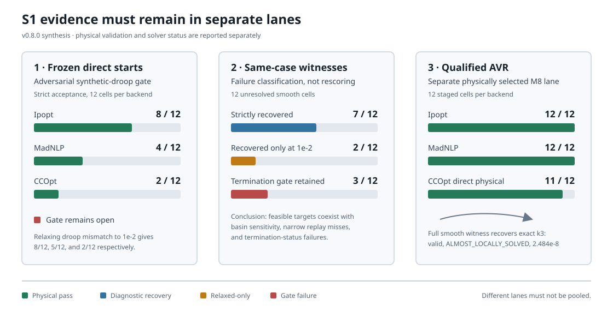

# S1 current decision report

**Decision: the frozen S1 reliability gate remains open.** The equipment and
reactive-control equations have substantial independent support, and many
failed cells have validated same-case witnesses, but the declared direct-start
policy is not reliable across solvers, starts, networks, and load levels. M8's
qualified AVR lane is release evidence for a different, physically selected
controller policy; it does not overwrite or rescore the frozen synthetic-droop
matrix.

This page is the authoritative synthesis as of v0.8.0. The other S1 pages are
the chronological audit trail and retain the counts known at each checkpoint.



## Scope separation

| Lane | Question answered | May change the frozen score? |
|---|---|---:|
| Frozen synthetic-droop matrix | Does the declared direct-start policy reliably solve the unchanged adversarial workload? | Yes; this is the gate |
| Same-case witness diagnostic | Does a failed target admit a validated solution under the same equations, bounds, and load? | No; it classifies the failure |
| Relaxed `1e-2` re-score | Is rejection caused only by the exact-droop `1e-5` gate? | No; diagnostic only |
| Qualified AVR lane | Do explicitly selected physical control semantics work on the public cases? | No; separate M8 evidence |

The distinction is essential. A witness can refute an infeasibility inference
without making the prescribed start reliable. Likewise, a physically qualified
AVR model can pass without rehabilitating an anchor-derived synthetic droop
assignment.

## Acceptance contract

A cell passes only when all applicable checks pass. Solver status alone is not
acceptance, and a complementarity product is not a substitute for exact
physical replay.

| Gate | Frozen requirement |
|---|---|
| Solver | Accepted termination and a usable primal point |
| AC physics | Independently reconstructed active/reactive balance within the declared tolerance |
| Network and equipment | Voltage, generator, thermal, tap, and shunt policy limits |
| Reactive control | Exact droop/AVR regime replay; frozen droop mismatch at most `1e-5` pu |
| Budget | Declared per-attempt and restart allowance; diagnostic overruns remain separate |
| Provenance | Stable case, load, controller policy, start, backend, smoothing, and context hash |

The user-requested `1e-2` mismatch view is retained as a re-score. It changes
only the exact-droop threshold; it does not waive solver, balance, policy, or
equipment checks.

## Frozen direct-start scorecard

All three rows cover the same 12 public cells: IEEE 118/300, nominal/+5%
demand, and anchor/flat-low/flat-high starts. Ipopt and MadNLP use the frozen
smooth explicit-droop model and one-reset policy. CCOpt uses exact
complementarity and its native direct budget, so it is a third solver family,
not a like-for-like smooth-backend ranking.

| Backend | Formulation and budget | Strict `1e-5` | Relaxed `1e-2` | Main rejection mechanism |
|---|---|---:|---:|---|
| Ipopt | Smooth; one reset, 2000 iterations / 120 s total | 8/12 | 8/12 | Iteration/basin failures; two witness reruns narrowly miss strict droop replay |
| MadNLP | Smooth; one reset, 2000 iterations / 120 s total | 4/12 | 5/12 | `SLOW_PROGRESS`, iteration, and basin sensitivity |
| CCOpt | Exact; one direct solve, 1000 inner iterations / 60 s | 2/12 | 2/12 | Rejected cells also fail termination or AC balance |

The strict direct score is therefore **14/36 across separately declared solver
lanes**, not a pooled success probability. Starts and cells are deliberately
adversarial and are not samples from an operational distribution.

## Same-case witness diagnostic

The 12 unresolved smooth cells were rerun from a validated witness for the same
network and load. The seed contains the full physical decision—AC state, tap,
shunt, and droop settings—while equations, bounds, objective, smoothing,
validation, and restart budget remain unchanged.

| Outcome class | Cells | Interpretation |
|---|---:|---|
| Strictly recovered | 7/12 | Direct failure was basin/start sensitive |
| Recovered only under `1e-2` droop re-score | 2/12 | `LOCALLY_SOLVED`, raw mismatch about `1.122e-5`; strict gate remains failed |
| Not recovered because of `SLOW_PROGRESS` | 3/12 | Balance and droop residuals are near machine precision, but the declared termination gate remains failed |

Thus the witness diagnostic reaches 7/12 strictly and 9/12 under the relaxed
droop-only view. It establishes feasible-but-not-reliably-reached targets and
separates physical residual quality from termination robustness.

## Qualified AVR lane

M8 replaces synthetic controller semantics only in a separately labelled lane.
Candidates are selected by normalized bidirectional raw-Q headroom, at most one
generator per bus, with raw voltage at least `1e-5` inside its limits. AVR
setpoints come from the independently validated FreeQ operating point. Joint
design uses a fixed first-transformer ±1% tap policy and staged k1 → k2 → k3
activation.

| Backend | Networks / loads | Staged physical validation | Termination detail |
|---|---|---:|---|
| Ipopt | IEEE 118/300 at 1.00 and 1.01 | 12/12 | 12/12 `LOCALLY_SOLVED` |
| MadNLP | IEEE 118/300 at 1.00 and 1.01 | 12/12 | 12/12 `LOCALLY_SOLVED` |
| CCOpt direct | IEEE 118/300 at 1.00 and 1.01 | 11/12 | 7/12 `LOCALLY_SOLVED`; four valid `ALMOST_LOCALLY_SOLVED`; one invalid stressed-k3 result |

The sole direct exact failure is IEEE-300 at load 1.01, k3. Seeding a fresh
exact solve from the full smooth k3 witness recovers a physically valid
`ALMOST_LOCALLY_SOLVED` point. Its maximum complementarity residual is
`2.484e-8`, and its tap differs from the smooth seed by about `5.18e-9`. This
classifies the direct `LOCALLY_INFEASIBLE` result as basin-sensitive solver
behavior, not evidence that the exact equations are infeasible. The cross-seed
is diagnostic and does not change the 11/12 direct score.

## Causal findings

| Hypothesis | Evidence | Current judgment |
|---|---|---|
| Transformer equation error | Independent PowerModels-style terminal-flow oracle checks across tap ratios and phase shifts | Not supported |
| Shunt equation is the dominant cause | Shunt-only and one-droop/one-shunt isolation cells pass; raw and shunt-only public slices are materially stronger | Not supported |
| Public source cases are generally infeasible | Valid raw and controlled witnesses exist over the tested envelopes | Not supported for the qualified envelopes |
| Every frozen failure is a residual-threshold artifact | Relaxing only droop mismatch leaves most rejected cells unchanged | Rejected |
| Solver basin/start sensitivity is material | Same-case witnesses recover 7 strict cells; controller-count and exact cross-seed results are non-monotone | Supported |
| Termination and physical validity are interchangeable | Near-machine-precision residual points can retain `SLOW_PROGRESS`; valid CCOpt points can be `ALMOST_LOCALLY_SOLVED` | Rejected |
| Frozen synthetic controls are representative hardware | Controllers are anchor-derived overlays rather than measured plant assignments | Rejected; retain as adversarial evidence |

The strongest conclusion is not that one solver is “best.” It is that the
current nonconvex formulations expose multiple failure classes: basin-sensitive
paths, termination-status robustness, narrow exact-replay misses, and genuinely
poor nonconverged iterates. Those classes require different remedies.

## Evidence provenance

| Evidence | Human-readable record | Machine-readable record |
|---|---|---|
| Frozen three-solver direct score | `artifacts/s1_three_solver_scorecard/report.md` | `artifacts/s1_three_solver_scorecard/summary.json` |
| Same-case witness reruns | `artifacts/s1_frozen_witness_seed_matrix/report.md` | `artifacts/s1_frozen_witness_seed_matrix/summary.json` |
| `1e-2` witness re-score | `artifacts/s1_witness_seed_tolerance_1e-2/report.md` | `artifacts/s1_witness_seed_tolerance_1e-2/summary.json` |
| Incremental control isolation | `artifacts/s1_incremental_controls/report.md` | Regenerate the large raw ledger with `examples/s1_incremental_controls.jl` |
| Controller-5 diagnostic | `artifacts/s1_incremental_control5/report.md` | Regenerate the large raw ledger with `examples/s1_controller5_witness_audit.jl` |
| Qualified AVR envelope | `artifacts/avr_ieee_qualification/README.md` | Per-cell JSON files in the same directory |

[Download the compact v0.8.0 scorecard](assets/s1_summary/current-scorecard.json).

The compact reports and scorecards are the intended review surface. Large raw
iteration traces and multi-megabyte per-attempt ledgers are reproducible working
evidence and are intentionally excluded from the release tree; failed outcomes
remain represented in the committed reports.

## Limitations and decision

- The public overlays are synthetic and do not establish utility-grade plant
  assignments, discrete implementability, or probabilistic reliability.
- AC OPF remains nonconvex. A validated witness establishes local feasibility,
  not global optimality or uniqueness.
- The 1.00/1.01 AVR envelope and nominal/+5% frozen envelope answer different
  questions and must not be merged.
- Runtime measurements include compilation and machine-specific effects unless
  a report explicitly states otherwise.
- M8 qualification is base-case work. It does not authorize independent
  scenario-specific tap, shunt, or voltage targets in SCOPF.

The project may proceed to M9 because the physical control semantics and
failure classes are now explicit, but M9 must preserve this evidence split.
Taps and shunts are preventive by default; corrective movement requires an
explicit response-time policy. Droop and AVR may respond automatically only
through declared scenario coupling. S1 remains open until an unchanged remedy
improves the complete frozen matrix without weakening its acceptance contract.

## Reproduction

```sh
julia --project=. examples/s1_three_solver_scorecard.jl
julia --project=. examples/s1_frozen_witness_seed_matrix.jl
julia --project=. examples/s1_witness_seed_tolerance_rescore.jl
julia --project=. examples/avr_ieee_qualification.jl 118 ipopt 3 1.0,1.01 joint_staged
julia --project=. examples/avr_ieee_qualification.jl 300 ccopt 3 1.01 joint_cross_seed
```

Historical experimental pages remain useful for method detail, but their
checkpoint counts should not be quoted as the current aggregate status.
