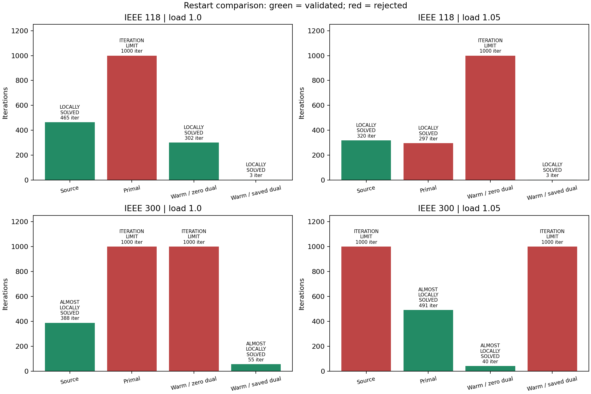
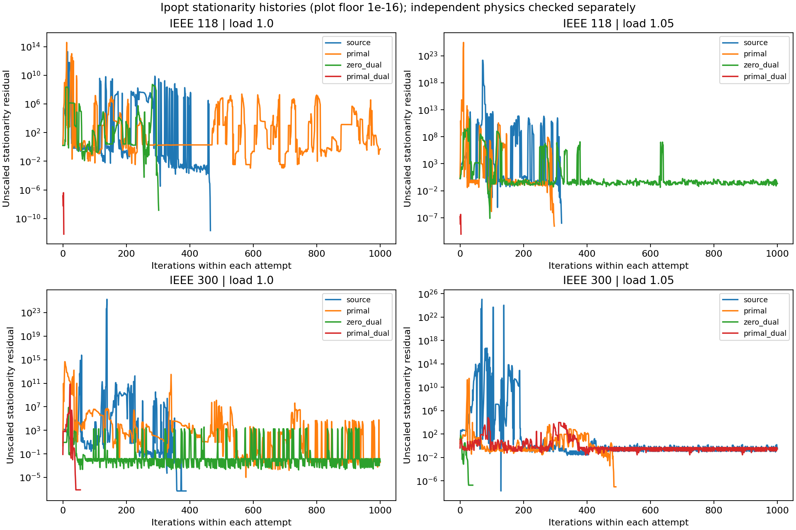
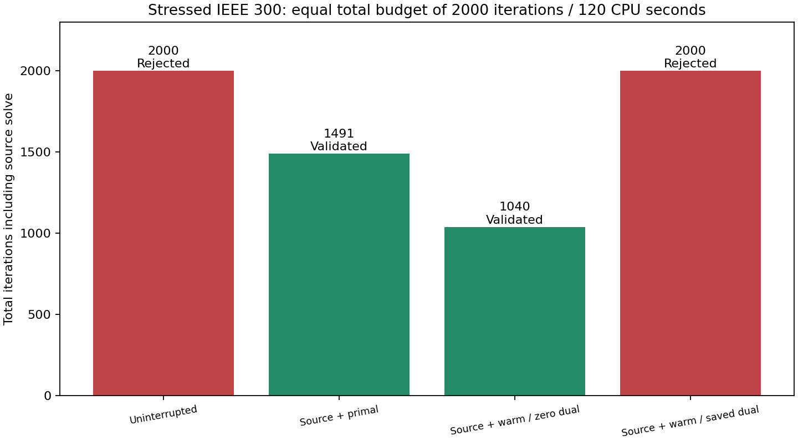

# S1 primal/dual restart checkpoint

**9/16 attempts validate, including four source attempts. S1 remains open.**

All three restart arms use the same persisted terminal iterate from the source solve, on the same formulation. Primal restarts use ordinary initialization; both warm-start arms share identical warm-start options, with either zero or saved dual multipliers. The zero-dual arm separates the effect of warm-start initialization from retaining multipliers. Failed source iterates are numerical seeds only, never accepted as feasible solutions.

Each attempt retains the 1000-iteration/60 CPU-second budget, epsilon 1e-6, original objective, zero bound relaxation and unchanged physical tolerances. A source plus a restart has a larger cumulative budget than the source alone. A separate uninterrupted equal-budget comparison below tests the one failed source case. These dependent probes are not independent multistart trials or isolated performance benchmarks.

The start JSON contains builder defaults; restart tags point to the persisted seed that overrides them. Seeds store JuMP/MOI primal and dual values, including variable bounds and legacy nonlinear constraints. A model-layout signature, explicit formulation context, dimensions and finite-value checks guard application. This is an example-level, same-formulation Ipopt experiment; transfer across cases, smoothing levels, model revisions, or solvers is not supported. It does not preserve the full internal Ipopt state, barrier history or factorization.

| Attempt | Status | Valid | Iterations | Valid objective | Physical failures |
|---|---|---|---|---|---|
| [public118-load1.0-source](assets/s1_warmstarts/public118-load1.0-source-diagnostics.json) | LOCALLY_SOLVED | True | 465 | 7.594008005 | none |
| [public118-load1.0-primal](assets/s1_warmstarts/public118-load1.0-primal-diagnostics.json) | ITERATION_LIMIT | False | 1000 | — | power_balance, droop |
| [public118-load1.0-zero_dual](assets/s1_warmstarts/public118-load1.0-zero_dual-diagnostics.json) | LOCALLY_SOLVED | True | 302 | 7.593238736 | none |
| [public118-load1.0-primal_dual](assets/s1_warmstarts/public118-load1.0-primal_dual-diagnostics.json) | LOCALLY_SOLVED | True | 3 | 7.594008005 | none |
| [public118-load1.05-source](assets/s1_warmstarts/public118-load1.05-source-diagnostics.json) | LOCALLY_SOLVED | True | 320 | 11.38742842 | none |
| [public118-load1.05-primal](assets/s1_warmstarts/public118-load1.05-primal-diagnostics.json) | LOCALLY_SOLVED | False | 297 | — | droop |
| [public118-load1.05-zero_dual](assets/s1_warmstarts/public118-load1.05-zero_dual-diagnostics.json) | ITERATION_LIMIT | False | 1000 | — | power_balance, droop |
| [public118-load1.05-primal_dual](assets/s1_warmstarts/public118-load1.05-primal_dual-diagnostics.json) | LOCALLY_SOLVED | True | 3 | 11.38742842 | none |
| [public300-load1.0-source](assets/s1_warmstarts/public300-load1.0-source-diagnostics.json) | ALMOST_LOCALLY_SOLVED | True | 388 | 89.22604414 | none |
| [public300-load1.0-primal](assets/s1_warmstarts/public300-load1.0-primal-diagnostics.json) | ITERATION_LIMIT | False | 1000 | — | droop |
| [public300-load1.0-zero_dual](assets/s1_warmstarts/public300-load1.0-zero_dual-diagnostics.json) | ITERATION_LIMIT | False | 1000 | — | power_balance, droop |
| [public300-load1.0-primal_dual](assets/s1_warmstarts/public300-load1.0-primal_dual-diagnostics.json) | ALMOST_LOCALLY_SOLVED | True | 55 | 89.22529645 | none |
| [public300-load1.05-source](assets/s1_warmstarts/public300-load1.05-source-diagnostics.json) | ITERATION_LIMIT | False | 1000 | — | power_balance, droop |
| [public300-load1.05-primal](assets/s1_warmstarts/public300-load1.05-primal-diagnostics.json) | ALMOST_LOCALLY_SOLVED | True | 491 | 140.9541114 | none |
| [public300-load1.05-zero_dual](assets/s1_warmstarts/public300-load1.05-zero_dual-diagnostics.json) | ALMOST_LOCALLY_SOLVED | True | 40 | 140.953331 | none |
| [public300-load1.05-primal_dual](assets/s1_warmstarts/public300-load1.05-primal_dual-diagnostics.json) | ITERATION_LIMIT | False | 1000 | — | power_balance, droop |

## Declared candidate selection

Select the lowest objective among fully validated source/restart attempts; if none validate, retain an unresolved result. This experimental selection rule does not certify global optimality or establish a production restart policy.

| Case | Selected attempt | Persisted seed |
|---|---|---|
| 118 / demand ×1.0 | public118-load1.0-zero_dual | [Seed](assets/s1_warmstarts/public118-load1.0-seed.json) |
| 118 / demand ×1.05 | public118-load1.05-source | [Seed](assets/s1_warmstarts/public118-load1.05-seed.json) |
| 300 / demand ×1.0 | public300-load1.0-primal_dual | [Seed](assets/s1_warmstarts/public300-load1.0-seed.json) |
| 300 / demand ×1.05 | public300-load1.05-zero_dual | [Seed](assets/s1_warmstarts/public300-load1.05-seed.json) |

## Equal-total-budget comparison

The uninterrupted stressed IEEE 300 solve uses 2000 iterations and 120 CPU seconds, matching the maximum combined budget of source plus one restart. It ends with ITERATION_LIMIT and validation=False. The source objective trace matches the shared initial portion exactly. Zero-dual warm initialization validates in 1000+40 iterations; ordinary primal restart validates in 1000+491. Saved-dual restart fails after 1000+1000. [Uninterrupted diagnostics](assets/s1_warmstarts/public300-load1.05-uninterrupted-diagnostics.json).

This is evidence for recovery on this retained case, not statistical evidence of universal reliability. Saved duals preserve validated solutions on the other three cases, but should not be assumed useful after a failed solve. Validation and finite-value checks must control acceptance; termination status alone is insufficient.

## Interpretation

The matrix validates 9/16 attempts. Saved-dual restarts validate in 3, 3 and 55 iterations for the three validated sources. The failed source is recovered by resetting multipliers, and a longer uninterrupted solve still fails. This motivates testing a status-dependent restart policy, while retaining a known validated incumbent and accepting candidates only after independent physical checks. The current experiment tries all arms; it does not yet implement or validate an automatic production policy.

## Remaining work

Explicit variable normalization, broader start variation, broader equal-total-budget comparisons and a reliable restart policy remain open. M9 is not unlocked. Equipment equations, physical bounds, objective and validation tolerances are unchanged.
